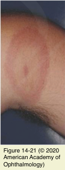

# 5.14.15. Systemic Conditions (XV): Neuro-Ophthalmic Manifestations of Infectious Diseases (III): Lyme Disease

## Images

## Hierarchy

- Borrelia burgdorferi
  - spirochete
  - transmitted by deer ticks
- stage 1
  - localized infection
  - within days or weeks of infection
  - skin rash (erythema chronicum migrans)
    - 60-80%
  - ± systemic findings
    - fever
    - minor constitutional symptoms
  - ocular findings
    - photophobia
    - periorbital edema
    - conjunctivitis
    - iridocyclitis
    - diffuse choroiditis
    - exudative retinal detachment
- Stage 3
  - persistent infection
  - keratitis
  - systemic findings
    - arthritis
    - scleroderma-like skin lesions
  - neurologic findings
    - chronic encephalomyelitis
    - spastic paraparesis
    - ataxic gait
    - subtle mental disorders
    - chronic radiculopathy
    - neurologic picture may resemble that of MS
      - clinically and radiographically
- diagnosis
  - exposure to endemic area
    - patient might not recall a tick bite
  - typical rash
  - elevated Lyme antibody titer in the serum or CSF
    - ELISA
      - for screening
    - Western blot
      - confirms the diagnosis
- Treatment
  - orchestrated by a specialist in infectious diseases
- Stage 2
  - disseminated infection through the blood or lymphatic system
  - within days or weeks
  - systemic findings
    - annular or malar rash
    - arthralgia
    - pancarditis
    - lymphadenopathy
    - splenomegaly
    - hepatitis
    - hematuria
    - proteinuria
    - malaise
      - similar to sarcoidosis
    - fatigue
  - neurologic findings
    - cranial neuropathies
      - most commonly facial nerve palsy
    - meningitis with headache and neck stiffness
    - radiculopathies
    - optic neuritis
  - ocular findings
    - 2/3 of patients have ocular findings
    - keratitis
    - granulomatous iritis
    - pars planitis
    - vitritis
    - panophthalmitis
    - papilledema (IIH-like syndrome)
    - orbital myositis
