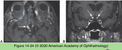

# 5.14.16. Systemic Conditions (XVI): Neuro-Ophthalmic Manifestations of Infectious Diseases (IV)

## Images

## Hierarchy

- Toxoplasmosis
  - Toxoplasmic optic neuritis
    - rare
    - subacute visual loss
    - optic nerve swelling
      - ± macular star
        - neuroretinitis
  - CNS toxoplasmosis
    - often associated with immune deficiency
    - clinical presentation
      - multifocal lesions
      - predilection for
        - basal ganglia
        - frontal, parietal, and occipital lobes
      - fever
      - headache
      - seizure
      - mental status changes
      - focal neurologic deficits
      - neuro-ophthalmic findings
        - homonymous hemianopia and quadrantanopia
        - ocular motor palsies
        - gaze palsies
    - MRI
      - isointense with the brain on T1-weighted images
      - isointense or hyperintense on T2-weighted images
      - (+) enhancement
    - lifelong antitoxoplasmosis treatment is necessary to prevent recurrences
- multiple lesions
- Radiation Therapy (RT)
  - traditional whole-brain RT
    - to treat cerebral malignancies
    - delivered in fractions over ≈1 month
  - 3-dimensional conformal RT
    - uses a computer to concentrate radiation in a precise area
      - through the use of complex asymmetric 3- dimensional shapes
  - radiation surgery (radiosurgery)
    - linear accelerator
    - distinct from traditional RT
      - gamma knife techniques
    - uses computer-based techniques to focus radiation at the desired regions
    - to treat
      - malignancies
      - occasional inflammatory lesions
      - vascular malformations
  - Complications of RT directed at the CNS
    - Immediate complications
      - transient swelling of the involved tissue
    - Later complications
      - can occur years after therapy
      - radiation necrosis
        - death of nervous tissue with attendant edema
      - cranial neuropathies
        - may simulate recurrent neoplasm on traditional MRI or CT imaging
          - PET or magnetic resonance spectroscopy (MRS) are required to separate these entities
            - neoplasms are hypermetabolic
            - radiation necrosis is hypometabolic
      - radiation optic neuropathy (RON)
        - months after radiation administration
        - subacute
        - dose-related
          - doses >5000 cGy
        - enhancement of the optic nerve(s) on the postcontrast, T1-weighted sequences
        - treatment is often ineffective
          - anticoagulation
          - hyperbaric oxygen
          - corticosteroids
      - ocular neuromyotonia
        - months to years after radiation treatment
        - rare
        - episodic “spasms” of CN III, IV, or VI, causing recurrent short-lived episodes of diplopia
        - responds to carbamazepine
- Prion Diseases
  - transmissible spongiform encephalopathies
    - kuru
      - New Guinea
    - sporadic Creutzfeldt-Jakob disease (sCJD)
      - worldwide
    - variant of CJD (vCJD)
      - United Kingdom and France
      - linked to bovine spongiform encephalopathy (“mad cow” disease)
  - pathogenesis
    - normal cell surface protein (PrPC)
      - converted to
        - abnormal cell surface protein (PrPCJD)
          - induces a conformational change in the normal cell surface protein (PrPC)
            - propagation of the abnormal form
              - alters neuronal function
  - genetics
    - sporadic CJD
      - spontaneous, random conversion of a normal prion protein to an abnormal prion protein
      - somatic mutation in the prion protein gene
    - familial
      - 10%
      - inherited mutations in the PrP gene
  - rapidly progressive dementia
    - uniformly fatal
      - usually in 8 months
  - visual symptoms
    - diplopia
    - supranuclear palsies
    - complex visual disturbances
    - homonymous visual field defects
    - hallucinations
    - cortical blindness
    - Heidenhain variant of CJD
      - present primarily with isolated visual symptoms
  - Diagnostic testing
    - MRI diffusion-weighted images
      - high-intensity caudate and/or putamen lesions
    - electroencephalogram (EEG)
    - CSF
      - 14-3-3 protein
        - within the first 2 years of disease onset
          - characteristic periodic sharp wave complexes (PSWCs)
    - brain biopsy
      - spongiform degeneration
  - No treatment is currently available
