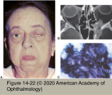
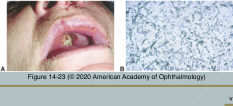

# 5.14.17. Systemic Conditions (XVII): Neuro-Ophthalmic Manifestations of Infectious Diseases (V): Fungal Infections

## Images

## Hierarchy

- "filamentous fungi"
  - extend and branch to form a mycelium
- hyphae
- reproduce when hyphae break off
  - aspergillosis
- fungi
  - molds
- candida
  - mucormycosis
  - grow as a yeast or a mold
- round
  - 2 main types of fungi
- similar to aspergillosis
- reproduce by budding
  - outpouchings called buds or pseudohyphae
- fungi
  - yeasts
- candida
  - cryptococcosis
    - coccidioidomycosis
  - histoplasmosis
- Aspergillosis
  - most frequent mode of transmission
    - inhalation of spores
  - 3 main types of infection
    - allergic aspergillosis
      - bronchopulmonary system
      - paranasal sinuses
      - neuro-ophthalmic findings are rare
        - optic neuropathy
        - proptosis
        - diplopia
        - headache
        - secondarily with sphenoid sinus involvement
    - aspergillomas
      - fungus balls
      - immunocompromised or immunocompetent patients
      - arise in
        - orbit
          - symptoms of orbital mass
            - proptosis
            - vision loss
            - diplopia
            - pain
          - typically also involve the sinuses or brain
          - extension to
            - optic canal
            - optic nerves
            - optic chiasm
            - cavernous sinus
        - paranasal sinuses
        - brain
          - intracranial aspergillomas act like mass lesions
    - invasive aspergillosis
      - immunocompromised patients
      - primary infection
        - initially have pulmonary involvement
        - skin, orbit, or sinuses may be the nidus of infection
      - CNS infection occurs secondarily by
        - direct spread
        - hematogenous spread
      - ophthalmic manifestations
        - acute retrobulbar optic neuropathy
        - orbital apex syndrome
        - cavernous sinus syndrome
        - vascular invasion
          - cerebral infarction or hemorrhage
            - tendency to invade retinal and choroidal vessels (angiocentric)
        - meningitis
        - intracranial abscess
        - epidural and subdural hematoma
        - mycotic aneurysm formation
        - encephalitis
  - treatment
    - antifungal agents
      - voriconazole
        - transient visual disturbances
          - extremely high mortality rate (>90%)
      - itraconazole
      - posaconazole
    - surgical intervention
      - often necessary to treat aspergillomas and invasive aspergillosis
- endophthalmitis
- Mucormycosis
  - pathogenesis
    - several types of Zygomycetes
      - ubiquitous organisms
      - low virulence except in debilitated hosts
    - enters the body through the respiratory tract
      - hyphal invasion of tissues
        - predilection for blood vessels
          - hemorrhage
          - thrombosis
          - ischemic necrosis
          - aneurysm/pseudoaneurysm formation in the intracranial vasculature
            - devastating consequences when rupture occurs
    - grows rapidly
      - produces a more acute infection than other fungi
  - rhinocerebral mucormycosis
    - predisposing factors
      - diabetes mellitus
      - corticosteroid use
    - initial infection
      - facial skin
        - neutropenic patient receiving antibiotics
      - nasal mucosa
      - paranasal sinuses
      - hard palate
      - spreads to the nearby blood vessels
        - orbital vessels
        - carotid arteries
        - cavernous sinuses
        - jugular veins
    - most common signs and symptoms
      - fever
      - headache
      - decreased vision
      - nasal necrosis
      - sinusitis
      - periorbital swelling
      - ophthalmoplegia
    - mechanisms of blindness
      - retinal infarction
      - ophthalmic artery occlusion
    - neurologic signs
      - hemiparesis
        - optic nerve infiltration
      - aphasia
      - seizures
      - altered mental status
    - prognosis
      - rapid deterioration
        - death within days if untreated
      - few patients have chronic course with little indication of systemic illness
  - CNS mucormycosis
    - very rare
    - fungus gains access to the CNS from nose or paranasal sinus
      - no nasal, sinus, ocular, or orbital disease when neurologic manifestations appear!
      - infection of the orbit, palate, nose, and sinuses occurs secondarily
    - clinical presentation
      - meningitis
      - brain abscess
      - cranial nerve involvement
      - seizure
  - diagnosis
    - high index of suspicion
    - CT scan
      - soft-tissue changes in the paranasal sinuses and orbit
        - air–fluid levels in the sinuses and orbits
      - brain abscess
    - MRI, MRA, and arteriography
      - vascular thrombosis
    - tissue biopsy
      - definite test
      - vascular invasion
      - tissue necrosis
      - eschar formation
      - inflammatory cells
        - nonseptate hyphae
  - treatment
    - treatment of underlying systemic disease
    - elimination of immunosuppressant agents, if possible
    - aggressive surgical debridement of necrotic tissue
    - antifungal agents both locally and systemically
    - hyperbaric oxygen
    - high mortality rate
      - prompt diagnosis and aggressive therapy may be life-saving
- bone destruction
- Cryptococcosis
  - Cryptococcus neoformans
    - ubiquitous
      - found in
        - contaminated soil
          - pigeon droppings
    - rare in otherwise healthy people
      - causes severe disseminated disease among immunocompromised/debilitated patients
      - ≈ 10% of patients with AIDS
        - most common life-threatening mycosis in these patients
  - predilection for the central nervous system
    - the most common cause of fungal meningitis
      - ocular infections occur months after the onset of meningitis
        - most frequent fungal eye infection in patients with HIV/AIDS
  - symptoms
    - usually insidious onset
      - waxing and waning course
    - headache
    - nausea
    - vomiting
    - dizziness
    - mental status changes
    - homonymous visual field defects
    - nystagmus
    - photophobia
    - blurred vision
    - retrobulbar pain
  - clinical presentation
    - neuro-ophthalmic findings
      - papilledema from cryptococcal meningitis
        - most common
      - retrobulbar optic neuritis
        - gradual loss of vision over hours to days
      - cranial neuropathies
        - unilateral or bilateral sixth nerve palsies
    - other ophthalmic findings
      - retinochoroiditis
      - cotton-wool spots
  - diagnosis
    - CSF
      - C neoformans capsular antigen
      - isolating the yeast
    - serum antigen titers
      - most patients with CNS cryptococcosis have disseminated disease
        - evidence of infection in
          - blood
          - lungs
          - bone marrow
          - skin
          - kidneys
          - other organs
  - treatment
    - antifungal treatment should be initiated urgently
    - vision loss caused by papilledema
      - CSF shunting
      - mortality rate of CNS cryptococcosis
        - optic nerve sheath fenestration
        - 25–30%
  - prognosis
    - prognosis is worse with underlying malignancy or AIDS
