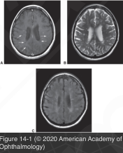

# 5.14.2. Systemic Conditions (II): Immunologic Disorders (II): Multiple Sclerosis (I)

## Images

## Hierarchy

- Epidemiology and genetics
  - more common in latitudes >40 degrees from the equator
  - more common in whites
    - rare among certain native ethnic groups
      - Inuit
      - Maori
      - despite the latitude
  - F : M = 2–3 : 1
  - highest among young adults (25–40 years)
    - onset even after the age of 50 years is not rare
    - uncommon <10 years
  - genetic factors
    - significantly increased risk in first-degree relatives of patients with MS
    - 10x greater concordance among identical twins than among fraternal twins
    - HLA-DRB1 antigen
    - an acquired agent, such as a virus, may trigger the disease
      - no specific infectious etiology has been identified
  - references
- Funduscopic abnormalities
  - nerve fiber layer defects
  - perivenous sheathing and fluorescein leakage along peripheral veins
    - 10%
  - autopsy studies
    - retinitis and periphlebitis
      - 5%–10%
  - anterior or posterior uveitis (including pars planitis)
    - 0.4%–26%
- 90%
- photisms
  - light induced by noise, smell, taste, or touch
- Course and prognosis
  - relapsing-remitting clinical course
    - episodes of neurologic dysfunction separated by intervals of months or years
    - pathologic burden in CNS accumulates even in the absence of clinical activity
      - secondary progressive form
        - within 10 years ≈ 50% of patients with relapsing-remitting course exhibit a slow continuous deterioration in neurologic status
  - primary progressive form
    - disease progresses inexorably from onset with no recognizable attacks
      - 10%–20%
    - near total disability within 1–2 years of onset may result after a fulminant course
  - relatively benign course without serious disability
    - 5–10%
- Optic neuritis in multiple sclerosis
  - symptoms
    - transient deterioration of vision may be brought on by
      - exercise
      - elevations in body temperature
        - Uhthoff symptom
    - phosphenes
      - bright flashes of light
      - with movement of the affected eye
  - incidence
    - optic neuritis as a presenting symptom of MS
      - 25%
    - optic neuritis occurring at some point in the course of disease
      - 75%
    - evidence of optic nerve involvement as demonstrated by an abnormal visual evoked response
      - 90%
    - anterior visual pathway demyelination on autopsy studies
      - in virtually all patients with clinically definite MS
  - risk of MS after an episode of optic neuritis
    - Optic Neuritis Treatment Trial (ONTT)
      - clinically definite MS developed in 50% in 15 years
      - no lesions on brain MRI
        - 25%
      - ≥1 lesions on brain MRI
        - 72%
      - CSF analysis
        - presence of abnormalities on brain MRI during an episode of optic neuritis was the strongest predictive factor for developing MS
        - oligoclonal banding
          - predictive value for development of MS only in patients with a normal MRI
      - patients with history of prior optic neuritis and nonspecific neurologic symptoms were at higher risk of MS
  - OCT
    - to measure the nerve fiber layer in MS
      - a marker for neuronal damage
- Clinical presentation
  - neurologic symptoms/signs occur over time and affect different areas of the CNS
    - ocular symptomatology is commonly part of the clinical picture
    - nonocular signs and symptoms may precede, follow, or coincide with the ocular signs
  - symptoms of early MS are often evanescent and unaccompanied by objective neurologic findings
  - significant episodes last for weeks or months
  - pregnancy
    - MS is typically quiescent during the third trimester of pregnancy
    - may flare up after delivery
  - cerebellar dysfunction
    - ataxia
    - vertigo
    - dysarthria
    - intention tremor
    - truncal or head titubation
    - dysmetria
      - described by the patient as poor depth perception
  - motor symptoms
    - extremity weakness
    - facial weakness
    - hemiparesis
    - paraplegia
  - sensory symptoms
    - paresthesias of face or body
    - bandlike distribution around the trunk
    - pain
      - Lhermitte sign
        - electric shock–like sensation in the limbs and trunk produced by neck flexion
      - occasionally, trigeminal neuralgia
  - mental changes
    - emotional instability
    - irritability
    - depression
    - fatigue
    - cognitive dysfunction
    - may precede the onset of focal neurologic deficits
  - sphincter disturbances
    - frequency
    - urgency
    - hesitancy
    - incontinence
    - urinary retention leading to urinary tract infection
- Pathology
  - demyelination
    - local perivascular mononuclear cell infiltration
      - myelin removal by macrophages
        - astrocytic proliferation --> glial fibrils
          - gliotic (sclerotic) plaque lesions
            - white matter at the ventricular margins
            - optic nerves and chiasm
            - corpus callosum
            - spinal cord
            - brainstem
            - cerebellar peduncles
  - axonal damage
    - “black holes” on the T1-weighted MRI sequences
  - references
