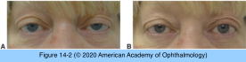

# 5.14.4. Systemic Conditions (IV): Immunologic Disorders (IV): Myasthenia Gravis (MG)

## Images

## Hierarchy

- General
  - usually a systemic disorder
    - 1/2 of affected patients have ocular symptoms/ signs at onset
    - systemic MG will develop over the next 2 years in ≤85% of patients who present with ocular MG
    - purely ocular MG does exist
      - late conversion to generalized MG is possible
        - if ocular signs remain truly isolated for >2 years, the disease is likely to remain clinically ocular
  - pathogenesis
    - antibodies against acetylcholine receptors
  - precipitating factors
    - antiarrhythmics
    - antibiotics
    - chemotherapeutic drugs
    - antiepileptics
    - quinolones
    - penicillamine
    - corticosteroids
    - β-blockers
    - calcium channel blockers
  - references
  - Lambert-Eaton
    - decreased presynaptic release of acetylcholine
    - symptoms worse in the morning
    - 50-80% associated with small cell lung cancer
  - botulism
    - toxin interferes with presynaptic release of acetylcholine
    - ocular findings
      - ptosis
        - in contrast to MG
      - ophthalmoplegia
      - dilated non-reactive pupil
  - oculopharyngeal dystrophy
    - ptosis
    - dysphagia
  - myotonic dystrophy
    - ophthalmoplegia
    - ptosis
    - pigmentary retinopathy
    - masseter and temporalis wasting
    - Christmas tree cataract
- Diagnosis
  - acetylcholinesterase inhibitor tests
    - edrophonium chloride test
      - short-acting
      - rare but serious adverse effects
        - bradycardia
        - respiratory arrest
        - bronchospasm
        - syncopal episodes
        - cholinergic crisis
          - other adverse effects
            - sweating
            - lacrimation
            - salivation
            - nausea
            - vomiting
            - fasciculations
            - abdominal cramping
        - not commonly performed in eye clinics
        - atropine sulfate (0.4–0.6 mg) should be available
          - some physicians pretreat with atropine (0.4 mg subcutaneously)
        - consult the primary physician for patients with a history of cardiac or pulmonary disease
      - technique
        - initial test dose of 2 mg (0.2 mL) intravenously
          - if no response, inject additional doses of 4 mg
            - up to a total of 10 mg
        - patient is observed for 60 seconds after injection
      - positive test result
        - symptoms disappear or decrease
          - eyelid elevates or motility improves
            - when the ocular symptom is marked, the endpoint is often dramatic
            - when the ocular symptom is subtle
              - Maddox rod tests with prisms
              - diplopia fields
      - false-positive responses are rare
      - a negative test result does not exclude the diagnosis of MG
        - repeat testing at a later date
    - neostigmine methylsulfate test
      - for children and for adults without ptosis who may require a longer observation period for ocular alignment measurements
      - adverse reactions
        - similar to those for edrophonium
        - salivation
        - fasciculations
        - gastrointestinal discomfort
      - intramuscular neostigmine and atropine are injected concurrently
      - positive test result produces improvement of signs within 30–45 minutes
  - sleep test
    - patient rests quietly with eyes closed for 30 minutes
    - measurements are repeated immediately after the patient “wakes up”
  - ice-pack test
    - only if the patient has ptosis
    - ice pack is placed over lightly closed eyes x 2 minutes
      - improvement of ptosis occurs in most patients
      - cooling effect may be insufficient to overcome complete myasthenic ptosis
  - serum assays
    - acetylcholine receptor antibody tests
      - 3 types
        - binding antibodies
          - 90% of patients with generalized MG
          - 50% of patients with ocular MG
        - blocking antibodies
          - rarely present (1%) without binding antibodies
        - modulating antibodies
          - present as frequently as binding antibodies
        - may detect MG in some patients who do not have anti–acetylcholine receptor antibodies
          - blocking and modulating antibody testing is for patients who test negative for the binding antibody and for whom evidence of autoimmune MG is necessary
    - anti–muscle-specific kinase (MuSK) antibodies
    - antibodies against low-density lipoprotein receptor–related protein (LRP4)
      - a novel diagnostic marker
      - additional studies will need to be performed to fully characterize this antibody
  - electromyographic repetitive nerve stimulation
    - characteristic decremental response in many patients with systemic MG
    - single-fiber EMG
      - most sensitive for MG
  - all patients with MG must be investigated radiologically for thymomas
    - 10% on CT
    - malignant thymomas
      - in a small percentage
  - serologic testing for thyroid dysfunction and pernicious anemia
    - high coexistence of MG with other autoimmune disorder
- Clinical presentation
  - weakness
    - variable & fatigable
  - ocular signs and symptoms
    - ptosis
      - unilateral or bilateral
        - most common sign
      - worsens
        - in the evening
        - with use of the eyes
        - after prolonged upward gaze
        - after exertion
      - may improve with rest
        - Cogan eyelid twitch
          - brief overelevation of the upper eyelid after refixation from downgaze to upgaze
      - enhancement of ptosis
        - the less ptotic eyelid falls when the more ptotic eyelid is elevated manually
          - Figure 11-3
      - fatigue of ptosis
        - assessed by asking the patient to sustain upgaze for ≥1 minute
    - diplopia
      - variable, both during the day and from one day to another
      - ocular motility pattern may simulate
        - ocular motor cranial nerve paresis
          - usually sixth nerve or partial, pupil-sparing, third nerve palsy
        - internuclear ophthalmoplegia
        - supranuclear motility disturbances
          - e.g. gaze palsies
        - isolated muscle “palsy"
          - eg, isolated inferior rectus
        - total ophthalmoplegia
        - any changing pattern of diplopia, with or without ptosis, should suggest MG
      - motility fatigue can also be assessed by having the patient sustain gaze in the direction of paresis
      - orbicularis oculi weakness
        - diagnostically crucial in differentiating MG from other causes of external ophthalmoplegia
      - pupillary abnormalities and sensory disturbances are not associated with MG
  - systemic symptoms and signs
    - weakness of muscles of mastication
    - weakness of extensors of the neck, trunk, and limbs
    - dysphagia
    - dyspnea
    - hoarseness
    - dysarthria
    - thyroid eye disease
      - 5%
        - should be suspected if a patient with MG exhibits exotropia
    - dysphagia and dyspnea can be life threatening and require prompt treatment
- Treatment
  - nonpharmacologic treatment
    - patch
    - ptosis crutch
    - prisms
      - when the variability is small
      - not always helpful
  - pharmacologic treatment
    - acetylcholinesterase inhibitors
      - neostigmine
      - pyridostigmine
    - corticosteroids
    - immunosuppressant drugs
  - thymectomy
    - for patients with a thymoma
    - for patients with generalized MG who have thymic enlargement
  - short-term therapies
    - intravenous immunoglobulin
    - plasmapheresis
    - occasionally necessary
  - manage patients in cooperation with a neurologist
