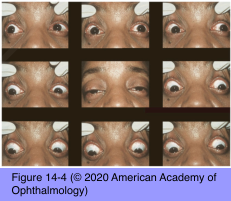
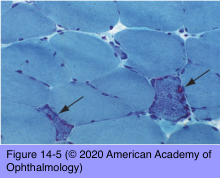

# 5.14.6. Systemic Conditions (VI): Inherited Disorders (I): Myopathies

## Images

## Hierarchy

- Oculopharyngeal dystrophy
  - onset in the fifth and sixth decades
    - older patients than CPEO
  - French-Canadian ancestry
  - genetics
    - hereditary
      - autosomal dominant
        - not mitochondrial
    - mutation
  - clinical presentation
    - proximal muscle weakness
      - progressive dysphagia
        - triplet repeat expansion in exon 1 of the polyadenine binding protein nuclear 1 (PABPN1) gene
    - ptosis
    - external ophthalmoplegia
      - ± diplopia if asymmetric
  - pathology
    - vacuolar myopathy
- oculopharyngeal dystrophy affects proximal muscles first
  - symptoms start in late childhood or early adulthood
    - exacerbated by
      - excitement
      - cold
- Chronic progressive external ophthalmoplegia (CPEO)
  - 2nd decade of life
  - mitochondrial myopathy
  - genetics
    - mode of inheritance
      - mitochondrial
        - mitochondrial DNA point deletion
        - most common
          - maternal transmission
      - autosomal
      - sporadic
        - nuclear DNA mutations can drive mtDNA mutation
    - may not be transmissible to the next generation
  - clinical presentation
    - ± ptosis
      - slowly progressive, symmetric ophthalmoplegia
        - do not generally complain of diplopia
          - ophthalmoplegia is usually symmetric
      - often initially present with ptosis
    - majority of patients have difficulty with visual impairment and reading
  - differential diagnosis
    - myasthenia gravis
      - in contrast to CPEO, MG patients have variable signs and symptoms
  - systemic symptoms
  - diagnostic workup
    - genetic testing
      - generalized muscle weakness
    - histologic examination of muscle biopsy
      - characteristic “ragged red fibers”
      - mitochondrial proliferation
    - electron microscopy
      - inclusion body abnormalities of the affected mitochondria
  - Kearns-Sayre syndrome
    - inherited
    - mitochondrial myopathy
      - CPEO
    - clinical features
      - pigmentary retinopathy
      - cardiac conduction abnormalities
        - cardiac evaluation is essential
      - cerebellar ataxia
      - deafness
      - elevated CSF protein levels
- ptosis
- Myotonic dystrophy
  - hereditary
  - 2 types
    - type 1
      - autosomal dominant
      - mutation on chromosome 19
    - type 2
      - mutation on chromosome 3
  - clinical presentation
    - affects distal limb musculature first
      - ask the patient to shake hands
        - fatigue
        - patient will not be able to quickly release his or her grasp
    - myopathic facies
      - wasting of the temporalis and masseter muscles
        - “hatchet face”
      - frontal balding
    - ophthalmoplegia
      - may mimic CPEO
    - ocular findings
      - ptosis
      - ophthalmoparesis
        - similar to CPEO
      - pigmentary retinopathy
      - polychromatic lenticular deposits
        - “Christmas tree” cataracts
      - pupils
        - miotic
        - respond sluggishly to light
    - multisystem disorder
      - testicular atrophy
      - uterine atony
  - electromyography
    - provides definite diagnosis
      - typical myotonic discharges
