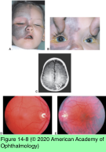
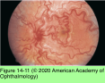
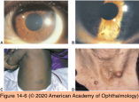
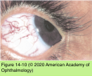
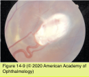
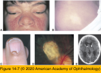

# 5.14.7. Systemic Conditions (VII): Inherited Disorders (II): Neurocutaneous Syndromes

## Images

## Hierarchy

- General
  - "phakomatoses"
  - phakoma
    - tumor formed from normal tissue elements
      - hamartoma
        - elements normally found at the involved site
        - not true neoplasms
          - lack the capability for limitless proliferation
      - choristoma
        - tumorlike growth composed of tissue not normally present at the site of growth
  - hamartomas involving different organ systems
    - skin
    - eyes
    - CNS
    - viscera
  - entities
    - neurofibromatosis (NF)
    - tuberous sclerosis (Bourneville syndrome)
    - cerebrofacial angiomatosis (Sturge-Weber syndrome)
    - retinal angiomatosis (von Hippel disease)
    - ataxia-telangiectasia (Louis-Bar syndrome)
    - Wyburn-Mason syndrome
    - Klippel-Trénaunay-Weber syndrome
- Cerebrofacial (encephalotrigeminal) angiomatosis
  - Sturge-Weber syndrome
  - sporadic
  - clinical manifestations
    - nevus flammeus (portwine stain)
      - angioma involving skin and subcutaneous tissues
      - follows the distribution of CN V
      - present from birth
      - usually unilateral
    - parieto-occipital leptomeningeal hemangioma
      - ipsilateral to the facial nevus flammeus
      - MRI will show leptomeningeal enhancement
      - calcification of the cortex underlying the hemangioma
        - CT scan is best for showing the calcification
    - unilateral congenital open-angle glaucoma
      - 30%–70%
        - seizures are a major problem
      - may occur at any time
      - usually associated with an angioma of upper eyelid
    - heterochromia iridis
    - choroidal hemangioma
      - yellow-orange, moderately elevated
      - “tomato ketchup” appearance
      - exudative retinal detachment
      - ≤50%
  - Klippel-Trénaunay-Weber syndrome
    - variant of cerebrofacial angiomatosis
    - nonocular findings
      - cutaneous nevus flammeus and hemangiomas
        - amenable to laser treatment
      - intracranial angiomas
      - varicosities
    - ocular findings
      - conjunctival telangiectasia
        - hemihypertrophy of the limbs
      - congenital glaucoma
      - uncommon
- Neurofibromatosis
  - von Recklinghausen neurofibromatosis (NF1)
    - more common
    - autosomal dominant
      - chromosome 17
    - clinical presentation
      - pigmented skin lesions
        - multiple cutaneous pigmented macules (café- au-lait spots)
      - iris (Lisch) nodules
        - pigmented iris hamartomas
        - do not become symptomatic
          - 94–97% of patients with NF1 >6 years
        - mild cases may show only iris nodules + café- au-lait spots
      - other ocular involvement
        - congenital glaucoma
        - retinal astrocytomas
        - osseous defects of the orbit
          - greater wing of the sphenoid
          - orbital encephalocele
      - osseous malformations
        - vertebral and long-bone defects
      - nervous system
        - tumors of the brain, spinal cord, and meninges
          - meningioma
        - tumors of the cranial, peripheral, and sympathetic nerves
          - neurofibromas
            - multiple
            - histologically benign
            - 2 types
              - fibroma molluscum
              - plexiform neurofibroma
            - may involve eyelid and face
        - optic nerve or chiasmal gliomas
          - children
          - proptosis
          - vision loss
      - pheochromocytoma
  - bilateral acoustic neurofibromatosis (NF2)
    - less common
    - café-au-lait spots or peripheral neurofibromas
      - 60%
    - Lisch nodules are not a feature of NF2
    - other CNS tumors may occur
      - bilateral acoustic neuromas
        - present symptomatically in young adulthood
      - not as frequently as in NF1
    - other ocular findings
      - combined retinal–retinal pigment epithelial hamartomas
      - posterior subcapsular cataracts
- Wyburn-Mason syndrome
  - sporadic
  - intracranial arteriovenous malformation (AVM)
    - sites
      - midbrain
      - basofrontal region
      - posterior fossa
    - spontaneous intracranial hemorrhage
    - convulsions
    - MRI scan of the brain should be obtained for patients with a retinal AVM
  - AVM of the ipsilateral retina (racemose angioma)
    - direct communications between the arteries and the veins without an intervening capillary bed
    - vessels are usually fully developed
      - increased in number, size, and tortuosity
    - may involve any part of the posterior pole
    - spontaneous hemorrhage
  - orbital AVMs
    - mild proptosis
    - conjunctival vascular dilation
    - bruit
  - AVMs of the maxilla, pterygoid fossa, or mandible
- autosomal dominant
  - chromosome 22
- Ataxia-telangiectasia
  - Louis-Bar syndrome
  - autosomal recessive
    - chromosome 11
    - progressive cerebellar ataxia
      - inactivation of a critical protein kinase that regulates response to DNA double-strand breaks
      - most common cause of progressive ataxia in early childhood
  - oculocutaneous telangiectasia
    - conjunctival telangiectasia
      - almost always observed, especially as the child ages
  - ocular motility deficits
    - horizontal and vertical supranuclear gaze palsies
      - inability to initiate saccades
        - head thrusting
        - abnormalities of the fast phase of OKN
      - impaired pursuit
      - total ophthalmoplegia
    - oculocephalic responses remain intact
  - thymic hypoplasia
    - defective T-cell function
      - immunodeficiency
        - high incidence of malignancy
        - recurrent sinopulmonary infections
    - immunoglobulin deficiency
- Tuberous sclerosis
  - Bourneville syndrome
  - autosomal dominant
    - 2 tuberous sclerosis genes
      - TSC1
        - chromosome 9q34
          - tuberin
      - TSC2
        - 16p13.3
          - hamartin
  - hamartomatous angiofibromas
    - adenoma sebaceum
      - form a heterodimer that inhibits cell growth and proliferation
    - butterfly distribution over the nose and cheeks
  - cognitive deficiency
    - many have normal mentation
  - epilepsy
    - most patients have seizures
  - other skin lesions
    - periungual fibromas
    - café-au-lait spots
    - shagreen patches
      - large, leatherlike, hyperpigmented, raised patches
      - located on the trunk
    - ash-leaf spot
      - leaf-shaped area of skin depigmentation
      - fluoresces under a Wood lamp
  - calcified astrocytic brain hamartomas
    - brain stones
      - pathognomonic for tuberous sclerosis
    - evident on plain skull x-ray and CT scan
  - cardiac rhabdomyomas
  - kidney
    - renal cysts
    - angiomyolipomas
  - astrocytic hamartomas of the retina or optic disc
- Retinal angiomatosis
  - von Hippel disease
  - genetics
    - autosomal dominant
    - sporadic
  - retinal capillary angioma
    - globular, smooth-surfaced, pink retinal tumor
    - fed by a single dilated, tortuous retinal artery and drained by a similar-appearing vein
    - often multiple
    - serous retinal detachment
  - CNS hemangioblastomas
    - cerebellar hemangioblastomas
      - von Hippel–Lindau disease
    - brainstem or spinal cord hemangioblastomas
      - may be associated with syrinxes
  - renal, pancreatic, hepatic, or epididymal cysts
  - pheochromocytomas
  - renal cell carcinoma
    - potentially lethal
- 50% bilateral
- 25%
