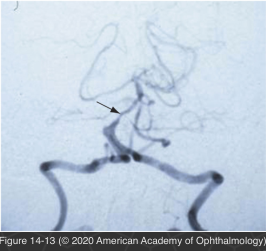

# 5.14.9. Systemic Conditions (IX): Cerebrovascular Disorders (I): Vertebrobasilar System Disease

## Images

## Hierarchy

- Transient Visual Loss
  - transient neurologic or ophthalmic symptoms in middle-aged/elderly patients suggest a vascular origin
  - ischemia
    - vertebrobasilar artery territory
    - carotid artery territory
  - major cause of death in these patients is coronary artery disease
  - control risk factors for cardiovascular disease
    - hypertension
    - diabetes mellitus
    - hyperlipidemias
    - cessation of smoking
- vertebrobasilar system (posterior circulation)
  - vertebral, basilar, and posterior cerebral arteries
- etiology
  - atheromatous occlusion
  - microembolization
  - fluctuations in cardiac output
  - hypertensive vascular disease (lacunar infarction)
  - arterial dissection
  - congenital aplasia or hypoplasia of a vertebral or posterior communicating artery
  - mechanical factors
    - cervical spondylosis
    - chiropractic manipulation of the cervical spine
  - subclavian steal
    - reversal of blood flow in the vertebral artery
    - caused by a proximal occlusion of the subclavian artery
  - vasospasm
  - polycythemia
  - hypercoagulable states
  - anemia
- clinical presentation
  - ocular motor and visual symptoms are prominent
    - supplies
      - occipital cortex
      - brainstem
    - cerebellum
  - visual symptoms
    - almost as frequently as vertigo
    - alone or in combination with the other symptoms of vertebrobasilar insufficiency
    - seconds to minutes
      - sudden bilateral blurring/dimming/graying/ whiting out of vision
    - repetitive
    - ± flickering or flashing stars
    - ± photopsia
      - closely mimicking the scintillating scotomata of migraine
    - migraine can produce similar symptoms, with or without an associated headache
    - visual field changes
      - homonymous visual field changes without other neurologic symptoms suggest involvement of the posterior circulation
      - highly congruous homonymous visual field defects without other symptoms are typical of occipital lobe infarcts
    - cortical blindness
      - bilateral occipital lobe lesions
        - reading difficulties without an obvious cause
          - perform visual field and Amsler grid examination
            - look for centrally located congruous homonymous visual field defects
      - amaurosis
      - normally reactive pupils
      - unremarkable fundus appearance
      - patients may deny their blindness
        - Anton syndrome
  - ocular motor disturbances
    - common with vertebrobasilar insufficiency
    - horizontal or vertical gaze palsies
      - diplopia is a frequent complaint
    - internuclear ophthalmoplegia
    - skew deviation
    - ocular motor cranial nerve palsies
    - nystagmus
    - ipsilateral, central Horner syndrome
      - pontine or medullary infarcts (Wallenberg syndrome)
  - nonophthalmic TIA
    - ataxia, imbalance, or staggering
    - vertigo + other brainstem symptoms such as deafness or vomiting
    - dysarthria and dysphagia
    - hemiparesis, hemiplegia, and hemisensory disturbances
    - drop attacks
      - patient suddenly falls to the ground with no warning and no loss of consciousness
- clinical and laboratory evaluation
  - neuroimaging
    - all patients with homonymous visual field defects and other signs of brainstem or cerebellar dysfunction
  - MRA and CTA are the best noninvasive methods
    - ± conventional angiography
  - carotid Doppler imaging
    - not sufficient for evaluating suspected posterior circulation symptoms
  - much less likely to find a treatable structural vascular abnormality with posterior circulation ischemia than with carotid system disease
  - search for underlying cardiac or systemic disorders
    - hypercholesterolemia
    - hypertension
    - diabetes mellitus
    - postural hypotension
    - ± echocardiography.
- treatment
  - antiplatelet therapy or anticoagulants
  - intravascular stent placement
    - in select patients with either carotid artery or vertebrobasilar stenosis
