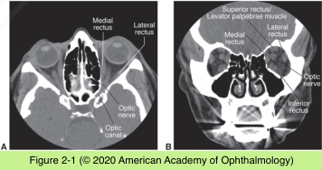
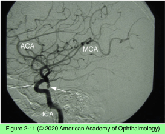

# 5.2.1. Neuroimaging in Neuro- Ophthalmology (I)

## Images

## Hierarchy

- General
  - most neuro-ophthalmic diseases are best assessed with MRI of the brain and orbit
    - contrast
    - fat-saturation techniques
  - If a vascular abnormality is suspected
    - magnetic resonance angiography (MRA)
    - magnetic resonance venography (MRV)
  - open communication between the ophthalmologist and radiologist
    - selecting the best imaging modality
      - prescriptive errors
    - interpreting the study results
      - interpretive errors
- Retinal and Nerve Fiber Layer Imaging
  - Heidelberg retinal tomography (HRT)
  - scanning laser polarimetry (GDx)
  - optical coherence tomography (OCT)
  - use laser or short coherence light
- CT contrast contains hydrogen
- Computed Tomography (CT)
  - uses computer (digital) processing to generate a 2- or 3-dimensional image from a series of 2-dimensional x-ray (sectional) images
  - by manipulating (“windowing”) the data, various structures can be visualized
  - fat provides excellent contrast to the globe, lacrimal gland, optic nerve, and extraocular muscles
  - bone and other calcium-containing processes can be visualized easily
  - soft-tissue details can be further enhanced by the injection of iodinated contrast material
    - crosses a disturbed blood–brain barrier to accumulate within a local lesion
      - reveals inflammatory and neoplastic processes
  - modern CT scanners
    - image the patient with simultaneous sectioning (ie, spiral or helical)
    - have multiplanar reconstruction capabilities
  - advantages of CT
    - relatively low cost
    - wide availability
    - excellent spatial resolution
    - rapid image acquisition
    - ability to identify acute blood
    - ability to identify bone abnormalities
    - See Table 2-1
      - especially useful in trauma
      - iodinated
        - similar to CT contrast
- Sonography
  - reflection of 8–20 MHz ultrasound waves at acoustic interfaces
  - advantages
    - inexpensive
    - quick
    - office-based
  - disadnantage
    - requires expertise in image acquisition and interpretation
  - carotid Doppler
    - accurate at detecting cervical carotid artery stenosis
    - does not provide information about more proximal or distal vessels
    - not accurate at detecting carotid artery dissection
  - orbital Doppler sonography
    - carotid-cavernous fistula
      - reversal of normally retrograde venous blood flow
  - orbital ultrasound
    - provides useful data concerning
      - optic nerve
      - muscle
      - vessels
  - globe ultrasound
    - to distinguish disc edema from optic nerve head drusen
      - does not provide accurate imaging of the orbital apex
- Computed Tomography Angiography and Computed Tomography Venography
  - Computed tomography angiography (CTA)
    - high-speed spiral scanner
    - excellent vessel resolution
    - 3-dimensional capability
    - complementary to MRA
    - employs ionizing radiation
      - requires use of iodinated contrast dye
    - takes ≈ 15 minutes
      - aneurysms >3 mm
        - accurately detects aneurysms >3–4 mm in almost all patients with CN III palsy
    - sensitivity
      - stenosis >70%
      - ≈ 95%
  - Computed tomography venography (CTV)
    - for visualizing the cerebral venous system
    - comparable to MRV
- Catheter or Contrast Angiography
  - gold standard for intracerebral vascular imaging
  - catheter is placed intra-arterially
    - iodinated radiodense contrast dye is injected
  - digital subtraction angiography (DSA)
    - reduces artifacts by subtracting densities created by the overlying bony skull
    - ability to visualize vascular structures with smaller amounts of contrast dye
  - demonstrates
    - stenosis
    - aneurysms
    - vascular malformations
    - flow dynamics
    - vessel wall irregularities
  - overall morbidity of approximately 2.5%
    - ischemia from emboli or vasospasm
    - dye-related reactions
    - complications at the arterial puncture site (eg, hematoma)
