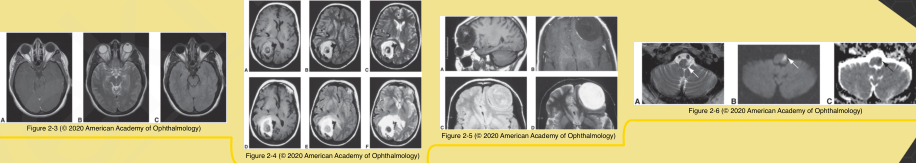
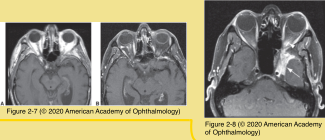
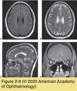
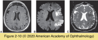

# 5.2.2. Neuroimaging in Neuro- Ophthalmology (II)

## Images

## Hierarchy

- Metabolic and Functional Imaging Modalities
  - Magnetic resonance spectroscopy (MRS)
    - integrity and metabolism of neural tissue
    - depends on the presence of
      - hydrogen
      - phosphorus
    - produces 5 principal spectra
      - N-acetylaspartate (NAA)
        - associated with neuronal integrity
        - decrease in NAA is associated with neuronal loss
      - choline
        - component of cell membranes
      - creatinine
        - relatively stable in the brain
        - can serve as an internal control
      - lactate
        - normally barely visible
      - lipid
        - not significant
          - marker of anaerobic metabolism
    - changes in the pattern of the spectra peaks are associated with different disease processes
      - can help characterize abnormalities detected initially on MRI
      - nonnecrotic brain neoplasm
        - reduced NAA peak
        - elevated choline peak
  - Functional MRI (fMRI)
    - mechanism
      - changes in regional blood flow in the brain in accord with metabolic demand
      - local differences in blood oxygenation (blood oxygenation level–dependent [BOLD] responses)
    - areas of higher metabolic activity can be identified during specific tasks
      - accurate visualization of the cortical areas involved in ocular motility
      - cortical retinotopy within the visual cortex
    - advantages (compared to PET)
      - less expensive
      - faster imaging speed
      - higher spatial resolution
      - practical repeatability
      - less invasive
    - applications
      - research
      - planning neurosurgical procedures
  - Positron emission tomography (PET)
    - uptake of short-lived radioactive isotopes is related to metabolic activity
    - radioisotope with a short half-life
      - fluorine (18F)
      - carbon (11C)
      - nitrogen (13N)
      - isotope uptake is related to metabolic activity
    - imaging of the positrons produced during isotope decay
    - usually combined with CT to enhance resolution
    - PET with [18F]-fluoro-2-deoxyglucose
      - increased visual cortex metabolism during ictal visual hallucinations
      - regions of hypoperfusion in cases associated with visual cortex ischemia
  - Single-photon emission computed tomography (SPECT)
    - cerebral perfusion and extraction agent
      - iodinated radiotracer
      - technetium-99m
      - reveal patterns of blood flow and cerebral metabolism
    - can be used to study
      - stroke
      - epilepsy
      - dementia
    - more widely available than PET
    - lacks sufficient resolution and specificity
    - may reveal altered regional cerebral blood flow in patients with cerebral visual impairment, even after nondiagnostic or normal MRI results
- Magnetic Resonance Imaging (MRI)
  - technique
    - atoms with odd number of nucleons (protons and neutrons)
      - hydrogen is the most common
        - MRI is sensitive to changes in water content of soft tissue
          - how the water is bound
          - how it moves within tissue
      - small magnetic moment (spinning magnetic field)
    - powerful magnetic field of an MRI scanner
      - magnetic moments of the hydrogen nuclei align in the field
    - radiofrequency (RF) pulses
      - transiently perturb the hydrogen nuclei, knocking their magnetic moments out of alignment
    - rate of relaxation (return to alignment with the scanner’s magnetic field) generates a tissue- specific signal
    - varying the RF pulses and the timing of signal recording
      - produces different types of images
    - 3-dimensional data set
      - can construct views in axial, coronal, sagittal, or even oblique planes
  - gadolinium
    - paramagnetic contrast agent
    - traverses a disrupted blood–brain barrier
      - infectious and inflammatory lesions
      - certain tumors with compositions indistinguishable from normal cortical tissue
    - systemic fibrosis syndrome
      - often involves the skin
        - patients with preexisting renal disease!
        - nephrogenic fibrosing dermopathy
  - T1- or T2-weighted images
    - each tissue type has a characteristic T1 and T2 relaxation time
    - T1-weighted images
      - short time to echo (TE)
        - 20–35 ms
      - short time to repetition (TR)
        - 200–700 ms
      - optimal for demonstrating anatomy
      - resolution is higher than T2-weighted images
        - increased intensity of the signal
        - faster acquisition times
    - T2-weighted images
      - long TE
        - 75–250 ms
      - long TR
        - 1500–3000 ms
      - maximize differences in tissue water content and state
      - the most sensitive to inflammatory, ischemic, or neoplastic alterations in tissue
    - See Table 2-2
    - See Table 2-3
  - special RF pulse sequences
    - are used to reduce intense signals
      - intense tissue signals obscure subtle signal abnormalities in neighboring tissues
    - short tau inversion recovery (STIR)
      - T1-weighted images without the confounding bright fat signal
        - "fat-suppression"
      - particularly useful in studying the orbit
    - fluid-attenuated inversion recovery (FLAIR)
      - T2-weighted images without the bright CSF signal
      - ideal for periventricular white matter changes in a demyelinating process
    - diffusion-weighted imaging (DWI)
      - sensitive to recent alterations in vascular perfusion
      - ideal for identifying recent infarctions
      - abnormal DWI signal occurs within minutes of the onset of cerebral ischemia
        - persists for ≈ 3 weeks
          - See Table 2-4
- oxygen (15O)
