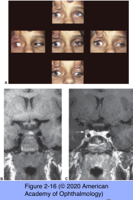
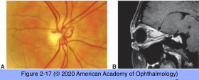
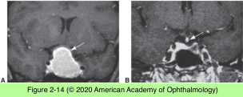
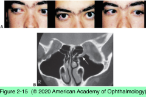

# 5.2.3. Neuroimaging in Neuro- Ophthalmology (III)

## Images

## Hierarchy

- Fundamental Concepts in Localization
  - first goal of neuro-ophthalmic evaluation is clinical localization of the lesion
    - See Table 2-5
- Negative Study Results
  - when an imaging study fails to demonstrate expected pathology
    - first step is to reexamine the study parameters
      - speaking directly with the radiologist
        - can provide the clinical information required to enhance the radiographic report’s accuracy and usefulness
      - ideally with a neuroradiologist
  - were the appropriate studies performed, including required sequences and orientations?
  - was the area of interest adequately imaged?
  - are the study results really negative?
- How to Order
  - provide pertinent clinical information to the radiologist
    - expected location of the pathology
    - suspected differential diagnosis
  - inappropriate images are often worse than no images at all
    - provide a false sense of security
    - create third-party–payer barriers to the required reimaging
- When to Order
  - information acquired by imaging should
    - have some influence on patient management
    - provide a more accurate prognosis of the disease’s natural history
    - not be available by simpler or less expensive means
  - transient visual phenomena without residual deficit
    - most frequently related to large-vessel disease
      - require assessment of the vascular structures
  - suspicion of a neoplastic mass lesion
    - order imaging study
  - optic neuropathy that is not otherwise clinically explained (decreased vision)
    - imaging of the course of the optic nerve
  - unilateral disc edema
    - anterior ischemic optic neuropathy (AION)
      - imaging not required in classic nonarteritic AION
    - papillitis (acute optic neuritis)
      - cerebral MRI
        - cerebral white matter signal abnormalities typical of multiple sclerosis
          - best demonstrated on
            - T2-weighted images
            - FLAIR images
      - specific orbital MRI sequences
        - postcontrast T1-weighted with fat saturation
        - T2-weighted
        - signal abnormalities within the affected optic nerve
      - CT scan has very limited value in demyelinating disease
    - intraorbital compression
  - central visual function is affected without disc edema
  - field defects respect the vertical midline
    - parachiasmal or retrochiasmal pathology
  - bitemporal visual field defects
    - chiasm or parasellar region
      - pituitary adenoma with suprasellar extension
      - meningioma
      - craniopharyngioma
      - chiasmatic glioma
      - aneurysm
      - metastases
      - chordomas
      - dysgerminomas
      - lymphomas
      - histiocytoses
      - epidermoids
      - Rathke cleft cysts
      - granulomatous inflammatory disease
        - most commonly vascular in origin
          - should be imaged unless clearly associated with a prior stroke syndrome
  - homonymous visual field defects
    - retrochiasmal visual pathway
  - binocular double vision
    - both CT and MRI may provide necessary information regarding the extraocular muscles
      - MRI is somewhat more sensitive to changes associated with inflammation or infiltration
      - CT delineates the size of the extraocular muscles well
        - particularly on direct (ie, not reformatted) coronal images
    - acute onset of isolated ocular motor cranial nerve palsy
      - most likely due to microvascular ischemia
        - especially
          - age >50 year
          - when associated with a history of diabetes mellitus, hypertension, or vascular disease
      - emergent imaging may not be required
    - pupil involving CN III palsy
      - requires immediate imaging
    - simultaneously occurring ocular motor cranial nerve palsies
      - especially when the fifth nerve is involved
      - cavernous sinus location is most likely
  - skew deviation
    - supranuclear lesion producing a vertical misalignment that does not fit the pattern of CN III or CN IV palsy
    - MRI of the posterior fossa should be obtained
  - pain associated with ptosis and miosis (Horner syndrome)
    - carotid artery dissection should be suspected
      - MRI/MRA
      - CT/CTA
      - through the carotid artery
  - conditions associated with negative imaging
    - AION (nonarteritic or arteritic)
    - eye pain in a patient with normal findings on neuro-ophthalmic examination
      - isolated microvascular ischemic ocular motor cranial neuropathy
- What to Order
  - MRI is usually more valuable than CT in detecting a lesion and narrowing the differential diagnosis
  - suspected large-vessel disease
    - MRA
    - CTA
    - digital angiography
  - imaging should be done of brain and orbits
    - orbital imaging provides details of the optic nerves and surrounding tissues that are often not detected with brain imaging alone
  - pathology localized to the orbit
    - either CT or MRI can provide useful information
    - orbital fat produces excellent contrast with the other orbital components on CT and MRI
    - direct coronal images are useful in most orbital disorders
      - with MRI, direct coronal imaging is not a problem
      - CT may require specific positioning (eg, neck extension)
    - MRI of the orbit should be done with fat- saturation techniques
