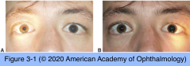
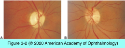
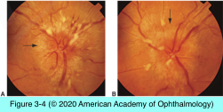

# 5.3.1. The Patient With Decreased Vision: Evaluation (I)

## Images

## Hierarchy

- Pupillary Testing
  - relative afferent pupillary defect (RAPD)
    - difference in pupillary responses after light stimulation of the right versus left eye
  - swinging flashlight test
    - most popular clinical method for detecting an RAPD
    - technique
      - patient stares into the distance
      - lights dimmed
      - examiner shines a bright focal light along the visual axis into 1 pupil for 2–3 seconds
      - rapidly swings the light to shine into the other pupil for 2–3 seconds
      - repeated 4–5 times
  - optic nerve disease
    - light stimulation of the affected eye will produce slower pupillary constriction of lower amplitude
    - RAPD is an extremely reliable and sensitive indicator of optic nerve dysfunction
      - absence of RAPD indicates
        - lack of an optic neuropathy
        - bilateral optic nerve involvement
  - retinal disease
    - require substantial retinal involvement to produce an RAPD
      - central retinal artery occlusion
      - retinal detachment
  - chiasmal lesions
    - may produce RAPD secondary to asymmetric optic nerve involvement
  - optic tract lesions
  - media opacities
    - cataract or vitreous hemorrhage
      - produce mild contralateral RAPD
        - each tract contains more crossed than uncrossed fibers
  - amblyopia
  - rare
- History
  - Unilateral Versus Bilateral Involvement
    - unilateral vision loss
    - bilateral vision loss
      - bilateral ocular
        - anterior to the chiasm
  - Time Course of Vision Loss
    - sudden onset (within minutes)
      - ischemic
        - chiasmal or retrochiasmal
      - patients may become acutely aware of chronic processes
    - rapid vision loss (over hours)
      - ischemic
    - over days to weeks
      - inflammatory
    - over months
      - toxic
    - over months or years
      - compressive
  - Associated Symptoms
    - globe tenderness/ipsilateral periorbital pain that increases with eye movement
      - optic neuritis
        - demyelinating disease
          - diplopia
          - oscillopsia
          - hemiparesis
          - hemisensory changes
    - nonspecific pain, facial numbness, or diplopia
      - orbital or cavernous sinus lesions
    - headache, jaw claudication, and systemic symptoms
      - giant cell arteritis
- Examination
  - Best-Corrected Visual Acuity (BCVA)
    - with refraction
    - Improvement with pinhole viewing indicates refractive component
      - worsening with pinhole viewing suggests retinal or lenticular contribution
    - visual acuity< 20/400
      - quantify BCVA using a standard 200 optotype E
        - the distance at which the patient discerns the letter orientation (e.g. “5/200”)
    - distance and near BCVA should be similar
      - better visual acuity at near
        - nuclear sclerotic cataract
        - better visual acuity at distance
          - macular disease
          - posterior subcapsular or polar cataracts
    - document the presence of
      - eccentric fixation
        - possible central scotoma
      - tendency to read half of the eye chart
        - possible hemianopic field defect
      - improvement in BCVA when reading single optotypes
        - possible amblyopia
- disc margins become sharper
- Fundus Examination
  - direct ophthalmoscopy
    - can screen for opacities/irregularities in the cornea, lens, or vitreous using the red reflex
    - clarity of the view suggests how much visual impairment the media opacities might cause
  - optic disc atrophy
    - damage to the retinal ganglion cells
      - from the cell bodies to their synapses at the lateral geniculate nucleus
    - optic disc pallor
      - takes ≥4–6 weeks
      - subtle pallor is appreciated only in relation to the normal fellow eye
        - difficult after unilateral cataract extraction
    - surface disc vascular net becomes thin or absent in early atrophy
    - dropout of the NFL fibers may precede visible optic atrophy
      - dark bands among normal striations
        - rake defects
        - normal translucent, glistening quality of the retina may disappear
          - dull red broad or fine radial patches
            - Figure 3-3
      - initially affect the superior and inferior arcades
  - optic disc edema
    - impaired axoplasmic flow
      - swelling of the unmyelinated nerve fibers
    - etiology
      - increased intracranial pressure
      - focal mechanical compression
      - ischemia
      - inflammation
    - clinical features
      - elevation of the nerve head
        - variable filling in of the physiologic cup
        - retinal vessels may appear to drape over the elevated disc margin
      - blurring of the disc margins
      - peripapillary NFL opacification
        - grayish white and opalescent with feathered margins
        - obscures portions of the retinal vessels
      - hyperemia and dilation of the disc surface capillary net
      - retinal venous dilation and tortuosity
      - peripapillary hemorrhages, exudates, or cotton-wool spots
      - retinal or choroidal folds or macular edema
- Color Vision Testing
  - optic nerve disease
    - color vision loss > visual acuity loss
      - an eye with 20/30 visual acuity but severe loss of color vision
      - persistent dyschromatopsia even after recovery of visual acuity
    - particularly demyelinating optic neuritis
  - macular disease
  - congenital dyschromatopsia
    - color vision loss = visual acuity loss
    - bilateral, symmetric color vision loss in men
  - most optic neuropathies manifest red-green defects
  - blue-yellow color defects
    - optic neuropathy
    - macular disease
    - glaucoma
  - pseudoisochromatic color plate
    - screens for congenital red-green color deficiencies
  - Hardy-Rand-Rittler (HRR) plates
    - can screen for tritan (ie, blue-yellow) defects as well as red-green defects
  - Lanthony tritan plates
    - can detect blue-yellow defects
  - Farnsworth panel D-15 test
  - Farnsworth-Munsell 100-hue test
    - requires a substantial amount of time
    - shortened version, using only 21 color chips
- may miss mild cases of acquired dyschromatopsia
