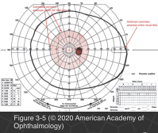
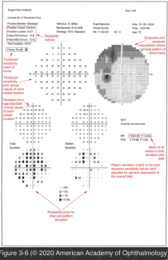

# 5.3.3. The Patient With Decreased Vision: Evaluation (III): Visual Field Evaluation (II): Perimetry

## Images

## Hierarchy

- General
  - more detailed evaluation of the visual field
  - types
    - static testing
      - stimuli turn on and off at designated points
    - kinetic testing
      - stimulus moves from a nonseeing to a seeing area
        - all points of equal sensitivity for a specific stimulus are connected to form an isopter
          - represents the outer limit of visibility for that stimulus
        - analysis of several isopters (plotted with different stimuli) produces a “contour map”
  - visual field is analyzed for areas of decreased sensitivity, in location and degree
- Tangent screen
  - patient seated 1 m from a black screen
  - patient fixates on a central white target
  - patient identifies targets moving in from the peripheral, nonseeing field along each radial meridian
  - used to map 1 or 2 isopters kinetically
  - targets
    - black wand with various-sized targets attached to the tip
    - focal light source such as a handheld laser pointer
- Automated static perimetry
  - advantages
    - less technician dependence
      - standardized testing conditions, which improve serial and inter-institutional comparisons of results
    - improved sensitivity
    - numerical data amenable to statistical analysis for comparisons and clinical studies
    - results amenable to electronic data storage
  - technique
    - uses static stimuli
      - similar in size to the standard Goldmann size III stimulus
    - randomly presents stimuli at predetermined locations within a specified region of the visual field
    - sensitivity threshold
      - stimuli vary in brightness
      - patient responses determine the minimum visible stimulus at each location
        - the dimmest target identified 50% of the time at a given location
  - testing the central 24° or 30° is typically adequate for detecting most visual defects
    - 80% of the visual cortex correlates to the central visual field
  - printout
    - threshold sensitivity plot
      - for each region tested, the printout displays the threshold value in decibels
        - measured values are not absolute numbers
        - a higher value at a certain point indicates that the patient is able to see a dimmer stimulus
          - do not have equivalence among perimeters
          - greater visual sensitivity at that point
      - deviation from age-adjusted normal values
        - probability plot for total deviation
    - total-deviation plot
      - optic neuropathy
        - causes substantial total deviation depression
        - few or no pattern deviation abnormalities
    - pattern-deviation plot
      - total deviation adjusted for the general depression of the ovarall field (refractive error, cataract)
        - determines the sensitivity values for all points shifted
          - compensates for the overall sensitivity depression
    - total-deviation probability plot
      - the statistical probability that the value falls outside the normal range as compared with age-matched control subjects
        - allows recognition of abnormal patterns
      - dark squares represent higher probability and lighter squares represent lower probability
    - pattern-deviation probability plot
    - grayscale map
      - symbolic representation of the threshold values
      - overall topographic impression of the visual field data
      - dark symbols for low-sensitivity points
      - lighter symbols for high-sensitivity points.
      - computer program interpolates between tested points to provide a user-friendly picture
  - reliability of perimetry test results
    - false-positive response rate
      - the patient signals when no light is displayed
      - <25% on threshold testing
      - <15% on SITA testing
    - false-negative response rate
      - the patient fails to signal when a target brighter than the previously determined threshold for that spot is displayed
      - <25%
      - incidence increases in regions of true visual field loss
    - fixation losses
      - the eye is not aligned with the fixation target
    - short-term fluctuation measurement
      - consistency of patient responses at specific points at which repeat testing is performed
  - global indices
    - mean deviation (MD)
      - center-weighted mean of all point sensitivity depressions from normal
        - based on total deviation plot
    - pattern standard deviation (PSD)
  - shorter version (FASTPAC)
    - reduces testing time of full-threshold test but at a cost of accuracy
  - Swedish interactive threshold algorithm (SITA)
    - shortens the time needed to complete the full- threshold test by half but maintains the accuracy and reliability
- Goldmann perimetry
  - uses kinetic and static techniques
  - evaluates the entire visual field
  - kinetic testing
    - stimuli of varying sizes and intensities
      - presented along each radial meridian from a peripheral to central location
      - 2 or 3 isopters are plotted
        - relative defects undetected using larger or brighter stimuli may become apparent using smaller or dimmer ones
  - static testing
    - examiner performs static testing within each isopter to identify scotomata
    - varying the stimulus size, intensity, and location can delineate the depths and borders of scotomata
  - requires a skilled and knowledgeable perimetrist
- the patient identifies the stimulus in the previously plotted physiologic blind spot location
