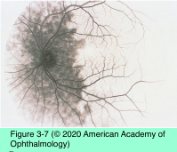
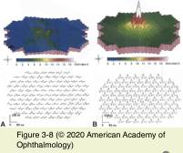

# 5.3.4. The Patient With Decreased Vision: Evaluation (IV): Adjunctive testing

## Images

## Hierarchy

- second positive (P2) peaks
- Contrast sensitivity
  - can detect and quantify vision loss in the presence of normal visual acuity
  - not specific for optic nerve dysfunction
    - media irregularities
    - macular lesions
  - interpreting contrast sensitivity test data is more complicated
  - 2 types
    - grating tests
      - rows of sine wave grating patches
        - each row reflects a different spatial frequency
      - contrast threshold
        - minimum contrast the patient can detect at each spatial frequency level
      - contrast sensitivity function (CSF)
        - graph of threshold versus frequency
        - represents the sensitivity of the central retinal region over a range of contrast levels
      - difficult to administer and to reproduce reliably
    - letter tests
      - single-size optotype with a gradually diminishing contrast level
      - low-contrast letters of decreasing size
- arguably superior to letter tests
- Photostress recovery test
  - to differentiate vision loss caused by macular lesion or ocular ischemia from optic neuropathy
    - maculopathy
      - prolonged recovery times
        - ≥ 90–180 seconds
    - severe carotid artery stenosis
  - technique
    - best-corrected visual acuity is measured
      - optic neuropathy
        - normal recovery times
          - <30 seconds
      - visual acuity must be ≥20/80
    - test monocularly
    - patient gazes directly x 10 seconds into a strong light held 2–3 cm from the eye
    - patient attempts to read the next larger Snellen visual acuity line above his BCVA
- Potential acuity meter
  - to determine if media irregularities or opacities are the cause of decreased vision
    - provides an estimate of best potential visual acuity
  - optotypes are projected onto the retina through a dilated pupil
  - 20/100 visual acuity that improves to 20/20 on PAM testing
    - probably does not require further testing
- Electrophysiologic testing
  - to evaluate central or peripheral vision loss in absence of obvious fundus abnormality
  - Visual evoked potential (VEP)
    - measures electrical signals at the scalp overlying the occipital cortex in response to a visual stimulus
    - light stimulus
      - checkerboard target
        - pattern reverses every half second
        - pattern size may also be varied
          - more quantifiable and reliable
            - smaller pattern sizes allow detection of smaller changes in function
        - for patients with poor vision who cannot easily see a pattern stimulus
      - flash stimulus
    - VEP waveform
      - initial negative peak (N1)
      - positive peak (P1, also known as P100)
      - second negative (N2) peak
    - clinical findings
      - damage anywhere along the afferent visual pathway can cause waveform abnormalities
      - P100 latency and, to a lesser degree, the amplitude are the most useful features
        - peak latencies are relatively consistent
      - demyelination of the optic nerve
        - increased latency of the P100 waveform
          - amplitude data are less consistent
        - no significant effect on amplitude
      - decreased amplitude, with less effect on latency
        - ischemic damage
        - compressive damage
      - unilateral abnormalities may reflect optic neuropathy
        - clinically useful in 2 situations
          - inarticulate patient
            - toxic damage
        - patient with suspected nonorganic disease
      - a normal response confirms intact visual pathways
        - isolated peripheral vision loss may yield normal VEP!
          - central visual field predominates in the occipital cortex!
      - an abnormal pattern response may indicate
        - damage to afferent visual pathway
        - a false-negative result
          - abnormal waveforms despite normal visual pathways
            - uncorrected refractive error
            - media opacities
            - amblyopia
            - fatigue
            - inattention (intentional or unintentional)
            - VEP has limited clinical usefulness
      - a consistently abnormal flash response reflects gross impairment
    - multifocal VEP (mfVEP)
      - to detect small abnormalities in optic nerve transmission
      - to provide topographic correlation along the visual pathway
  - Electroretinogram (ERG)
    - measures electrical activity of the retina in response to various light stimuli by electrodes embedded in a corneal contact lens
      - under different states of light adaptation
      - positive wave
    - full-field ERG
      - stimulating the entire retina with a light source
        - negative wave
      - electrical waveform
        - a-wave
          - photoreceptor layer
            - rod and cone responses can be separated by varying the stimuli and the state of retinal adaptation
        - b-wave
          - inner retina (probably Müller and ON-bipolar cells)
        - c-wave
          - RPE and photoreceptors
      - useful in detecting diffuse retinal disease in cases of generalized or peripheral vision loss
        - retinitis pigmentosa
        - cone–rod dystrophy
        - toxic retinopathies
        - retinal paraneoplastic syndromes
        - ERG is severely depressed by the time substantial vision loss has occurred
      - measures only a mass response of the entire retina
        - minor/localized retinal disease, particularly maculopathy, may not produce an abnormal response
          - even with severe visual acuity loss!
    - pattern ERG (PERG)
      - N95 component of the waveform
        - Ganglion cell activity
        - may detect subtle optic neuropathies
          - relatively normal in demyelination
            - if not atrophic!
          - abnormal in ischemia
    - multifocal ERG
      - ERG signals from up to 250 focal retinal locations within the central 30°
      - can detect occult focal retinal abnormalities in the macula (or more peripherally)
        - distinguishes between optic nerve and macular disease
          - signal generally remains normal in optic nerve disease
        - may detect focal retinal dysfunction too small to be measured by full-field technique
- Fluorescein angiography
  - to differentiate macular from optic nerve– related vision loss
    - macular disorders with subtle clinical signs
      - retinal capillary dropout
      - mild cystoid macular edema
      - minor collections of submacular fluid (eg, central serous retinopathy)
      - toxic maculopathies (eg, chloroquine)
      - early cone dystrophies
      - may become more evident on angiography
  - angiographic leakage can differentiate truly swollen optic nerve from pseudoedema of the disc
    - pseudoedema is characteristic of Leber hereditary optic neuropathy
  - may demonstrate delayed or absent choroidal filling
    - choroidal ischemia may strongly suggest giant cell arteritis
  - indocyanine green (ICG) angiography
    - may better assess choroidal blood flow and deep inflammatory lesions
- Optical coherence tomography
  - near-infrared light
  - 2- and 3-dimensional tomographic images
  - peripapillary RNFL thickness can be measured
    - compared with measurements in an age- matched, normative database
    - RNFL thickness can be monitored over time to quantify axonal loss
  - abnormally thick RNFL
    - true optic disc edema
      - repeat OCT measurements may reveal an increase in RNFL thickening over time
    - pseudoedema of the disc
