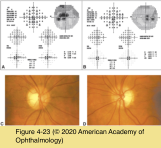
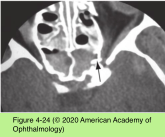

# 5.4.11. Patient With Decreased Vision: Classification & Management (XI): Posterior Optic Neuropathies (IV)

## Images

## Hierarchy

- Posterior ischemic optic neuropathy
  - rare
  - diagnosis of exclusion
  - clinical presentation
    - vision loss
      - abrupt
      - severe
    - RAPD
    - initially normal-appearing optic disc
  - 3 distinct scenarios
    - perioperative
      - spine, cardiac, and head or neck procedures
      - bilateral
      - profound
      - multifactorial
        - patient and perioperative factors
        - substantial blood loss, hypotension, and prolonged anesthesia time
          - some patients with PION lost < 500 mL of blood and had systolic blood pressure >90 mm Hg
    - arteritic
      - giant cell arteritis
    - nonarteritic
      - risk factors and clinical course similar to those of NAION
  - diagnostic workup
    - neuroimaging
      - patients with no history of previous surgery
    - GCA work-up in older individuals
  - treatment
    - high-dose corticosteroid treatment is indicated for cases of proven GCA
    - poor prognosis for vision recovery
- Toxic or nutritional optic neuropathy
  - clinical presentation
    - vision loss
      - gradual, progressive
        - more rapid onset may occur occasionally
      - painless
      - bilateral and symmetric
      - early
        - subtle depression of central visual sensitivity
          - Amsler grid testing
          - perimetry testing
          - within the central 10°
      - late
        - central scotoma
        - decrease in visual acuity and color vision
    - optic atrophy eventually develops
    - mild to moderate optic disc edema
      - rare
  - implicated medications
    - most common
      - ethambutol
      - isoniazid
      - linezolid
      - chloramphenicol
      - hydroxyquinolines
      - penicillamine
      - antineoplastic drugs
        - cisplatin
        - vincristine
    - methanol
      - rapid onset of severe bilateral vision loss with prominent disc edema
    - ethylene glycol
    - amiodarone
      - vision loss and disc edema
      - features differentiating from NAION
        - subacute onset
        - bilateral
        - diffuse rather than altitudinal visual field loss
        - slow resolution of optic disc edema over months
    - Interferon alpha
      - bilateral NAION
    - lead ingestion
      - in children
    - ethanol abuse
      - indirectly by causing malnutrition
    - dietary deficiencies
      - vitamin B12
      - folate
        - temporal optic atrophy similar to AD optic atrophy
      - thiamine
    - tobacco use
      - evidence is questionable
    - See Table 4-7
  - differential diagnosis
    - maculopathies
    - hereditary
    - compressive
    - demyelinating
    - infiltrative
      - optic neuropathies
  - diagnostic workup
    - diagnosis may be difficult, particularly with vague complaints and little objective abnormality
    - specific vitamin deficiencies are detected only infrequently on blood testing
    - neuroimaging
      - should be performed routinely to rule out a compressive etiology
  - treatment
    - stopping medication
    - replacement of dietary deficiencies.
  - prognosis
    - good if optic atrophy has not occurred
      - recovery is highly variable
        - occurs slowly over several months
- Optic Atrophy
  - nonspecific
    - chronic phase of any of the optic neuropathies
  - clinical presentation
    - vision loss
    - RAPD
    - optic atrophy
  - diagnostic workup
    - when historical features and clinical signs do not suggest a specific cause
    - level of optic nerve function
      - visual acuity
      - color vision
      - perimetry testing
    - degree and pattern of atrophy
      - fundus photography
        - stereoscopic views
      - retinal nerve fiber layer thickness
        - optical coherence tomography
    - neuroimaging
      - MRI of the brain and orbits
        - gadolinium contrast
        - fat suppression
      - rate of compressive lesions in patients with isolated optic atrophy
        - warranted in any case without a clear cause
        - 20%
    - low yield in screening for
      - syphilis
      - sarcoidosis
      - vasculitis
      - vitamin B12 deficiency
      - folate deficiency
      - metal toxicity
      - for patients without a history or findings suggestive of these specific diseases
        - in the appropriate clinical or historical setting, the clinician should pursue laboratory evaluation
  - treatment
    - observation
      - reasonable for patients with negative test results
      - reassess if the condition worsens or new findings develop
- most common
- Infiltrative optic neuropathy
  - etiology
    - granulomatous inflammation
      - sarcoidosis
      - syphilis
      - tuberculosis
      - fungal infections
    - lymphoma
    - metastasis to the optic nerve
      - rare
      - breast or lung carcinoma
    - carcinomatous infiltration of the meninges at the skull base
      - involvement of multiple cranial nerves
      - optic nerves involved in 15–40%
    - onset may precede, coincide with, or follow diagnosis of the underlying malignancy
  - clinical presentation
    - progressive, often severe, vision loss
      - progresses over days to weeks
    - 1 or both eyes
      - often associated with pain
    - ± other cranial nerve involvement
    - with retrobulbar infiltration, the optic nerve head may appear normal initially
    - optic disc cellular infiltrate creates a swollen appearance that may be distinct from that of simple optic disc edema
  - evaluation
    - MRI of the brain and orbits
      - indications
        - to rule out compressive lesions
        - to confirm pachymeningeal or meningeal infiltration
      - fat suppression
      - gadolinium contrast
      - ± diffuse thickening and enhancement of the dura and the surrounding subarachnoid space
      - abnormalities may not be visible in the early stages
    - serologic testing
      - myeloproliferative, inflammatory, and infectious disorders
    - CSF analysis
      - malignant cells, elevated white blood cell count, and elevated protein level consistent with a neoplastic, infectious, or inflammatory cause
      - sensitivity of a single lumbar puncture is low
        - repeat testing is often necessary
  - timely, correct diagnosis is essential
    - identification of associated malignancy or systemic disease may be life-saving.
    - in malignancies, palliative radiation therapy may substantially improve vision, even though the long-term prognosis is poor
      - median survival for meningeal carcinomatosis ranges from 4–9 weeks, even with aggressive therapy
    - in infectious or inflammatory disorders, antimicrobial or corticosteroid therapy may partially reverse damage
- Traumatic optic neuropathy
  - trauma to the head, orbit, or globe
    - direct optic nerve damage
      - optic nerve avulsion
      - laceration by bone fragments
      - laceration by foreign bodies
      - compressive optic neuropathy
        - intraorbital or intrasheath hemorrhage
    - indirect optic nerve damage
      - may occur with relatively minor head injury
      - trauma to frontal or maxillary bones
        - transmitted forces damage the optic nerve at the orbital apex
          - shear forces on the nerve and possibly its vascular supply at its intracanalicular tether point
  - clinical presentation
    - vision loss is typically immediate and often severe
      - 24%–86% no light perception vision at presentation
    - RAPD
    - optic disc usually appears normal at onset
      - becomes atrophic within 4–8 weeks
    - external evidence of injury may be scarce
  - management
    - neuroimaging
    - orbital or cranial surgery may be necessary
      - may not affect the prognosis for the optic nerve
    - therapy for indirect traumatic optic neuropathy is controversial
      - prognosis for vision recovery has been regarded as poor
        - numerous reports describe spontaneous recovery of some visual function in a significant number of cases
      - International Optic Nerve Trauma Study
        - no clear benefit for intravenous corticosteroids
      - study of more than 10,000 head-injury patients
        - no clear benefit for optic canal decompression
        - high-dose corticosteroid group had a higher rate of mortality than the placebo group
