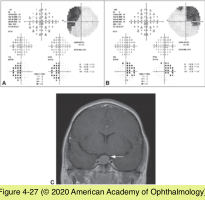
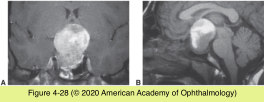
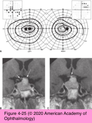
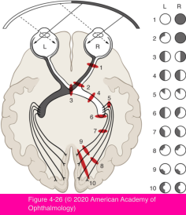
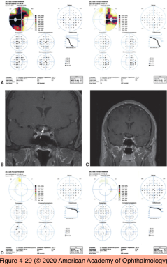

# 5.4.12. Patient With Decreased Vision: Classification & Management (XII): Chiasmal Lesions

## Images

## Hierarchy

- Introduction
  - optic disc appearance
    - optic discs appear normal initially
      - even with significant visual field loss!
    - ± increased disc cupping
      - with progressive damage, optic discs show typical atrophy
        - often temporal
    - chiasmal compression almost never produces optic disc edema
  - perimetry
    - gradually progressive, bilateral vision loss
      - often asymmetric!
      - peripheral (temporal) visual fields usually are involved first
  - RAPD
    - only with markedly asymmetric visual field loss
      - in any case of bilateral visual field loss, evaluate perimetry results for respect of the vertical midline
  - optic nerve disorders produce more central loss, with impaired visual acuity, dyschromatopsia, and an RAPD
- Visual Field Loss Patterns
  - junctional scotoma
    - lesions that injure an optic nerve at its junction with the optic chiasm
    - ipsilateral eye
      - central visual field loss
        - diminished visual acuity
    - opposite eye
      - temporal hemianopia
  - unilateral temporal hemianopia
    - the mass compresses only the crossing nasal fibers from 1 eye
    - no involvement of the visual field in the opposite eye
    - most common visual field defect of chiasmal compression
      - respects the vertical midline!
  - bitemporal hemianopia
    - relative or complete
    - may involve the paracentral temporal field alone
    - visual acuity is often unaffected until late
- Extrinsic lesions affecting the chiasm
  - etiology
    - pituitary adenoma
      - any adult age
        - most common cause of chiasmal compression
        - rare in childhood
      - may enlarge during pregnancy
      - types
        - nonsecreting tumors
          - present with vision loss
        - hormonally active tumors
          - present with systemic symptoms
      - pituitary apoplexy
        - acute hemorrhage or infarction of the pituitary tumor
        - clinical presentation
          - severe headache
          - nausea
          - extravasation of blood into the subarachnoid space
            - decreased level of consciousness
            - vasospasm with secondary stroke
          - acute endocrine abnormalities
            - adrenal crisis
          - neuro-ophthalmic findings
            - diplopia
              - dysfunction of CNs III, IV, V, and VI
                - CN III the most commonly affected
            - central visual loss to no light perception vision
            - visual field loss
          - sudden expansion of the tumor into the adjacent cavernous sinuses
        - treatment
          - recognition of pituitary apoplexy is crucial
            - potentially life-threatening!
          - immediate administration of corticosteroids
          - appropriate supportive measures
            - surgical decompression of the sella
              - conservative management when neuro- ophthalmic signs are absent or mild
    - parasellar meningioma
      - middle-aged women
      - arise most frequently from the tuberculum sella, planum sphenoidale, or anterior clinoid
      - asymmetric bitemporal vision loss
      - may enlarge and produce chiasmal compression during pregnancy
    - craniopharyngioma
      - may present at any age
        - second incidence peak in adulthood
      - arise superiorly
        - produce inferior bitemporal visual field loss
          - unlike pituitary tumors
    - parasellar internal carotid artery aneurysm
      - markedly asymmetric chiasmal syndrome
      - optic nerve compression on the side of the aneurysm
    - other CNS mass lesions
      - third-ventricle dilation
        - secondary posterior chiasmal compression
  - diagnostic workup
    - visual field and visual acuity testing
      - 2–3 months after treatment (baseline)
      - repeat at intervals of 6–12 months
    - periodic neuroimaging
  - treatment
    - methods
      - observation only
        - if visual fields are normal
      - surgery (transfrontal or transsphenoidal)
        - vision recovery is usually rapid
          - within 24 hours
        - vision recovery may be dramatic, even with severe vision loss
          - mean retinal nerve fiber layer thickness <75 μm is associated with poor visual prognosis
      - medical therapy
        - has a slower effect
          - bromocriptine or cabergoline for prolactin- secreting pituitary tumors
          - days to weeks
        - produces tumor shrinkage and improved visual function in responsive cases
      - radiation therapy
        - primary or as adjunctive therapy for incompletely resectable tumors
          - tumor recurrence
            - the first sign of recurrence may be vision loss
    - delayed vision loss after therapy for parasellar lesions
      - delayed radionecrosis of the chiasm or optic nerves
      - chiasmal distortion due to adhesions or secondary empty sella syndrome, with descent and traction on the chiasm
      - chiasmal compression from expansion of intraoperative overpacking of the sella with fat
- common in children
- Intrinsic lesions affecting the chiasm
  - infectious (eg, tuberculosis, Lyme disease)
  - inflammatory (eg, sarcoidosis, multiple sclerosis)
  - neoplasms can be either primary (eg, glioma) or secondary (eg, metastasis)
  - significant closed-head trauma
  - parasellar radiation therapy
