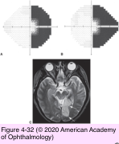
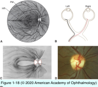
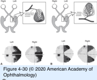
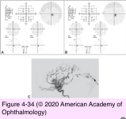
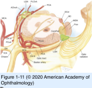
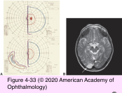
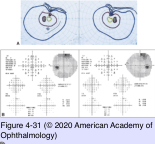

# 5.4.13. Patient With Decreased Vision: Classification & Management (XIII): Retrochiasmal Lesions

## Images

## Hierarchy

- Introduction
  - retrochiasmal visual pathway
    - crossed nasal fibers from the contralateral eye and uncrossed temporal fibers from the ipsilateral eye are located together
  - perimetry
    - homonymous visual field defects that respect the vertical midline
  - rule of congruity
    - anterior lesions
      - dissimilar (incongruous) defects
    - posterior lesions
      - progressively more similar (congruous) defects
    - “rule” of congruity has been called into question
      - 50% of optic tract lesions caused congruous homonymous hemianopia
      - lesions severe enough to produce complete hemianopic defects may occur at any anteroposterior retrochiasmal location
- Parietal Lobe
  - etiology
    - stroke
      - most common
  - visual field defects
    - homonymous hemianopia
      - hemifields contralateral to the lesion
    - inferior
      - parietal lobe lesions involve superior fibers first
        - more extensive lesions also involve superior visual fields but remain denser inferiorly
  - parietal lobe syndromes
    - perceptual problems (agnosia)
    - apraxia
    - dominant parietal lobe
      - Gerstmann syndrome
        - acalculia
        - agraphia
        - finger agnosia
    - nondominant parietal lobe
      - contralateral neglect
        - left-right confusion
    - reduced optokinetic nystagmus (OKN)
      - pursuit pathways converge in the posterior parietal lobes (near the visual radiations)
        - asymmetry in the pursuit system likely indicates involvement of area V5 or MT
      - elicit the impaired OKN response by moving targets toward the affected side
      - homonymous hemianopia should prompt OKN testing
        - lesions of optic tract or occipital lobe do not affect the OKN response
- Optic Tract
  - etiology
    - mass lesions (aneurysms)
      - most common
    - inflammatory and demyelinating lesions
      - occasionally
    - ischemic lesions
      - uncommon
      - surgical disruption of the anterior choroidal artery
  - visual field defect
    - incongruous
    - homonymous
    - hemianopia
      - hemifields contralateral to the lesion
  - other findings of optic tract syndrome
    - “bow-tie” optic atrophy
      - optic tract consists of
        - crossed nasal fibers from the contralateral eye
          - papillomacular fibers
          - nasal radiating fibers
          - causing atrophy in the corresponding nasal and temporal horizontal portions of the disc
        - uncrossed arcuate temporal fibers from the ipsilateral eye
          - enter the disc at the superior and inferior poles
          - causing atrophy in the corresponding superior and inferior portions of the disc
    - mild RAPD in the contralateral eye
      - more crossed than uncrossed pupillary fibers in the optic tract
- Occipital Lobe
  - visual fibers approaching occipital lobe become more congruous
    - central fibers course to the occipital tip
    - peripheral fibers course to the anteromedial cortex
      - some peripheral nasal fibers are not matched with corresponding uncrossed fibers
        - 60°–90°
          - monocular “temporal crescent”
    - visual fibers localize within the occipital cortex superior and inferior to the calcarine fissure
  - visual field defects
    - congruous homonymous hemianopia
      - ± sparing the fixational region (macula- sparing)
        - stroke involving the posterior cerebral artery
        - tip of the occipital lobe receives a dual blood supply
          - posterior cerebral artery
          - middle cerebral artery
      - homonymous paracentral hemianopic scotomata
        - systemic hypoperfusion
          - damages the occipital tip
            - watershed area
            - may be the only injured area
          - most commonly after surgery or other episodes involving blood loss with severe hypotension
    - monocular defect of the contralateral temporal crescent
      - lesion involving only the most anterior portion of the occipital lobe
    - homonymous hemianopia sparing the temporal crescent in the eye contralateral to the lesion
      - Goldmann perimetry is required
    - homonymous hemianopia that respects both the vertical and horizontal meridians
  - associated neurologic findings
    - most occipital lobe lesions encountered by ophthalmologists result from stroke
      - cause no other neurologic deficits
    - cortical blindness from bilateral occipital lobe destruction
      - normal pupillary responses
      - normal optic nerve appearance
        - distinguish cortical blindness from total blindness caused by bilateral prechiasmal or chiasmal lesions
    - Anton syndrome
      - denial of blindness
        - bilateral occipital lobe lesions occasionally permit some residual visual function
      - can be due to a lesion at any level of the visual system severe enough to cause blindness
    - Riddoch phenomenon
      - perceive moving targets but not static ones
      - may also occur with lesions in other parts of the visual pathway
    - unformed visual hallucinations
      - disturbances of the primary visual cortex
        - tumors
        - migraine
        - drugs
    - formed visual hallucinations
      - lesions of the extrastriate cortex or temporal lobe
- Lateral Geniculate Body (LGB)
  - highly organized and layered retinotopic structure
  - highly localizing visual field defects
    - disruption of anterior choroidal artery
      - branch of the middle cerebral artery
      - loss of the upper and lower homonymous quadrants
        - with preservation of a horizontal wedge
        - “quadruple sectoranopia”
    - disruption of posterior lateral choroidal artery
      - branch of the posterior cerebral artery
      - very congruous horizontal sectoranopia
  - visual field defects respect the vertical meridian
    - unlike the uncommon wedge defect observed in glaucoma
  - very incongruous homonymous hemianopias can also occur
  - sectoral optic atrophy
- Temporal Lobe
  - optic radiation
    - inferior fibers course from the LGB anteriorly in the Meyer loop of the temporal lobe
      - 2.5 cm from the anterior tip of the temporal lobe
        - damage to temporal lobe anterior to the Meyer loop does not cause visual field loss
    - superior fibers course more directly posteriorly in the parietal lobe
      - homonymous hemianopic defects extending inferiorly
  - visual field defects from lesions of Meyer loop
    - homonymous hemianopia
      - hemifields contralateral to the lesion
    - superior
      - pie in the sky
    - incongruous
      - spare fixation
  - etiology
    - temporal lobe tumors
      - common cause of visual field loss
      - neurologic findings of temporal lobe lesions
        - seizure
          - formed visual hallucinations
    - surgical excision of seizure foci
- Visual Rehabilitation
  - patients with homonymous hemianopia or quadrantanopia may benefit by referral to a vision rehabilitation specialist
  - visual scanning techniques
    - encourage frequent exploratory saccades toward the blind hemifield
  - orientation and mobility training
    - help the patient manage daily tasks
  - prisms
    - compensate for visual field loss
- olfactory
