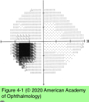

# 5.4.1. Patient With Decreased Vision: Classification & Management (I): Retinopathy (I)

## Images

## Hierarchy

- Ocular Media Abnormality
  - irregularities/opacities of the ocular media
    - reduce visual acuity
    - ± cause generalized reduction of sensitivity on automated perimetry testing
    - do not affect pupils, color vision, or the appearance of the posterior pole
- Vitamin A Deficiency
  - predisposing conditions
    - malnutrition
    - malabsorption
    - liver disease
    - zinc deficiency
      - cofactor in the conversion of retinol to 11-cis- retinal
  - clinical presentation
    - nyctalopia
    - peripheral visual field loss
    - ± central vision loss
    - xerosis
    - conjunctival Bitôt spots
    - keratomalacia
  - dramatic recovery with treatment
    - vitamin A supplementation
    - treatment of any underlying systemic disorder
- Retinopathy
  - clinical presentation
    - decreased visual acuity
    - central visual field loss
      - focal and central
        - optic nerve disease: visual field defects are larger, often cecocentral, and part of a generalized field depression
    - variable color vision loss
      - color vision loss = visual acuity loss
        - optic nerve disease: color vision loss > visual acuity loss
    - metamorphopsia
      - almost never in optic neuropathy
  - diagnostic workup
    - OCT
      - absent relative afferent pupillary defect (RAPD)
    - fluorescein angiography
    - multifocal electroretinography (mfERG)
  - maculopathies/retinopathies mistaken for optic nerve disease
    - acute idiopathic blind-spot enlargement
      - overlaps with multiple evanescent white dot syndrome
    - cone dystrophy
    - cancer-associated retinopathy (CAR) and melanoma-associated retinopathy (MAR)
    - central serous retinopathy
    - cystoid macular edema
    - acute zonal occult outer retinopathy (AZOOR)
  - See Table 4-1
- AIBSE
- Paraneoplastic Syndromes
  - Cancer-associated retinopathy (CAR)
    - symptoms
      - photopsia
      - impaired dark adaptation
        - nyctalopia
      - dimming
      - peripheral and/or central visual field loss
        - ring scotoma
      - often (50%) before the underlying malignancy is identified
      - progressively worsen over weeks to months
    - etiology
      - small cell lung carcinoma
      - other lung tumors
      - breast cancer
      - uterine cancer
      - cervical cancer
    - funduscopy
      - initially normal
        - attenuated retinal arterioles
      - late
        - thinned and mottled RPE
        - optic disc atrophy
    - ERG
      - markedly reduced amplitudes
        - both a- and b-waves
        - both rods and cones affected
    - pathogenesis
      - tumor expresses an antigen homologous to 23-kDa retinal photoreceptor protein
        - recoverin
          - calcium-binding protein
      - circulating autoantibodies against the tumor- associated antigen
        - cross-react with retinal recoverin
          - immune-mediated degeneration of rods and cones
          - • CaR = Cone + Rod ; ReCoverin • maR = Rod
    - treatment
      - corticosteroids
        - treatment of inciting tumor has an unclear effect on retinal function
      - plasmapheresis
      - intravenous immunoglobulin
        - prognosis for vision is poor
          - vision loss is typically severe
  - Melanoma-associated retinopathy (MAR)
    - extremely rare
    - etiology
      - previously diagnosed melanoma
        - investigation often reveals recurrence or metastasis
      - involves rod bipolar cells
    - symptoms
      - photopsia
        - • CaR = Cone + Rod ; ReCoverin • maR = Rod
      - nyctalopia
      - prominent peripheral visual field loss
        - CAR affects rods and cones
          - CAR with auto-antibodies against alpha-enolase affects cones
      - develop rapidly over weeks to months
        - visual acuity, color vision, and the central visual field are often initially normal
        - may have a sudden onset
      - bilateral
    - fundus
      - may appear normal
      - may show
        - RPE irregularity
        - retinal arteriolar attenuation
          - MAR
        - optic disc pallor
    - diagnostic workup
      - full-field ERG
        - rod dysfunction
          - MAR affects rod function !
        - negative ERG waveform
          - similar to CSNB
            - similar to Duchenne muscular dystrophy
      - mfERG
        - relatively preserved
          - mfERG measures photopic (cone) responses
    - prognosis
      - visual function may remain stable and nonprogressive
        - unlike CAR!
    - treatment
      - no treatment has proven effective
      - intravenous immunoglobulin
- Acute Idiopathic Blind-Spot Enlargement (AIBSE)
  - differential diagnosis of enlarged blind spot
    - optic disc edema
    - optic disc tilting
  - clinical presentation
    - AIBSE
      - symptoms
        - monocular scotoma
          - temporal location
      - funduscopy
        - ± normal
          - photopsias
            - reflects disease of the outer retina
        - may show
          - disc edema
          - peripapillary retinal lesions
          - choroiditis
          - retinal pigment epithelium (RPE) changes
          - uveitis
    - multiple evanescent white dot syndrome (MEWDS)
      - photopsia
      - retinal white spots
        - small
        - deep
        - posterior retina
        - resolve spontaneously
          - last weeks
    - ±RAPD
  - diagnostic workup
    - perimetry
      - enlargement of the blind spot
    - mfERG
      - peripapillary depression
    - spectral domain OCT
      - peripapillary attenuation of outer retina
    - fluorescein angiography
      - early wreathlike hyperfluorescence and late staining
    - ICG angiography
      - peripapillary hypofluorescent lesions
        - correspond to the enlarged blind spot
    - full-field ERG
      - depressed a-waves
      - substantial intereye asymmetry
  - prognosis
    - good visual prognosis
- Hydroxychloroquine and Chloroquine Retinopathy
  - risk factors
    - duration of use > 5 years
    - cumulative dose
      - 1000 g (hydroxychloroquine)
      - 460 g (chloroquine)
      - 400 mg (hydroxychloroquine) or
        - <6.5 mg/kg/day
          - <5 mg/kg/day is safer
    - daily dose
      - 250 mg (chloroquine)
        - <3 mg/kg/day
    - older age (>60 years)
    - kidney or liver dysfunction
    - preexisting macular disease
  - revised screening recommendations (2011)
    - baseline evaluation within 1 year of beginning treatment
    - annual examinations after 5 years of treatment
      - dilated fundus examination
      - automated, white 10-2 threshold perimetry
      - 1 or more of the following 3 objective tests
        - spectral domain OCT (to detect parafoveal outer retinal attenuation)
        - multifocal ERG (to detect parafoveal depressed amplitudes)
        - fundus autofluorescence (to detect parafoveal increased autofluorescence)
        - detect toxicity before fundus abnormalities become visible
    - fundus photography, Amsler grid testing, and color vision testing no longer recommended
- Cone Dystrophy
  - symptoms
    - gradually progressive decline in visual acuity and color vision
      - any age
      - bilateral
    - photophobia
    - hemeralopia (“day blindness”)
  - clinical presentation
    - funduscopy
      - early stages
      - late stages
        - macular RPE becomes atrophic in a central oval region
          - “bull’s-eye” pattern
            - similar to that observed in late chloroquine- induced maculopathy
  - diagnostic workup
    - fluorescein angiography
    - fundus autofluorescence
      - highlight these abnormalities before they become clinically apparent
    - full-field ERG
      - may be normal initially
      - eventually shows markedly depressed photopic (cone) response and less prominently affected scotopic (rod) response
    - multifocal ERG
      - central depression
    - OCT
      - thinning of outer macular layers
