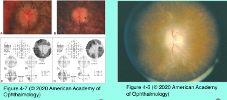
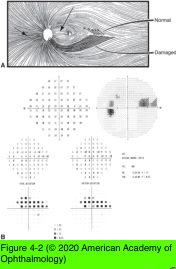
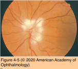
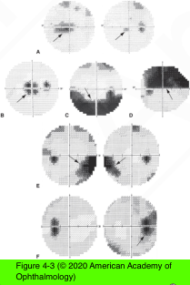
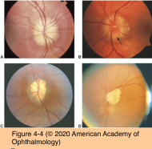

# 5.4.2. Patient With Decreased Vision: Classification & Management (II): Optic neuropathy (I)

## Images

## Hierarchy

- Chronic papilledema
  - months to years
  - bilateral
    - RAPD if asymmetric
  - optic nerve function may deteriorate in patients with chronic papilledema
  - clinical presentation
    - pale disc
    - gliosis of peripapillary NFL
      - grayish, less “fluffy” and more membranous
      - follows retinal vessels (vascular sheathing)
    - optociliary shunt vessels (retinochoroidal collaterals)
      - preexisting venous channels on disc surface dilate in response to chronic CRVO from elevated ICP
      - dive deep into the choroid immediately adjacent to the disc
      - enlarge over time
    - refractile bodies of the disc
      - chronic lipid-rich exudation
      - smaller than drusen
      - noncalcified
      - on the disc surface
        - rather than within its substance
      - clustering at the disc margin
      - disappear as papilledema resolves
  - perimetry
    - • nasal field loss
    - • arcuate scotomata
    - • generalized peripheral depression
    - central visual field involvement does not occur until late
  - references
- Acute papilledema
  - papilledema
    - edema of the optic nerve head from increased intracranial pressure (ICP)
  - etiology
    - intracranial mass
    - hydrocephalus
    - central nervous system (CNS) infection
    - infiltration by a granulomatous or neoplastic process
    - cerebral venous thrombosis
    - pseudotumor cerebri
  - symptoms
    - headache
    - nausea, and vomiting
    - transient visual obscurations
      - unilateral or bilateral
      - x seconds
      - occurring with orthostatic changes
  - clinical presentation
    - ophthalmoscopic features
      - disc hyperemia
        - dilation/telangiectasia of disc surface and radial peripapillary vessels
      - edema of peripapillary retinal NFL
        - grayish white and opalescent
        - feathered, striated margins
        - obscures the disc edge
        - obscures retinal vessels coursing through it
        - starts at superior and inferior poles
          - involves nasal disc margin
            - involves the entire optic disc
              - c-shaped area of disc edema with the opening along the temporal rim
          - early papilledema
      - disc and retinal
        - cotton-wool spots
        - exudates
        - hemorrhages
      - late findings
        - absence of the physiologic cup
        - obscuration of vessels on the disc itself
      - absence of spontaneous venous pulsations
        - may reflect increased ICP
        - 20% of general population does not have spontaneous venous pulsations
          - disappearance after prior documented presence suggests ICP elevation
      - indistinguishable from disc edema resulting from other causes
    - normal pupillary responses
    - normal visual acuity and color vision
    - visual fields demonstrate enlarged blind spot
  - pseudopapilledema
    - findings suggesting true acquired disc edema
      - hyperemia
      - microvascular abnormalities on the disc surface (telangiectasis, flame hemorrhages)
      - opacification of the peripapillary retinal NFL
    - optic disc drusen
    - hyaloid remnants/glial tissue on disc surface
    - congenital “fullness” of the disc
      - entry of optic nerve into the eye through a relatively small scleral canal
    - disc fullness associated with hyperopia
    - vitreopapillary traction
    - myelination of the NFL
      - typically occurs at the disc margin
      - obscures the disc–retina border
      - obscures the retinal vessels
      - results in a feathered edge
      - dense, white opacity
        - compared with the partially translucent, grayish white appearance of true edema
  - diagnostic workup
    - suspicion of papilledema warrants urgent neuroimaging
    - CSF opening pressure and composition
      - if normal imaging
- Visual Field Patterns in Optic Neuropathy
  - papillomacular fibers
    - cecocentral scotoma
      - See Table 4-2
    - paracentral scotoma
    - arcuate scotoma
      - central scotoma
      - nerve fiber bundle defect
  - arcuate fibers
    - altitudinal defect
      - broader region of arcuate fibers
    - nasal (step) defect
      - temporal portion of arcuate fibers
    - align along the temporal horizontal retinal raphe
      - defects do not cross the nasal horizontal meridian
  - nasal radiating fibers
  - blind-spot enlargement
    - optic disc edema of any cause
      - displacement of peripapillary retina
      - Figure 4-3 Patterns of visual field loss in optic neuropathies. A, Cecocentral scotoma (left; arrow); paracentral scotoma (right; arrow). B, Central scotoma (arrow). C, Arcuate scotoma (arrow). D, Broad arcuate (altitudinal) defect (arrow). E, Nasal arcuate (step) defects (arrows). F, Enlarged blind spot (arrow). (Parts E, F courtesy of Anthony C. Arnold, MD.)
- temporal wedge defect
