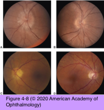

# 5.4.4. Patient With Decreased Vision: Classification & Management (IV): Optic neuropathy (III): AION

## Images

## Hierarchy

- Anterior ischemic optic neuropathy (AION)
  - See Table 4-4
  - most common acute optic neuropathy in patients >50
  - painless monocular vision loss
    - over hours to days
    - ± decreased visual acuity
    - visual field loss always occurs
      - altitudinal/arcuate defects are most common
  - RAPD is present
  - optic disc edema develops at onset
    - may precede the vision loss
- Nonarteritic anterior ischemic optic neuropathy (NAION)
  - epidemiology
    - relatively younger patients
      - 90%–95% of AION cases
      - mean age, 60 years
    - annual incidence
      - 80/100,000
  - pathogenesis
    - area of infarction is located within the scleral canal alone
      - compromised optic disc microcirculation in eyes with structural “crowding” of the disc
  - clinical presentation
    - visual impairment upon awakening
      - course
        - static
          - vision loss is stable
        - progressive
          - episodic, stepwise decrements
          - steady decline
          - over weeks to months
          - 22%–37%
          - recurrent episodes of vision loss in the same eye after 3 months are unusual
            - up to 6.4%
            - occurring most often in young patients
      - vision loss is usually less severe
        - visual acuity >20/200 in >60%
    - visual field loss
      - most common pattern is altitudinal
    - optic disc edema
      - diffuse or segmental
      - hyperemic or pale
      - optic disc in contralateral eye is typically small with small/absent physiologic cup (“disc at risk”)
      - optic disc atrophy
        - within 6–8 weeks
          - persistence of edema suggests an alternative diagnosis
    - 5-year risk of contralateral eye involvement
      - 15%
      - “pseudo–Foster Kennedy syndrome,”
        - previously affected disc is atrophic and currently involved disc is edematous
          - in contrast to true Foster Kennedy syndrome, both eyes show visual field loss
    - no systemic symptoms
      - structural crowding of the disc (disc at risk)
  - risk factors
    - systemic hypertension
    - diabetes mellitus (particularly in young patients)
    - hyperlipidemia
    - ± associated but currently unproven
      - hypercoagulable/prothrombotic disorders
      - carotid occlusive disease
      - sleep apnea
      - nocturnal hypotension
      - phosphodiesterase inhibitors
        - eg, sildenafil
  - differential diagnosis
    - optic neuritis
      - contrast-enhanced MRI
        - optic nerve appears normal in NAION (95%)
        - optic nerve enhances with use of gadolinium (90%) in optic neuritis
      - See Table 4-5
  - untreated NAION generally remains stable after reaching the low point of visual function
    - improvement of at least 3 lines of Snellen visual acuity was reported in 31% of patients after 2 years
  - treatment
    - no proven therapy
    - optic nerve sheath fenestration
      - not beneficial
    - neuroprotective drugs
      - beneficial effects against secondary neuronal degeneration in animal models
    - oral prednisone
      - 80 mg daily for 2 weeks
        - slow taper over several weeks
      - remains controversial
        - improvement in visual acuity and visual fields only among patients with visual acuity of ≤20/70
    - no proven prophylaxis for the fellow eye
    - aspirin
      - proven effect in reducing the risk of secondary stroke
      - unproven role in reducing the risk of fellow eye NAION
- Arteritic anterior ischemic optic neuropathy (AAION)
  - epidemiology
    - 5%–10% of AION cases
    - older patients
      - mean age, 70 years
  - pathogenesis
    - inflammatory and thrombotic occlusion of short posterior ciliary arteries
  - systemic symptoms of GCA
    - headache
    - scalp tenderness
    - malaise
    - anorexia
    - weight loss
    - fever
    - jaw claudication
      - most specific symptom
      - masseter muscle pain or fatigue that occurs with prolonged chewing
        - resolves over minutes after stopping chewing
    - usually present
  - occult GCA
    - 20% of patients with AAION
    - elevated ESR without systemic symptoms
    - normal ESR in the presence of systemic symptoms
  - clinical presentation
    - vision loss is typically severe
      - visual acuity <20/200 in >60%
      - no light perception vision should prompt an aggressive evaluation for GCA
      - transient vision loss preceding AION may indicate GCA
    - funduscopic clues to a diagnosis of AAION over NAION
      - chalky white optic disc edema
        - in NAION the disc is often hyperemic
      - cotton-wool spots away from the optic disc
        - cotton-wool spots on or adjacent to the optic disc can be present in NAION
      - delayed choroidal filling on fluorescein angiography
        - normally, the choroid fills completely within 3– 5 seconds, before retinal arteries
      - normal or large cup in the fellow eye
        - in NAION, a small cup–disc ratio is common
  - management
    - high-dose corticosteroid therapy
      - intravenous methylprednisolone
        - 1 g/day for the first 3–5 days
      - oral prednisone
        - 1 mg/kg/d
          - ≤100 mg/day
        - taper slowly over ≥3–12 months
          - risk of recurrent or contralateral optic nerve involvement during corticosteroid withdrawal
            - 7%
            - recurrent symptoms or elevation of ESR should prompt reevaluation
        - alternate-day corticosteroid therapy is inadequate for AAION
    - ± adjunctive daily aspirin
    - major goal of AAION therapy is to prevent contralateral vision loss
      - confirmational temporal artery biopsy may be delayed for 7–10 days
      - untreated, the fellow eye becomes involved in ≤95% of cases
        - within days to weeks
  - prognosis
    - recovery does not generally occur
    - initially affected eye may improve somewhat
