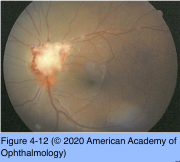
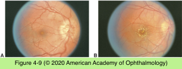
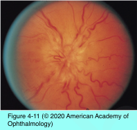
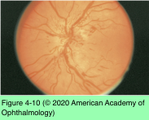

# 5.4.5. Patient With Decreased Vision: Classification & Management (V): Optic neuropathy (IV)

## Images

## Hierarchy

- more common
- Optic neuritis
  - types
    - retrobulbar
      - normal optic disc appearance
    - papillitis
      - 1/3
      - disc edema
        - hyperemic
        - diffuse
      - papillitis more common in postviral & infectious neuritis than in demyelinating neuritis
      - children, in particular, manifest postviral optic neuritis and papillitis
        - bilateral profound vision loss
  - in adults, the management of optic neuritis is similar with or without optic disc edema
  - Optic Neuritis Treatment Trial
    - MS did not develop in patients who had normal MRI findings and severe papillitis, peripapillary hemorrhages, or retinal exudates
- Anterior orbital compressive or infiltrative lesions
  - Compressive
    - etiology
      - anterior orbital mass
      - compressive lesions at the orbital apex may or may not result in disc edema
    - clinical presentation
      - optic disc edema
      - may occasionally lead to CRVO
        - ± optociliary shunt vessels (retinochoroidal collaterals)
  - Infiltrative
    - etiology
      - inflammatory
        - focal granulomatous infiltration
          - focal nodule on the disc surface
      - infectious
      - neoplastic
    - clinical presentation
      - optic disc edema
      - ± visible prelaminar cellular infiltrate (diffuse or focal)
        - grayish or yellowish discoloration
          - denser and more opaque than in nonspecific edema
    - diagnostic workup for an infiltrative lesion
      - indications
        - edema and vision loss persist or progress in an atypical way
        - prelaminar infiltrate is visible
- Neuroretinitis
  - clinical presentation
    - acute loss of vision associated with disc edema and a star pattern of exudates in the macula
    - diffuse disc edema
      - spreads through the outer plexiform layer along the papillomacular bundle and around the fovea
      - as the fluid resorbs, lipid precipitates in a characteristic radial pattern in Henle layer
        - macular star
          - can appear at initial presentation or several days later
    - ± mild vitritis
    - ± choroidal lesions
  - etiology
    - patients with neuroretinitis do not have an increased risk of multiple sclerosis
    - cat scratch disease
      - most common cause of neuroretinitis
      - elevated IgM titers for Bartonella quintana or B henselae
      - no definitive evidence exists that corticosteroids and antibiotics reduce the impact of ocular bartonellosis causing neuroretinitis
    - toxoplasmosis
    - tuberculosis
    - syphilis
    - sarcoidosis
    - Lyme disease
    - viruses
  - serologic testing for specific infections should be considered
- Papillophlebitis
  - subset of CRVO in the young
  - epidemiology
    - healthy, young patient
  - clinical presentation
    - unilateral
    - symptoms
      - transient visual obscurations
        - diabetic papillopathy Is unilateral or bilateral
      - vague blurring of vision
    - visual acuity is typically normal or mildly diminished
      - similar to diabetic papillopathy
    - pupils and color vision are normal
    - marked retinal venous engorgement
    - unusually prominent hyperemic disc edema
    - retinal hemorrhages extending to the equatorial region
  - visual field
    - blind spot enlargement
  - fluorescein angiography
    - retinal venous staining and leakage
    - circulatory slowing
    - no capillary occlusion
  - workup for hypercoagulable disorders
  - natural course
    - resolves spontaneously over 6–12 months
      - similar to diabetic papillopathy
    - no vision loss or only mild impairment
- Diabetic papillopathy
  - type 1 or type 2 diabetes mellitus
  - pathogenesis
    - mild, reversible ischemia
  - clinical presentation
    - symptoms
      - no symptoms
      - no pain
      - nonspecific symptoms of “blurred vision” or “distortion”
    - unilateral or bilateral
    - hyperemic disc edema
      - 50% show marked dilation of the disc surface microvasculature
        - appears similar to NVD
          - NVD leaks fluorescein into the vitreous
    - diabetic retinopathy
      - 63%–80%
        - absence of retinopathy does not preclude a diagnosis of diabetic papillopathy
  - differential diagnosis
    - papilledema
      - bilateral diabetic papillopathy warrants investigation to rule out papilledema
  - no proven therapy
  - clinical course & prognosis
    - resolve slowly over 2–10 months
      - optic atrophy (20%)
    - visual prognosis depends on accompanying diabetic retinopathy
      - rarely diabetic papillopathy progresses to AION
