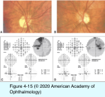
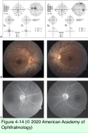
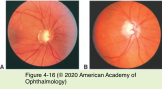

# 5.4.6. Patient With Decreased Vision: Classification & Management (VI): Optic neuropathy (V)

## Images

## Hierarchy

- first decade of life
- visual acuity rarely declines
  - evaluate for other lesions if visual acuity declines or progressively worsens
- Autosomal dominant optic atrophy (ADOA)
  - epidemiology
    - dominant inheritance pattern
      - most common hereditary optic neuropathy
        - 1:50,000
      - variable penetrance and expression
      - Mitochondrial DNA in LHON
  - genetics
    - chromosome 3
      - ADOA gene (OPA1)
        - OPA1 protein
          - widely expressed and most abundant in the retina
          - encodes dynamin-related GTPase
            - anchored to mitochondrial membranes
        - mutations result in loss of mitochondrial membrane integrity and function
          - retinal ganglion cell degeneration and optic atrophy
      - Compared to 10-30 years for LHON
  - clinical presentation
    - Compared to acute, severe vision loss of LHON
    - insidious onset of vision loss
      - bilateral and relatively symmetric
      - at detection, visual acuity loss is usually mild to moderate (20/30–20/60)
        - may decline progressively
          - LHON: impaired mitochondrial ATP production
        - most patients preserve visual acuity of > 20/200
    - color vision deficit
      - usually tritanopia (blue-yellow)
        - Compared to VA<20/200 in LHON
        - may pass evaluation with the Ishihara color plates
          - test red-green deficits
        - require testing by Hardy-Rand-Ritler plates or the Farnsworth Panel D-15 or D-100 test
    - focal, wedge-shaped temporal optic atrophy
      - diffuse pallor can occur
  - diagnostic workup
    - perimetry
      - central or cecocentral loss
    - negative results on neuroimaging
      - should be performed in all suspected cases
    - genetic testing
      - commercially available
      - does not test for all mutations
  - clinical course
    - stability or very slow progression
      - loss of 1 Snellen line per decade
  - no treatment available
- LHON shows disc hyperemia and telangiectasia
- Optic disc drusen (ODD)
  - epidemiology
    - prevalence
      - 0.34% (clinical)
      - 2% (autopsy)
    - M=F
    - rare in nonwhites
    - genetics
      - isolated
      - dominantly inherited
  - pathogenesis
    - small scleral canal
      - mechanical obstruction
        - impaired axonal transport
          - intra-axonal mitochondrial damage
            - deteriorating axons extrude their contents into the interstitial space
              - become calcified
  - associated conditions
    - retinitis pigmentosa
    - pseudoxanthoma elasticum
  - clinical presentation
    - often bilateral
      - 75%–86%
      - ± asymmetric
    - symptoms
      - usually asymptomatic
      - transient visual obscurations
        - 8.6%
    - ± RAPD with asymmetric visual field loss
    - optic disc appearance
      - small
      - elevated
      - blurred disc margin
        - axoplasmic stasis
        - yellowish, hazy appearance
          - unlike whitish, fluffy, striated appearance of NFL edema in true papilledema
          - unlike papilledema, does not abscure retinal vessels
        - ± irregular margins
      - no dilation of surface microvasculature (hyperemia)
      - round, whitish-yellow refractile bodies
        - frequently at nasal disc margin
        - scalloped appearance
        - occasionally located within the NFL just adjacent to the disc
      - ODD begin buried
        - become more visible over the years
    - anomalous vascular branching patterns
    - vascular complications
      - flame hemorrhage
      - AION
      - nerve fiber bundle defects
        - peripapillary subretinal neovascularization
          - rare
        - 75%–87%
  - diagnostic workup
    - useful in differentiating drusen from papilledema
    - Perimetry
      - visual field defects remain stable or worsen very slowly
        - acute papilledema causes enlarged blind spot
        - chronic papilledema can cause visual field defect
      - location of visible drusen does not necessarily correlate with the location of visual field loss
        - should be monitored over time!
    - B-scan ultrasonography
      - ODD are highly reflective
        - maintain high echogenicity with lowering of ultrasound gain
          - with papilledema, signal intensity decreases along with remainder of the ocular signals
      - may not detect noncalcified, buried ODD
        - ODD do not produce widening of the intraorbital portion of optic nerve
    - Fluorescein angiography
      - autofluorescence
        - on preinjection images using the fluorescein filter
      - ODD do not cause leakage
    - Neuroimaging
      - to rule out an intracranial or optic nerve tumor
      - CT scan remains superior to MRI for detection of drusen
        - bright signal at the junction of the posterior globe and optic nerve
          - with papilledema there is early diffuse hyperfluorescence of the optic disc, with late leakage
    - Optical coherence tomography
      - discrete hyperreflective drusen
  - differential diagnosis
    - refractile bodies of chronic papilledema
      - typically form near the temporal margin of the disc rather than within its substance
      - usually smaller than ODD
      - disappear with resolution of the papilledema
    - astrocytic hamartomas of the retina
      - mulberry appearance
        - may resemble ODD if located adjacent to the disc
          - "giant drusen of the optic disc"
      - originate at the disc margin, with extension to the peripapillary retina
      - arise in inner retinal layers and typically obscure retinal vessels
      - may have a fleshy, pinkish component
      - may show tumorlike vascularity on fluorescein angiography
      - associated conditions
        - tuberous sclerosis
        - neurofibromatosis
- with papilledema, the intraorbital portion of optic nerve is typically widened
  - will decrease in width with prolonged lateral gaze (30° test)
- Leber hereditary optic neuropathy
  - epidemiology
    - age 10–30 years
      - ± earlier or later
    - M>>F
      - 10%–20% F
    - tobacco or excessive alcohol intake might stress mitochondrial function
      - initiating role in LHON
  - clinical presentation
    - acute, severe, painless, sequential vision loss
      - visual acuity <20/200
    - central/cecocentral visual field impairment
    - classic fundus appearance triad
      - hyperemia & elevation of the optic disc, with thickening of the peripapillary retina
        - no fluorescein leakage (“pseudoedema”)
      - peripapillary telangiectasia
      - tortuosity of the medium-sized retinal arterioles
    - mild neurologic deficits
      - cardiac conduction abnormalities
  - genetics
    - mitochondrial DNA mutation
      - single base-pair nucleotide substitution
        - 11778 position
          - most vommon
          - lower chance (≈ 4%) of spontaneous improvement
        - 3460 location
        - 14484 location
          - higher chance (≤65%) of late spontaneous improvement
        - mitochondrial DNA is variably divided among the progeny cells (heteroplasmy)
          - when the fraction of mutated mitochondrial DNA reaches a threshold, the phenotype expresses clinically
      - impaired mitochondrial ATP production
      - inherited only from the mother
        - only women transmit the disease!
        - not all men with affected mitochondria experience vision loss
      - family history may be negative
        - de novo mutation
          - affected women only infrequently experience visual symptoms
            - protective effect of estrogen
        - lack of phenotypic expression
  - differential diagnosis
    - optic neuritis
    - compressive optic neuropathy
    - infiltrative optic neuropathy
  - diagnostic workup
    - negative family history
      - neuroimaging is advisable to rule out a treatable cause of vision loss
    - blood testing for mutations may confirm the diagnosis
      - mitochondrial testing for the most common mutations is commercially available
  - no treatment has been shown to be effective
    - corticosteroids are not beneficial
    - idebenone
      - may increase mitochondrial energy production
        - may improve the outcome of LHON
    - estrogen
    - gene therapy
- do not autofluoresce
- Glaucoma
  - slowly progressive arcuate and peripheral visual field loss
    - usually nasal VF
    - spares fixation until late in the course
      - patients usually asymptomatic
  - optic disc characteristically appears excavated
    - increased diameter and depth of physiologic cup
    - focal notching at the inferior or superior pole
    - cup pallor develops only with relatively advanced damage
  - intraocular pressure is often (but not invariably) elevated
  - glaucoma with intraocular pressure <21 mm Hg (normal-tension glaucoma)
    - more likely to produce paracentral scotomata
      - usually spares visual acuity
  - excavation of the optic disc
    - glaucoma
    - compressive
    - hereditary (LHON)
    - severe ischemic (AAION)
    - features differentiating from glaucoma
      - affect visual acuity and color vision
      - demonstrate early and more prominent pallor
  - chiasmal compressive lesions
    - produce temporal (hemianopic) rather than nasal visual field loss
      - cause less severe excavation and notching
