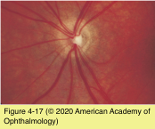
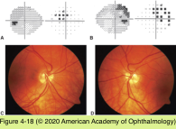

# 5.4.7. Patient With Decreased Vision: Classification & Management (VII): Congenital Optic Disc Anomalies

## Images

## Hierarchy

- Optic nerve hypoplasia
  - teratogens associated with optic nerve hypoplasia
    - quinine
    - ethanol
    - anticonvulsants
      - phenytoin
  - clinical presentation
    - variable visual acuity
      - 56%–92% bilateral
    - nearly all eyes have visual field loss
    - optic disc
      - small
        - 1/2 - 1/3 normal diameter
          - subtle cases may require a comparison of the 2 eyes
          - comparison of horizontal disc diameter to disc–macula distance
      - pale, gray, or (less commonly) hyperemic
      - may be surrounded by a yellow peripapillary halo
        - bordered by a ring of increased or decreased pigmentation
          - double-ring sign
      - retinal vessel diameter may seem large
        - vessels may appear tortuous
    - Unilateral or bilateral optic nerve hypoplasia may be associated with
      - midline or hemispheric brain defects
        - thin or absent corpus callosum
      - endocrinologic abnormalities
        - deficiency of growth hormone and other pituitary hormones
          - growth retardation
          - hypoglycemic seizures
      - congenital suprasellar tumors
      - skull-base defects
        - basal encephaloceles
    - septo-optic dysplasia
      - optic nerve hypoplasia
      - absent septum pellucidum
      - pituitary dwarfism
    - superior segment hypoplasia
      - inferior visual field defect
        - children of diabetic mothers
      - bilateral, symmetric
  - diagnostic workup
    - MRI is recommended in all cases
    - endocrinologic consultation
- autosomal dominant
  - PAX2 gene mutations
- Excavated optic disc anomalies
  - optic pit
    - depression of the optic disc surface
    - gray or white
      - inferotemporal
    - mild visual field defect
      - paracentral or arcuate
    - serous detachment of the macula
      - 25%–75%
      - liquefied vitreous through communication between the optic pit and the macula
  - coloboma
    - incomplete closure of the embryonic fissure
    - inferior
    - ± extension to adjacent choroid and retina
    - ± visual field defect
    - ± RAPD
    - ± colobomas of other structures
      - iris
      - choroid
  - dysplastic nerve of papillorenal syndrome (renal coloboma syndrome)
    - renal failure secondary to renal hypoplasia
    - visual acuity is often normal
    - superonasal visual field defects
      - excavated with absence or attenuation of the central retinal vessels
        - multiple cilioretinal vessels
          - emanating and exiting from the disc edge
  - morning glory disc anomaly
    - most often unilateral
    - funnel-shaped staphylomatous excavation of optic nerve and peripapillary retina
    - optic disc
      - enlarged
      - pink or orange
      - elevated or recessed within the staphyloma
        - chorioretinal pigmentation surrounds the excavation
      - emanation of retinal vessels from the periphery of the disc
    - RAPD
      - visual acuity ≤20/200
        - can be normal
    - serous retinal detachment
      - 26%–38%
    - neuroimaging is warranted
      - basal encephalocele
        - moyamoya disease
      - CNS vascular anomalies
- F>M
- In contrast to dysplastic nerve
  - white glial tissue is present on the central disc surface
- Congenital tilted disc syndrome
  - clinical presentation
    - 80% bilateral
    - inferonasal colobomatous excavation of optic nerve
      - superotemporal portion of the disc remains relatively intact
        - can seem elevated, simulating mild edema
      - superotemporal visual field defects
        - fail to respect the vertical midline
          - in contrast to visual field loss of chiasmal compression
        - partial improvement with myopic refractive correction
    - associated with thinning of adjacent RPE and choroid
    - retinal vessels are often nasalized
  - differential diagnosis
    - myopic tilted optic discs with temporal crescent
