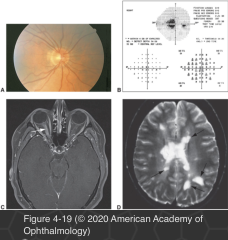

# 5.4.8. Patient With Decreased Vision: Posterior Optic Neuropathies (I): Retrobulbar Optic Neuritis

## Images

## Hierarchy

- epidemiology
  - young (mean age, 32 years)
  - female (77%)
- clinical presentation
  - subacute visual loss
    - over several days
  - monocular
  - 65% retrobulbar
    - optic disc appears normal
  - periorbital pain
    - 92%
    - with eye movement
  - dyschromatopsia
    - nearly universal
      - often precedes vision loss
    - particularly for red
    - out of proportion to the visual acuity loss
  - RAPD
  - atypical features that should prompt further evaluation
    - lack of pain
    - protracted pain
    - protracted vision loss
      - lack of any vision recovery by 1 month
    - bilateral vision loss
    - significant swelling of the optic disc
    - inflammatory ocular features
      - uveitis
      - phlebitis
      - choroiditis
      - pars planitis
    - involvement of other cranial nerves
    - steroid-responsive optic neuropathy
- prognosis
  - improvement within 1 month
  - ONTT 10-year follow-up study
    - recurrence in the affected or fellow eye
      - overall
        - 35%
      - in patients with conversion to MS
        - 48%
  - most eyes with a recurrence regained normal or almost-normal vision
    - recovery of visual acuity to ≥20/40
      - 92%
    - final visual acuities of ≤20/200
      - 3%
    - 25%
      - studies using measures of visual function other than Snellen visual acuity show residual abnormalities in ≤90% of patients with ≥20/30 visual acuity
  - risk for MS
    - zero lesions on MRI
      - predictors of lower risk of future MS in patients with normal baseline MRI
        - male sex
        - optic disc swelling
        - atypical features of optic neuritis
          - absence of pain
          - no light perception vision
          - peripapillary hemorrhages
          - retinal exudates
    - ≥1 lesion on MRI
      - 72%
    - highest rate of conversion to MS is within the first 5 years
      - patients with normal MRI and no conversion to MS by year 10
        - 2% risk of conversion by year 15
- treatment
  - corticosteroid therapy
    - intravenous methylprednisolone
      - 250 mg every 6 hours for 3 days
        - followed by oral prednisone, 1 mg/kg/day for 11 days
      - no long-term beneficial effect on vision
      - sped recovery by 1–2 weeks
      - reduces the rate of clinically definite MS after the initial optic neuritis only in patients with ≥2 white matter lesions
        - at 2 years
          - 36% untreated
          - 16% treated
      - consider treatment for cases in which a rapid return of vision is essential
        - monocular patient
          - by follow-up year 3, this protective effect was lost
            - value to reduce the long-term risk of MS is unproven
        - occupational need
        - intravenous methylprednisolone on an outpatient basis may be considered
    - oral prednisone alone
      - did not have any benefit to vision
      - incurred a recurrence rate double that of the other groups
      - not recommended
  - Immunomodulatory therapy
    - proven benefit for reducing morbidity in the relapsing-remitting form of MS
    - delay conversion of patients with acute optic neuritis to definite MS
  - the value of therapy and of additional diagnostic evaluation for MS must be assessed individually
  - references
- diagnostic workup
  - MRI of the brain
    - to evaluate for periventricular white matter lesions
    - recommended in every case of retrobulbar neuritis without known diagnosis of MS
  - perimetry
    - generalized reduction of sensitivity
      - 48%
    - any pattern of visual field loss may appear
  - additional testing for atypical cases
    - serum and CSF rapid plasma reagin and fluorescent treponemal antibody absorption testing (for syphilis)
      - for CSF analysis, refer to a consulting neurologist
    - chest x-ray, gallium scan, serum angiotensin- converting enzyme testing (for sarcoidosis)
    - ESR determination, ANA testing, and anti-DNA antibody testing (for systemic lupus erythematosus or vasculitis)
    - serum neuromyelitis optica IgG testing and spinal MRI (for neuromyelitis)
    - brain and orbit MRI with gadolinium contrast (for compressive, infiltrative disorders)
    - testing of antibody titers for Lyme disease (if endemic)
    - Leber hereditary optic neuropathy testing
    - serum Quantiferon Gold testing or purified protein derivative skin test (for tuberculosis)
