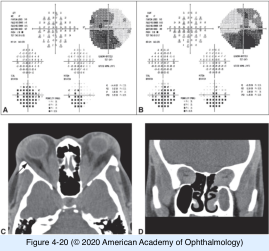

# 5.4.9. Patient With Decreased Vision: Optic Neuropathy (VIII): Posterior Optic Neuropathies (II)

## Images

## Hierarchy

- Intraorbital or intracanalicular compressive optic neuropathy
  - clinical presentation
    - monocular
    - slowly progressive vision loss
    - RAPD
    - visual field loss (usually central or diffuse)
    - associated signs of orbital disease
      - eyelid edema
      - retraction
      - lag
      - ptosis
      - proptosis
      - ophthalmoplegia
    - optic disc
      - normal or mildly atrophic at presentation
      - optic disc edema
        - anterior orbital lesions
    - ± choroidal folds
      - ± optociliary shunt vessels (retinochoroidal collaterals)
  - etiology
    - optic nerve sheath meningioma
    - glioma
    - cavernous hemangioma
      - produces compressive optic neuropathy only occasionally
  - diagnostic workup
    - MRI
      - particularly in differentiating meningioma from glioma
      - best for evaluating soft-tissue abnormalities in the orbit
    - thin-section CT scan
      - preferred for evaluation of calcification and bony abnormalities
- Neuromyelitis optica (NMO)
  - "Devic syndrome"
  - diagnostic criteria
    - optic neuritis (unilateral or bilateral)
      - simultaneously bilateral optic neuritis
      - episodes of myelitis and optic neuritis occur within weeks to months of each other
        - may be separated by several years
    - myelitis
    - ≥2 of the following
      - a contiguous spinal cord lesion on MRI involving 3 or more vertebral segments
      - a brain MRI scan nondiagnostic for MS
      - a positive NMO-IgG serologic test result (autoantibody)
        - 76% sensitivity
          - 94% specificity
        - binds to aquaporin-4
          - principal water channel protein expressed in astroglial foot processes
            - involved in fluid homeostasis in the CNS
        - indications for NMO-IgG testing in patients with optic neuritis
          - progressive vision loss for more than 2 weeks
          - lack of vision improvement by 1 month
          - recurrent optic neuritis
    - 99% sensitivity
    - 90% specificity
  - clinical course & prognosis
    - recurrent episodes of vision loss
    - vision and neurologic prognoses in NMO are poorer than in MS
      - severe visual impairment (<20/200) common in at least 1 eye
  - treatment
    - poorly responsive cases
      - high-dose intravenous corticosteroids
    - immunosuppressive drugs
      - azathioprine
      - mycophenolate
      - rituximab
      - reduce the risk of relapse
- Thyroid eye disease (TED)
  - pathogenesis
    - extraocular muscle enlargement & orbital fat hypertrophy
      - proptosis
        - stretching of the optic nerve
      - optic nerve compression at the orbital apex
  - signs
    - eyelid retraction
    - eyelid lag
    - eyelid and conjunctival edema
    - proptosis
    - vision loss
      - slowly progressive
    - RAPD
      - if optic neuropathy is asymmetric or unilateral
    - dyschromatopsia
      - early sign of optic neuropathy
    - optic disc is commonly normal
      - ± edematous
      - optic atrophy in chronic cases
    - visual field loss
      - central or diffuse depression
    - some patients present with only minimal orbital findings
  - treatment of acute optic neuropathy
    - systemic steroids
      - reduce optic nerve compression
      - temporizing measure!
    - surgical decompression of the posterior orbit
    - radiation therapy
      - not indicated for acute optic neuropathy!
- Optic perineuritis
  - generally older than optic neuritis
    - 36% are >50 years
  - F>M
  - clinical presentation
    - inflammation of the optic nerve sheath
      - in contrast to optic neuritis, pain persists until treated
    - acute painful vision loss
      - in contrast to optic neuritis, vision loss progresses over several weeks
  - orbital MRI
    - enhancement of the dural sheath rather than the optic nerve itself
      - can appear similar to optic nerve sheath meningioma
        - pain helps differentiate optic perineuritis from optic nerve sheath meningioma
  - clinical course & prognosis
    - in contrast to optic neuritis, not associated with increased risk of demyelinating disease
    - progressive vision loss without treatment
    - relapses are common with short courses of treatment
  - treatment
    - respond immediately and dramatically to corticosteroid treatment
- most often bilateral
