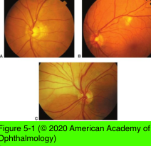
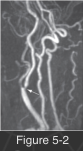

# 5.5.2. Patient With Transient Visual Loss (II): Transient Monocular Visual Loss (TMVL) (II): Retinal Emboli

## Images

## Hierarchy

- amaurosis fugax (“fleeting blindness”)
  - due to retinal emboli
  - visual loss is typically abrupt, painless, and descends (or ascends) like a curtain
  - unilateral
  - <1 hour
    - usually resolves in 10–15 minutes
  - not associated with other neurologic deficits
  - ocular examination is often normal
- types of emboli
  - cholesterol (Hollenhorst plaque)
  - platelet-fibrin
  - calcium
  - less common types
    - cardiac tumors (myxoma)
    - fat (long-bone fractures, pancreatitis)
    - sepsis
    - talc
    - air
    - silicone
    - depot drugs (corticosteroids)
  - See Table 5-2
- Clinical and laboratory evaluation
  - increased rates of morbidity and mortality from
    - stroke
    - myocardial infarction
      - with carotid artery disease, a routine echocardiogram is mandatory
    - aortic aneurysm
  - measurement of blood pressure
  - cardiac auscultation
  - auscultation for carotid bruits
    - best heard at the angle of the jaw
    - indicates turbulent flow within the vessel
    - a bruit will be absent
      - if flow is undisturbed
      - if carotid occlusion is complete
  - angiography
    - gold standard for quantifying the degree of carotid stenosis
    - invasive
      - intra-arterial injection of iodinated contrast dye
    - risk of serious complications (such as stroke or death) is <1%
  - noninvasive imaging modalities
    - used as screening tests
    - carotid ultrasonography (duplex scanning)
      - sensitive method of detecting ulcerated plaques
      - not accurate at detecting carotid artery dissection
    - magnetic resonance angiography (MRA)
    - computed tomographic arteriography (CTA)
    - MRA and CTA overestimate the degree of carotid stenosis
      - MRA, along with MRI, is extremely useful for detecting carotid artery dissection
      - allow visualization and characterization of the plaque, as well as of surrounding arterial wall
  - echocardiography
    - useful for detecting
      - valvular and cardiac wall defects
      - intracardiac tumors
      - large thrombi
  - transesophageal echocardiography
    - more sensitive
  - prolonged inpatient cardiac monitoring or ambulatory Holter monitoring
    - normal-appearing echocardiogram does not exclude the possibility of emboli
  - blood culture testing
    - suspected endocarditis
  - if a cardiac or carotid source of embolism formation is not found, other systemic processes may be contributing
    - advanced age
    - hypertension
    - hypotension and syncope
    - ischemic heart disease
    - diabetes mellitus
    - hypercholesterolemia
    - smoking
    - sleep apnea
    - thyroid disease
    - hypercoagulable states
    - collagen vascular diseases
    - vasculitis
    - syphilis
- sources of emboli
  - atheromas
    - develop at
      - bifurcation of the common carotid artery into the internal and external carotid arteries
        - Figure 5-2
      - carotid siphon
    - remain stationary, become fibrotic, regress, ulcerate, narrow/occlude the lumen, or release emboli
      - lumen must be reduced by 50%–90% before distal flow is affected
    - risk factors
      - hypertension
      - diabetes mellitus
      - hypercholesterolemia
      - smoking
  - cardiac emboli
    - causes
      - ventricular aneurysms
      - hypokinetic wall segments
      - endocarditis
        - infectious (associated with subacute bacterial endocarditis)
        - noninfectious (marantic)
      - valvular heart disease
        - mitral valve prolapse
        - atrial myxoma
      - cardiac arrhythmia
        - atrial fibrillation
        - paroxysmal arrhythmias
      - unsuspected patent foramen ovale with right- to-left cardiac shunt
