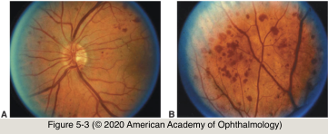

# 5.5.3. Patient With Transient Visual Loss (III): Transient Monocular Visual Loss (TMVL) (III)

## Images

## Hierarchy

- Vasospasm, Hyperviscosity, and Hypercoagulability
  - vasospasm of the retinal artery
    - rare
      - <50 years
    - stereotypic episodes of painless TMVL
      - strong personal or family history of migraine
      - often severe
        - ± complete visual loss
    - ocular examination findings are usually normal
      - ± constriction of retinal arteries
    - workup
      - complete blood count
        - diagnosis of vasospastic TMVL is one of exclusion!
          - whether vasospasm can truly cause transient visual loss is debated
      - cardiac evaluation
      - carotid imaging
      - erythrocyte sedimentation rate and C-reactive protein concentration
        - 50 years
    - calcium channel blockers
      - prevent vasospasm
        - seem to provide relief from amaurosis fugax in some patients
  - hyperviscosity syndrome & hypercoagulable states
    - in younger patients
    - 10% of patients with polycythemia vera complain of TMVL
    - serologic testing
      - anticardiolipin antibody
      - antiphosphatidyl choline and serine
      - antinuclear antibody
      - serum protein electrophoresis
      - partial thromboplastin time
      - VDRL
      - treponema pallidum hemagglutination assay (TPHA)
      - protein S
      - protein C
- Hypoperfusion
  - central retinal vein occlusion
    - recovery to normal vision
      - TMVL lasting seconds to minutes
    - symptoms may cease when collateral vessels develop
      - may predate more lasting visual loss by days or weeks
  - change in posture from a sitting to a standing position
    - TMVL lasting seconds to 1–2 minutes
    - progressive restriction of vision from the periphery (“iris diaphragm pattern”)
      - cardiac arrhythmia
    - etiology
      - severe stenosis of the great vessels
      - GCA
  - ocular ischemic syndrome
    - etiology
      - vascular occlusion anywhere between the heart and the eye
    - symptoms
      - recurrent orbital or facial pain that improves when the patient lies down
        - highly suggestive of carotid occlusive disease
      - transient visual loss on exposure to bright light
      - transient or persistent blurred vision
    - clinical presentation
      - early stages
        - midperipheral dot-and-blot hemorrhages
          - may resemble those associated with diabetes mellitus
      - late stages
        - anterior segment changes
          - red, painful eye
            - episcleral vascular injection
          - aqueous flare (ischemic uveitis)
            - may be confused with intraocular inflammation
          - neovascularization of the chamber angle and iris
          - dilated retinal veins
            - intraocular pressure (IOP) may be low, normal, or high
              - impaired ciliary body perfusion!
    - treatment
      - CEA
        - If preoperative IOP is low, CEA may precipitate dangerously high IOP
          - fundus changes
            - narrowed retinal arteries with microaneurysm formation
            - midperipheral dot-and-blot hemorrhages
            - macular edema
          - venous stasis retinopathy (VSR)
        - in some patients, carotid occlusion may be too advanced for surgical correction
        - with signs of chronic hypoperfusion, improvement is unlikely
          - early detection is crucial!
      - IOP-lowering drugs
      - corticosteroids for pain
      - panretinal photocoagulation
- ≥50 years
- Vasculitis
  - giant cell arteritis (GCA)
    - signals impending acute and permanent visual loss in 1 or both eyes
    - symptoms
      - headache
      - scalp tenderness
      - jaw claudication
      - proximal joint pain
      - muscle aches and myalgias
      - depressed appetite
      - weight loss
      - malaise
    - diagnostic workup
      - erythrocyte sedimentation rate
      - C-reactive protein
      - elevated platelet count
      - choroidal hypoperfusion
        - low intraocular pressure
        - changes on fluorescein angiogram
    - immediate treatment with high-dose corticosteroids
- Additional systemic causes
  - ophthalmic artery disease
  - giant cell arteritis
  - Raynaud disease
  - vasculitis
  - hyperviscosity syndromes
  - antiphospholipid antibody syndrome
  - vasospasm (migraine)
  - carotid dissection
    - painful ipsilateral monocular visual loss
    - associated with
      - Horner syndrome
      - contralateral neurologic signs
