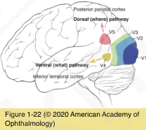
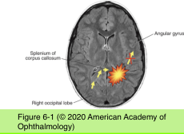

# 5.6.3. Disorders of Higher Cortical Function

## Images

## Hierarchy

- Introduction
  - visual information is projected from primary visual (occipital striate) cortex (area V1) to associative visual cortical areas (V2–V5)
  - 2 pathways
    - ventral occipitotemporal pathway
      - processes the physical attributes of an image
        - "what"
          - shape
          - pattern
          - color
    - dorsal occipitoparietal pathway
      - visuospatial analysis
        - "where"
      - guiding movements toward items of interest
  - cortical syndromes
    - 2 mechanisms
      - damage to specific cortical areas
      - interrruption of information flow between such areas
        - disconnection syndromes
  - See Table 6-2
- Disorders of Awareness of Vision or Visual Deficit
  - Anton syndrome
    - patient with cortical blindness denies blindness
      - patient hallucinates and confabulates
    - etiology
      - bilateral occipital infarctions
        - most common
      - blindness from bilateral optic nerve lesions
  - Riddoch phenomenon
    - preservation of the perception of motion in a blind hemifield
      - staticokinetic dissociation
    - when present in an otherwise complete homonymous hemianopia, it is thought to portend a better visual prognosis
  - Blindsight
    - an unconscious rudimentary visual perception in cortically blind patients
    - damage to
      - visual pathways through the superior colliculus
      - connections between the lateral geniculate body and the extrastriate visual cortex
  - Hemispatial neglect
    - patient will not acknowledge seeing objects in an area of vision known to be intact
    - confrontation testing using double simultaneous stimulation
    - damage in the right hemisphere
      - posterior parietal cortex
      - frontal eye field
      - cingulate gyrus
- Disorders of Recognition
  - Object agnosia
    - inability to recognize objects by sight
      - can identify objects by touch or by description but not by sight!
    - bilateral occipitotemporal (ventral) pathway dysfunction
      - affecting the inferior longitudinal fasciculi
  - Prosopagnosia
    - inability to recognize familiar faces
      - patients with advanced Alzheimer disease do not recognize their relatives
        - connect occipital lobe to temporal lobe on each side
    - have difficulty with other visual memory tasks
    - bilateral occipital lobe damage
    - right inferior occipital lobe damage
      - accompanying superior homonymous visual field defect
  - Akinetopsia
    - loss of the perception of visual motion
      - can perceive form, texture, and color
    - dorsal pathway damage
  - Alexia without agraphia
    - patient cannot read but can write
      - cannot read what he/she has just written!
    - during the act of reading visual information is relayed anteriorly through the corpus callosum to the dominant angular gyrus of the parietal lobe for comprehension
    - infarction of the left occipital lobe & fibers crossing in the splenium of the corpus callosum
    - damage to left angular gyrus
      - both reading and writing will be affected
        - alexia with agraphia
      - also often have
        - acalculia
        - right–left confusion
        - finger agnosia
          - Gerstmann syndrome
- Disorders of Visual–Spatial Relationships
  - Simultanagnosia
    - failure to integrate multiple elements of a scene to form the total picture
    - patient is asked to describe a picture scene
      - Figure 6-2
      - patient will describe only part of the picture
    - Ishihara pseudoisochromatic color plates
      - patient can identify colors but not the shapes of numbers
  - Balint syndrome
    - rare
      - bilateral occipitoparietal lesions
    - triad of
      - simultanagnosia
      - optic ataxia
        - disconnection between visual input and the motor system
      - acquired ocular motor apraxia
        - loss of voluntary movement of the eyes while fixating on a target
  - Visual allesthesia
    - see their environment rotated, flipped, or inverted
    - damage to
      - occipitoparietal area
        - lateral medullary region (Wallenberg syndrome)
