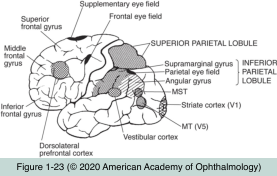
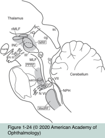

# 5.7.1. Supranuclear Disorders of Ocular Motility (I)

## Images

## Hierarchy

- Efferent visual system
  - controls ocular movements
    - "ocular motor system"
  - 2 pathways
    - supranuclear pathways
      - premotor and motor regions of the frontal and parietal cortices
      - cerebellum
      - basal ganglia
      - superior colliculi
      - thalamus (dorsal lateral geniculate nucleus and pulvinar)
      - brainstem centers (paramedian pontine reticular formation, neural integrators, and vestibular nuclei)
      - supranuclear disorders
        - affect both eyes similarly
          - do not produce diplopia
            - except skew deviation!
    - infranuclear pathways
      - ocular motor nuclei
      - intramedullary segments of the ocular motor nerves
      - peripheral segments of the ocular motor nerves
        - coursing through the subarachnoid space, cavernous sinus, superior orbital fissure, and orbit
      - neuromuscular junction
      - extraocular muscles
      - infranuclear disorders
        - affect the eyes differently
          - produce diplopia
- Fundamental Principles of Ocular Motor Control
  - attention to peripherally placed objects is driven by the perception of a changing stimulus
    - movement is an especially strong stimulus!
      - See Table 7-1
  - pursuit system
    - for tracking relatively slow-moving (<30° per second) targets
      - 1/3 the distance from the primary position to the far extent of the temporal visual field in 1 second
    - driven by visual attention to a target
      - foveation
        - moving target
        - moving person
  - vestibular ocular reflex (VOR) system
    - holds images stable on the retina during brief, high-frequency rotations of the head
      - walking
    - produces eye movements in a direction opposite to those of head acceleration
    - attenuates quickly (within seconds) during prolonged period of stable head velocity
  - optokinetic nystagmus (OKN) system
    - holds images stable on the retina during sustained rotation of the head (or environment)
    - supplements the VOR
      - during prolonged visual movement (running continuously), the OKN system maintains visual fixation even after vestibular influence has waned
    - the pursuit system is more influential in maintaining proper alignment during sustained rotations than the OKN system
    - 2 components
      - initial smooth pursuit to track a moving object
      - saccade in the opposite direction
        - the maximum amplitude of the pursuit movement is reached
        - speed of the moving object exceeds the maximum velocity of the pursuit system
        - involuntary saccade is mediated by the same vestibular neurons that respond to vestibular stimulation
          - integrity of the vestibular neurons can be studied without using vestibular stimuli!
    - both OKN and VOR can be suppressed by visual fixation on a target
  - saccadic system
    - rapidly shifts the fovea to targets of interest
      - for tracking faster-moving targets
      - relatively fast, back-to-back eye movements
        - duration is generally <100 milliseconds
    - “ballistic” movements
      - cannot be altered once initiated!
    - larger-amplitude saccades are faster than smaller-amplitude saccades
      - "main sequence"
      - may exceed 500° per second
        - from primary position to the farthest extent of the temporal visual field in only 0.2 second
  - vergence systems
    - for tracking objects moving toward or away from the eyes
      - convergence
      - divergence
    - driven primarily by a disparity in the relative location of images on the retinas
  - microsaccadic refixation movements
    - persistent foveal fixation on a stationary target causes attenuation of retinal neuronal responses
    - to-and-fro movements maintain the image within the field of the fovea
      - continuous
        - very small amplitude (0.1°–0.2°)
      - slight pause (180–200 ms) between movements (intersaccadic interval)
      - "square waves"
  - abnormalities in any of these systems may result in
    - degradation of visual acuity
    - blurring of vision
    - oscillopsia
    - motion sickness
  - pursuit, OKN, and saccadic systems are controlled by different anatomical pathways that converge at the level of the brainstem
    - share the same supranuclear neurons
      - paramedian pontine reticular formation (PPRF)
        - for horizontal movements
      - rostral interstitial nucleus of the medial longitudinal fasciculus
        - for vertical movements
      - innervate the ocular motor cranial nerve nuclei
- vestibular ocular reflex (VOR) system
  - brief, high-frequency rotations of the head
    - sustained rotation of the head (or environment)
- contralateral paramedian pontine reticular formation (PPRF)
  - optokinetic nystagmus (OKN) system
    - Eye movements
  - pursuit system
  - frontal eye field (FEF)
- FEF
  - pulse
    - horizontal eye movements
      - Saccadic system
- medial vestibular nucleus
  - tracking relatively slow-moving (<30° per second) targets
  - contralateral paramedian pontine reticular formation (PPRF)
  - accessory nucleus of CN XII
- step
- pulse
  - vertical and torsional eye movements
- step
- interstitial nucleus of Cajal (INC)
  - rostral interstitial nucleus of the medial longitudinal fasciculus (riMLF)
    - midbrain
- mesencephalic reticular formation
  - Vergence
    - Supranuclear centers
- medial superior temporal (MST) area
  - middle temporal (MT) area
    - FEF
      - cerebral cortex
        - anatomy
          - Pursuit system
  - posterior parietal cortex
    - an area at the confluence of the parietal, temporal, and occipital lobes
- descending pathways
  - pass through the posterior limb of the internal capsule
- uses some of the same architecture described for saccades
- cranial nerve nuclei
  - medial longitudinal fasciculus [MLF]
- several other pontine nuclei
  - brainstem
  - project to the cerebellum
    - paraflocculus plays a role in sustaining pursuit movements
