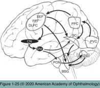
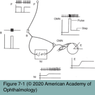
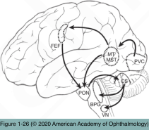

# 5.7.2. Supranuclear Disorders of Ocular Motility (II): Anatomy & Clinical Testing of the Functional Classes of Eye Movements

## Images

## Hierarchy

- Ocular Stability
  - observing patient’s ability to fixate on a target when the head and body are held stationary
  - spontaneous nystagmus
    - imbalance of vestibular input to the ocular motor nuclei
    - can be suppressed by visual fixation!
- Saccadic System
  - anatomy
    - cerebral cortex
      - premotor zones
      - frontal eye field (FEF)
        - produces conjugate, contralateral saccades
    - descending pathways from the FEF
      - innervate the contralateral paramedian pontine reticular formation (PPRF)
      - communicate with several intermediate structures
        - basal ganglia
        - superior colliculi
    - ocular motoneurons (cranial nerves III, IV, VI)
      - speed encoded by the impulse frequency
        - pulse
      - amplitude encoded by the impulse duration
        - step
    - horizontal eye movements
      - pulse
        - FEF
      - step
        - medial vestibular nucleus
        - accessory nucleus of CN XII
    - vertical and torsional eye movements
      - pulse
        - rostral interstitial nucleus of the medial longitudinal fasciculus (riMLF)
          - midbrain
      - step
        - interstitial nucleus of Cajal (INC)
    - saccades and gaze holding are also strongly influenced by the cerebellum
  - clinical examination
    - have the patient rapidly shift gaze between 2 targets
      - extended index fingers of the clinician’s outstretched hands
    - latency
    - accuracy
      - hypometric saccade
        - falls short
        - 1–2 small catch-up saccades may be within normal limits
      - hypermetric saccade
        - overshoots the target and is usually pathologic
    - velocity
    - conjugacy
- Vestibular Ocular Reflex (VOR)
  - anatomy
    - sensory organs
      - semicircular canals
        - angular movements
        - each canal innervates 1 pair of yoked extraocular muscles
      - otoliths of the utricle and saccule
        - linear acceleration
    - VOR pathway
      - vestibular nerves
        - vestibular nuclei
          - ocular motoneurons
          - strongly interconnected with the cerebellum
  - VOR dysfunction
    - spontaneous nystagmus
      - hallmark of an uncompensated vestibular imbalance
      - clinical examination
        - direct ophthalmoscopy
          - repetitive shifts in the position of the optic nerve head
            - drift of the optic disc to the patient’s right (drifting of the eyes to the left)
              - deficient left-sided vestibular input
          - first, with the fellow eye fixating on a target
          - next, with the fellow eye not fixating
            - covering the eye
              - an increase in nystagmus suggests the presence of an uncompensated imbalance of the peripheral vestibular system
        - horizontal head shaking x 10–15 seconds
          - transient nystagmus after the head is held stable indicates asymmetry of the vestibular inputs
            - peripheral or central vestibular lesions
          - prevent the patient from visually fixating during the test
            - having the patient close his or her eyes in a dark environment
            - high-plus lenses (+20 D) on a trial frame
            - placing Frenzel goggles in front of both eyes
            - eye movements should be examined in still- darkened room with a light held to the side of 1 eye
    - imbalance in VOR gain
      - VOR gain: ratio of the amplitude of eye rotation to the amplitude of head rotation
        - normally, if the head is accelerated 10°, the eyes will move exactly 10° in the opposite direction
      - clinical examination
        - head thrust maneuver
          - briskly turn the patient’s head (small amplitude) while the patient visually fixates on a target
          - imbalance in the VOR gain results in the eyes being off target at the end of the head thrust
            - a refixation saccade is required to recapture the target
            - defective response when the head is rotated toward side of the lesion
            - small horizontal or vertical head rotations at approximately 2 Hz while the patient reads the Snellen chart
              - decrease in visual acuity by several lines (≥ 4) indicates bilateral vestibular loss/hypofunction
        - ophthalmoscopy
          - more sensitive
          - more difficult
        - dynamic visual acuity
          - measuring visual acuity during head rotations
- Optokinetic Nystagmus (OKN)
  - OKN system cannot be isolated for testing in the clinical setting
    - requires that the moving stimulus fill the complete visual environment
    - rotating drum of black and white stripes
      - tests only the pursuit and saccade systems!
- Vergence
  - anatomy
    - cerebral cortex
      - binocularly driven cortical cells
    - brainstem neurons located in the mesencephalic reticular formation
      - dorsal to the third nerve nuclei
  - clinical examination
    - accommodative target that has enough visual detail
      - beware of poor patient effort!
        - penlight or finger is not adequate!
- Pursuit System
  - anatomy
    - cerebral cortex
      - FEF
      - middle temporal (MT) area
      - medial superior temporal (MST) area
      - posterior parietal cortex
    - an area at the confluence of the parietal, temporal, and occipital lobes
      - descending pathways
        - pass through the posterior limb of the internal capsule
    - brainstem
      - uses some of the same architecture described for saccades
        - medial longitudinal fasciculus [MLF]
        - cranial nerve nuclei
      - several other pontine nuclei
        - project to the cerebellum
          - paraflocculus plays a role in sustaining pursuit movements
  - clinical examination
    - have the patient follow a predictably moving target horizontally and then vertically
      - while the head and body are held in position
      - target should move relatively slowly—not >30° per second
      - the eyes should accurately follow the slowly moving stimulus
        - low gain
          - eyes lag behind the stimulus
            - generates a saccade that allows the eyes to catch up
