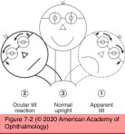
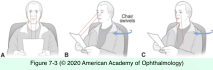

# 5.7.3. Supranuclear Disorders of Ocular Motility (III): Clinical Disorders of the Ocular Motor Systems (I)

## Images

## Hierarchy

- Ocular Stability Dysfunction
  - Saccadic intrusions
    - much smaller amplitude than pendular nystagmus
    - clinical presentation
      - small amplitude
      - rapid/brief duration
      - consist only of fast phases
      - lack periodicity
        - nystagmus has periodicity
          - nystagmus has fast and slow phases
    - square-wave jerks (SWJs)
      - most common
      - lead the eyes off to one side and then back onto the target with symmetric movements
        - brief intersaccadic interval
          - pendular nystagmus oscillates across a fixation point
      - from 0.5° to >5° (macrosquare-wave jerks)
      - etiology
        - infrequent SWJs may be normal
          - especially during smooth pursuit movements
        - progressive supranuclear palsy (PSP)
        - certain cerebellar diseases
        - cigarette smoking
- Vestibular Ocular Dysfunction
  - peripheral end-organ disease
    - semicircular canals
      - nystagmus
        - by far the most common cause
    - otolithic organs
      - asymmetric disruption of supranuclear input from the otolithic organs
        - ocular tilt reaction
          - skew deviation
          - head tilt
          - cyclotorsion
          - the head tilt and cyclotorsion (upper poles of both eyes) rotate away from the hypertropic eye
            - opposite to the normal compensatory rotation mediated by the VOR!
  - central nervous system disease
    - lesions of the caudal brainstem (lower pons and medulla)
      - lateral medullary syndrome (Wallenberg syndrome)
        - disrupts the sensory pathways
          - “stroke without paralysis”
            - no extremity weakness
        - clinical presentation
          - ipsilateral loss of facial pain and temperature sensation
            - involvement of the descending tract of CN V
          - contralateral loss of hemibody pain and temperature sensation
            - involvement of the lateral spinothalamic tract
          - ipsilateral cerebellar ataxia
            - damage to spinocerebellar tracts
          - ipsilateral first-order Horner syndrome
          - the ocular tilt reaction (sometimes)
          - ± other presentations
            - dysarthria
            - dysphagia
            - vertigo
            - persistent hiccups
            - damage to spinocerebellar tracts
        - etiology
          - vertebral artery occlusion
            - lateropulsion
              - sensation of being pulled to one side
            - ocular lateropulsion
              - hypermetric movements toward the side of the lesion
                - the eyes turn toward the side of the lesion after visual fixation is removed for a few seconds
                  - having a patient close his or her eyes
              - hypometric movements away from the side of the lesion
              - vertical saccades may follow an elliptical path
                - the eyes deviate toward the side of the lesion during vertical movement
    - cerebellar disease
      - impaired VOR suppression
        - there are situations when stable foveation depends on suppressing the VOR
          - viewing an object that moves with the head
        - patient holds and fixates on a near card while being rotated in the examination chair
          - rotation to the patient’s right is met with conjugate eye movement to the patient’s left, followed by a corrective saccade rightward
        - common in multiple sclerosis
- Optokinetic Nystagmus (OKN) Dysfunction
  - OKN is a normal phenomenon that occurs in response to a rotation movement
  - OKN represents the combined response of
    - OKN system
      - testing requires specialized equipment
    - smooth pursuit system
      - tested by using an OKN drum
  - asymmetry of drum-induced OKN response
    - unilateral lesion of the cerebral pathways that descend from the ipsilateral parietal, middle temporal, or medial superior temporal areas to the brainstem ocular motor centers
    - asymmetry produced by rotating the drum’s stripes toward the patient’s right suggests a lesion in the right cerebrum
    - large lesions of the parietal or parietal-occipital cortex
      - accompanied by a homonymous hemianopia
        - lesions confined to the occipital lobe also produce a homonymous hemianopia but not OKN asymmetry
          - OKN testing helps localize cerebral lesions that produces homonymous hemianopia
