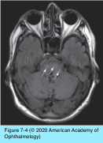
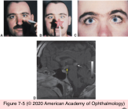

# 5.7.4. Supranuclear Disorders of Ocular Motility (IV): Clinical Disorders of the Ocular Motor Systems (II): Saccadic Dysfunction

## Images

## Hierarchy

- pulse
  - frontal eye field (FEF)
- FEF
  - contralateral paramedian pontine reticular formation (PPRF)
  - contralateral paramedian pontine reticular formation (PPRF)
  - medial vestibular nucleus
    - accessory nucleus of CN XII
- step
  - horizontal eye movements
    - Saccadic system
- pulse
- step
  - vertical and torsional eye movements
- interstitial nucleus of Cajal (INC)
  - rostral interstitial nucleus of the medial longitudinal fasciculus (riMLF)
    - midbrain
- Introduction
  - Types of dysfunction
    - prolonged latency
      - advancing age
      - PSP
        - slow volitional saccades
        - normal reflexive saccades
          - directed to an unanticipated target
            - a ball thrown toward the patient
      - cerebellar degeneration
      - Huntington disease
      - Wilson disease
      - Whipple disease
      - pontine disease
    - reduced speed
      - central lesions
        - saccadic slowness confined to the horizontal plane
          - pontine disease
            - paramedian pontine reticular formation
        - saccadic slowness confined to the vertical plane
          - midbrain disease
        - associated with prolonged latency
          - normal amplitude (not hypometric!)
      - peripheral lesions
        - nuclear, infranuclear, neuromuscular, or restrictive
    - poor accuracy
      - hypometria
        - peripheral or central lesions
          - are almost always hypometric
        - myasthenia gravis
          - faster-than-normal (“lightning-like”) saccades
            - over a reduced range of amplitudes
      - hypermetria
        - central lesions
          - disease of the cerebellum or its interconnections
      - significant bilateral loss of vision
        - difficult to assess accuracy of saccadic eye movements
      - advancing age
        - most common cause of saccadic dysfunction
          - conjugate limitation of upgaze
            - reduced range
            - normal velocity
    - ± unwanted saccadic intrusions
  - saccadic dysfunction is nonspecific with regard to etiology and site of the lesion
    - except
      - slow saccades in patient with extrapyramidal (Parkinson-like) syndrome + imbalance + impaired cognition
        - PSP
      - hypermetric saccades
        - disease of the cerebellum or its outflow pathways
      - unidirectional hypermetric saccades + ocular lateropulsion + hypermetric pursuit movements
        - lateral medullary syndrome (Wallenberg syndrome)
- Gaze palsy, gaze preference, and tonic deviations
  - Gaze palsy
    - symmetric limitation of the movements of both eyes in the same direction
    - brainstem lesions that produce a horizontal gaze palsy
      - disrupt eye movements toward the side of the lesion
      - pontine lesions (nuclear and infranuclear)
        - doll’s head maneuver is ineffective
        - bilateral pontine injury can abolish all horizontal eye movements
          - still allows vertical eye movements
            - often occur spontaneously (ocular bobbing)
          - In contrast to pontine lesions
  - Gaze preference
    - acute inability to produce gaze contralateral to the side of a cerebral (supranuclear) lesion
      - associated with tendency for tonic deviation of the eyes toward the side of the lesion
      - stroke
        - doll’s head maneuver generates a full range of horizontal eye movements
        - most common etiology
      - temporary
        - only days or weeks
  - Congenital horizontal gaze palsy
    - Möbius syndrome
      - aplasia of the sixth nerve nuclei
        - horizontal gaze palsy
      - bilateral facial paresis
  - Vertical gaze palsies
    - lesion is usually in the midbrain
    - limitation of conjugate upgaze
      - damage to the pretectum
        - pretectum
          - isthmus between the superior colliculi and the thalamus
          - supranuclear fibers decussate through the pretectum as they pass to the riMLF
            - riMLF
              - midbrain structure that functions as the saccadic generator for vertical eye movements
              - homologue for PPRF for horizontal saccades
        - dorsal midbrain syndrome (Parinaud syndrome)
          - clinical presentation
            - conjugate limitation of vertical gaze (usually upgaze)
              - the most common feature
            - co-contraction of extraocular muscles with attempted upgaze (convergence-retraction nystagmus)
            - mid-dilated pupils with light–near dissociation
            - retraction of the lids in primary position (Collier sign)
            - skew deviation
            - disruption of convergence (convergence spasm or convergence insufficiency/palsy)
          - etiology
            - mass lesions
              - increased square-wave jerks
              - pineal-based tumors
            - hydrocephalus
            - multiple sclerosis
            - stroke
              - pretectum is supplied by the arteries of Percheron
                - arise from the area around the top of the basilar artery
                  - stenosis at the origin of these vessels
                  - disease of the more proximal basilar artery
                  - emboli
  - Seizure
    - deviation of the eyes may occur with seizures involving any cerebral lobe
    - lesion of the FEF that causes excess neural activity
      - during seizure
        - will drive the eyes contralaterally
        - head also may turn contralaterally
      - post-ictal state
        - eyes may deviate ipsilateral to the side of the lesion
  - Pediatric patients
    - transient conjugate downward or upward deviation may occur in healthy newborns
      - vertical doll’s head maneuver can move the eyes out of their tonically held position
    - tonic downgaze in premature newborns can be associated with serious neurologic disease
      - intraventricular hemorrhage expanding the third ventricle and pressing on the pretectum
        - tonic downgaze of the eyes
        - retraction of the eyelids
        - conjugate paresis of upgaze is an associated finding
          - doll’s head maneuver cannot induce upward movements of the eyes
        - setting sun sign
          - dorsal midbrain syndrome (Parinaud syndrome) in children
  - Oculogyric crisis
    - tonic upward eye-movement deviation
      - difficult to direct eyes downward
        - does not disrupt a patient’s ability to move the eyes within the involved area
    - idiosyncratic reaction to neuroleptic drugs
      - higher-potency antipsychotic drugs
        - haloperidol
        - fluphenazine
      - antiemetics
        - metoclopramide
    - may persist for hours if not treated
      - anticholinergic drugs promptly stop the eye deviation
        - prochlorperazine
- Ocular motor apraxia
  - apraxia
    - inability to voluntarily initiate a movement that can be initiated by another means
  - Congenital ocular motor apraxia
    - use horizontal head thrusts past the point of interest
      - followed by slower head rotation in the opposite direction while the eyes maintain target fixation
    - normal vertical eye movements
    - location of the lesion is not known
      - normal nonvolitional saccades
    - may have other neurologic abnormalities
      - delayed development
    - associated diseases
      - ataxia telangiectasia
      - Pelizaeus-Merzbacher disease
      - Niemann-Pick disease type C
      - Gaucher disease
      - Joubert syndrome
      - Tay-Sachs disease
      - abetalipoproteinemia (causing vitamin E deficiency)
      - Wilson disease
  - Acquired ocular motor apraxia
    - bilateral lesions of the supranuclear gaze pathways
      - frontal and parietal lobes
        - bilateral strokes
          - anoxic encephalopathy following
            - cardiac arrest
            - coronary artery bypass grafting
            - thoracic aortic aneurysm repair
    - bilateral lesions at the parieto-occipital junction
      - Balint syndrome
        - inaccurate volitional saccades
        - optic ataxia
          - e.g. inaccurate arm pointing
        - simultanagnosia
          - difficulty to perceive all the major features of a scene at once
    - patients blink to break the fixation and then turn their head toward a new point of interest
