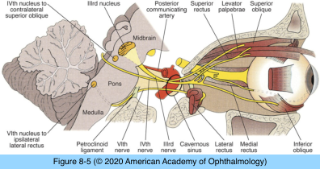
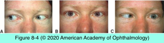
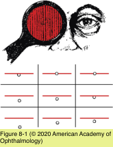
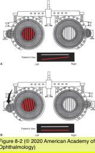
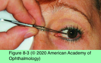

# 5.8.1. Diplopia (I)

## Images

## Hierarchy

- Localization
  - “wiring diagram” approach
    - conceptualize the anatomical pathway of the cranial nerve or nerves that are assumed to be involved
  - in general, a lesion involving the cranial nerve nucleus or fascicle will cause neurologic signs other than ophthalmoparesis
    - isolated cranial neuropathies secondary to central lesions are the exception and not the rule!
  - attempts at neural localization may fail or give false results in the presence of diffuse disease
  - not helpful in a clinical syndrome such as Wernicke encephalopathy
- History
  - patient may report
    - double vision
    - “blurred vision”
    - closing either eye eliminates the visual disturbance
  - important questions
    - does the double vision resolve when either eye is covered?
      - monocular vs binocular diplopia
    - is the double vision the same in all fields of gaze (comitant), or does it vary with gaze direction (incomitant)?
    - is the double vision horizontal, vertical, oblique, or torsional?
    - to what extent is diplopia constant, intermittent, or variable?
  - other questions
    - is double vision more bothersome with far or with near fixation?
    - head/eye pain
    - numbness
    - eye/eyelid swelling or redness
    - other neurologic symptoms
- Comitant and Incomitant Deviations
  - comitant deviation
    - congenital or early-onset strabismus
    - no diplopia
      - suppression!
      - may experience diplopia later in life if ocular misalignment changes
  - incomitant deviation
    - most frequently acquired
    - congenital incomitant deviations
      - e.g. overaction of the inferior oblique muscle
      - typically do not produce diplopia
    - usually causes diplopia
      - if deviation is very small, fusional amplitudes may eliminate the diplopia
      - small misalignments may produce blurred vision rather than obvious diplopia
      - patients with subnormal visual acuity may not recognize diplopia
    - an incomitant deviation may become comitant with time
      - “spread of comitance”
      - may occur with either a restrictive or paretic incomitant deviation
        - especially likely with a fourth nerve palsy
      - gradual recalibration of the innervation to yoke muscles of each eye
        - probably mediated at a cerebellar level
- Physical Examination
  - ocular redness/swelling
  - proptosis
  - consistent head tilt or head turn
    - evidence of chronicity may exist in old photographs
  - ductions
    - abnormal ductions can often be recognized by gross observation
  - versions
    - alternating cross-cover test
      - 9 standard positions of gaze
        - comitant vs incomitant
          - comitant misalignment
            - congenital strabismus
          - incomitant misalignment
            - acquired disorder
        - compare near and far fixation in primary position and downgaze
    - red Maddox rod
      - red Maddox rod in front of the right eye
      - left eye views the fixation light
      - patients with phoria may report misalignment of the visual axes
        - combine Maddox rod tests with the more objective results of alternate prism cover test
      - sensitive method of obtaining quantitative information about the degree and pattern of ocular misalignment
    - double Maddox rod test
      - to identify/quantify torsional misalignment when vertical diplopia is present
      - red Maddox rod in front of the right eye
      - white Maddox rod in front of the left
      - both rods are aligned vertically
      - if one of the lines is tilted, 1 Maddox rod is rotated in the appropriate direction to quantify the amount of torsional misalignment
    - qualitative method for detecting relative cyclotropia
      - metal pointer or other horizontal line
      - base-down prism is placed over 1 eye
        - 2 vertically displaced lines are visible
      - fourth nerve palsy is typically associated with convergence of the lines toward the side of the palsy
- Differentiating Paretic From Restrictive Etiologies of Diplopia
  - suggestive of restrictive etiology
    - proptosis
    - enophthalmos
    - eye surgery
    - thyroid eye disease
      - most common causes of restrictive strabismus
    - orbital trauma
  - patients may have both neural and restrictive components, especially after trauma
  - saccadic speed
    - paretic conditions reduce the saccadic velocity
      - restrictive conditions do no
  - forced duction test
    - restrictive process produces a mechanical limitation
      - can often be felt by an examiner
    - chronic neural lesions may also, rarely, cause mechanical limitation
      - false-positive result
  - measuring intraocular pressure in primary position and in upgaze
    - increase of ≥5 mm Hg suggests restrictive etiology
- Monocular Diplopia
  - etiology
    - abnormalities of the refractive media
      - uncorrected astigmatism
      - corneal irregularities
        - keratoconus
      - tear film abnormalities
      - cataract
      - improves with pinhole
    - maculopathy with retinal distortion
  - binocular diplopia can be relieved by closing either eye
  - demonstration of monocular diplopia obviates the need for a neurologic workup
