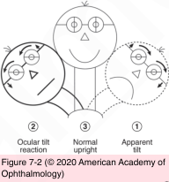

# 5.8.2. Diplopia (II): Supranuclear causes

## Images

## Hierarchy

- Introduction
  - supranuclear pathway for eye movement
    - definition: any afferent input to the ocular motor nerves
    - corticobulbar pathway
      - drives volitional eye movement
        - "look to the right"
    - vestibular pathway
      - analyzes the relative position of the eyes/head and the direction of the intended visual target
      - allows accurate calculation of saccadic velocity and direction
      - horizontal movement: particular population of neurons in the PPRF
  - most supranuclear disorders affect both eyes equally
    - do not cause diplopia!
      - except
        - See Table 8-1
        - Alternating Skew Deviation
        - Convergence insufficiency or spasm
        - Divergence insufficiency
        - Ocular tilt reaction
        - Skew deviation
        - Thalamic esodeviation
- Skew Deviation
  - pathogenesis
    - asymmetric disruption of supranuclear input from otolithic organs
      - peripheral lesions
        - utricle and saccule
          - sense linear motion and static head tilt
          - transmit information to
            - vertically acting ocular motoneurons
              - midbrain
            - interstitial nucleus of Cajal (INC)
      - central lesions
        - more common
        - anywhere within the posterior fossa
          - brainstem
          - cerebellum
  - clinical presentation
    - acquired
    - vertical misalignment
      - comitant or incomitant
    - ± torsional abnormalities
      - often produces diplopia
    - difficult to distinguish from a fourth nerve palsy
      - Parks-Bielschowsky 3-step test
        - opposite to alternating skew deviation
  - alternating skew deviation on lateral gaze
    - hypertropia of the abducting eye
      - right hypertropia on right gaze
        - switches when gaze is directed to the opposite side
    - lesions of
      - cerebellum
      - cervicomedullary junction
      - dorsal midbrain
    - differential diagnosis
      - bilateral fourth nerve palsies
        - hypertropia of the adducting eye
          - right hypertropia larger on left gaze
        - excyclotropia
  - ocular tilt reaction
    - lesions of
      - medulla, pons, or midbrain
        - alters the sense of true vertical
    - bilateral
    - clinical presentation
      - head tilt
      - skew deviation
        - head tilt is associated with contralateral hypertropia
      - cyclotorsional abnormalities
        - rotation of the upper poles of both eyes toward the lower ear
    - differential diagnosis
      - fourth nerve palsy
        - head tilt to opposite side (opposite to hypertropic eye)
          - similar to ocular tilt reaction
            - opposite to ocular tilt reaction
              - opposite to ocular tilt reaction
        - higher eye is extorted
        - hypertropia of adductiing eye (gaze to opposite side)
      - normal response of head tilting
        - rotation of the upper poles of both eyes toward the higher ear
          - counter rolling
  - periodic alternating skew
    - alternating hypertropia
      - similar to fourth nerve palsy
        - opposite to ocular tilt reaction
    - 30–60 second periodicity
    - rare
    - midbrain lesion
- Thalamic Esodeviation
  - acquired esodeviation
  - lesions near the junction of the diencephalon and midbrain
    - thalamic hemorrhage
  - insidious or acute
  - consider the possibility of a CNS lesion in children being evaluated for strabismus surgery
