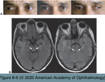
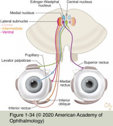
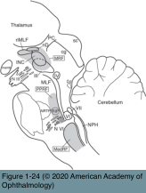
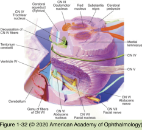
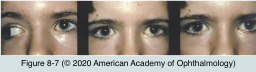

# 5.8.3. Diplopia (III): Nuclear & Internuclear Causes

## Images

## Hierarchy

- Nuclear Causes of Diplopia
  - third cranial nerve nuclear complex
    - anatomy
      - subnuclei for 4 extraocular muscles
        - superior rectus fascicles decussate just after emerging from their subnuclei
          - nuclear lesions may bilaterally affect the superior rectus muscles
      - single subnucleus for the levator palpebrae muscles
        - central caudal nucleus
          - nuclear lesions affect or spare both upper eyelids
      - paired subnuclei for the pupillary constrictor muscles
        - Edinger-Westphal nuclei
    - lesions
      - uncommon
      - reduced perfusion through a small, paramedian-penetrating blood vessel
        - affects the oculomotor nerve nucleus & fascicle on one side
        - asymmetric
  - fourth cranial nerve nucleus
    - short course within the brainstem
    - decussates in anterior medullary velum
      - intraparenchymal lesions of the fourth nerve are rare!
    - etiology
      - microvascular
      - inflammatory
      - demyelinating
    - descending sympathetic pathway is close to the caudal portion of the nucleus
      - nuclear lesion is clinically identical to fascicular lesion
      - fourth nerve palsy + contralateral Horner syndrome
  - sixth cranial nerve nucleus
    - 2 populations of neurons
      - primary motoneurons
        - innervate the ipsilateral lateral rectus muscle
      - internuclear motoneurons
        - innervate the contralateral medial rectus subnucleus (via contralateral MLF)
      - ipsilateral horizontal gaze palsy
        - not an isolated abduction paresis!
        - patients may not experience diplopia!
    - surrounded by the looping fibers (genu) of CN VII
      - ipsilateral upper and lower facial weakness
        - facial colliculus syndrome
- Internuclear Causes of Diplopia
  - medial longitudinal fasciculus (MLF)
    - connects the sixth nerve nucleus on one side of the pons to the medial rectus subnucleus on the contralateral side of the midbrain
  - internuclear Ophthalmoplegia (INO)
    - slow adducting saccadic velocity in 1 eye
      - ± adduction limitation
        - ± horizontal diplopia
      - ± convergence limitation
      - difficulty tracking fast-moving objects
      - INO is named for the side of limited adduction
        - lesion of right MLF causes right INO
        - skew deviation without INO: hyperdeviation contralateral to lesion
    - abducting nystagmus of the fellow eye
    - ± skew deviation
      - ± vertical-oblique diplopia
        - hyperdeviation ipsilateral to the lesion
    - bilateral INO
      - bilateral adduction lag
        - bilateral abducting nystagmus
      - vertical, gaze-evoked nystagmus
        - disruption of vertical vestibular pursuit and gaze-holding pathways
          - ascend from the vestibular nuclei through the MLF
      - large-angle exodeviation
        - “wall-eyed” bilateral INO, or WEBINO, syndrome
          - midbrain lesion near the third nerve nuclei
    - etiology
      - 2 most common causes
        - demyelination
          - adolescents and younger adults
        - stroke
          - older adults
    - differential diagnosis
      - myasthenia gravis
        - pseudo-INO
          - myasthenic eyelid signs
          - no vertical gaze–evoked nystagmus
          - adduction paresis may resolve transiently after intravenous edrophonium (edrophonium test)
          - responds to appropriate systemic therapy
    - references
  - One-and-a-Half Syndrome
    - WEBINO is midbrain
    - pontine abnormality large enough to involve ipsilateral
      - MLF
        - ipsilateral INO
      - PPRF (or sixth nerve nucleus)
        - ipsilateral horizontal gaze palsy
      - only horizontal eye movement remaining is abduction of the contralateral eye
    - one-and-a-half syndrome + involvement of intra-axial portion of the facial nerve
      - eight-and-a-half syndrome (7 + 1.5 = 8.5)
    - etiology
      - stroke
- vertical gaze is preserved
