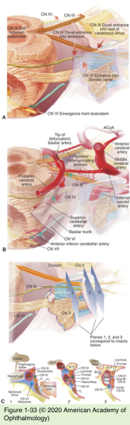
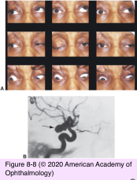
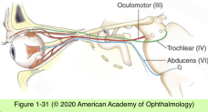
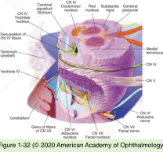
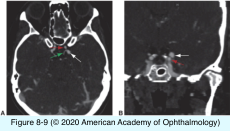

# 5.8.4. Diplopia (IV): Infranuclear Causes of Diplopia (I)

## Images

## Hierarchy

- Third Nerve Palsy
  - complete third nerve palsy
    - complete ptosis
    - eye positioned downward and outward
    - unable to adduct, infraduct, or supraduct
    - dilated pupil that responds poorly to light
  - partial third nerve palsy
    - more common
    - variable limitation of upward, downward, or adducting movements; ptosis; or pupillary dysfunction
  - etiology
    - microvascular injury
      - subarachnoid space or cavernous sinus
        - most common cause of isolated unilateral third nerve palsy
    - brain stem lesions
      - e.g. microvascular infarct
    - Less common causes
      - aneurysmal compression
      - tumor
      - inflammation (eg, sarcoidosis)
      - vasculitis
      - infection (eg, meningitis)
      - infiltration (eg, lymphoma, carcinoma)
      - trauma
- Introduction
  - Intra-axial (fascicular)
    - lesion of the nerve distal to its nucleus but within the confines of the brainstem
    - third cranial nerve
      - 4 syndromes
    - sixth cranial nerve
      - Foville syndrome
        - pons
          - damage to
            - sixth nerve fascicle
              - ipsilateral abduction palsy
            - seventh nerve fascicle
              - ipsilateral facial nerve palsy
              - loss of taste over the anterior two-thirds of the tongue
            - tractus solitarius
            - descending tract of the trigeminal nerve
              - facial hypoesthesia
      - Millard-Gubler syndrome
        - ventral pons
          - sixth nerve fascicle
            - ipsilateral abduction palsy
          - seventh nerve fascicle
            - ipsilateral facial nerve palsy
          - corticospinal tract
            - contralateral hemiplegia
    - fourth cranial nerve
      - uncommon
      - pineal tumors
        - compromise the proximal course of both fourth nerves by compressing the tectum of the midbrain
        - obstruct the Sylvian aqueduct, leading to elevated intracranial pressure and hydrocephalus
        - dorsal midbrain syndrome
  - Subarachnoid
    - from the brainstem to the cavernous sinus
      - nerves exit the dura
    - most ischemic cranial nerve palsies occur within this section
    - ischemic cranial mononeuropathies
      - occur in isolation
      - maximal deficit at presentation
        - occasionally, progress over 7–10 days
      - ± pain
        - may be quite severe
        - pain does not distinguish ischemia from more urgent causes
      - ocular misalignment almost always improves
        - diplopia usually resolves within 3 months
      - warning signs prompting evaluation for another etiology
        - progression of ocular misalignment beyond 2 weeks
        - failure to improve within 3 months
      - diagnosis of ischemic ocular motor nerve palsy is one of exclusion
      - risk factors
        - diabetes mellitus
        - hypertensive vascular disease,
        - elevated serum lipid
      - differential diagnosis
        - aneurysmal compression (posterior communicating artery)
          - isolated cranial mononeuropathy of the oculomotor nerve
        - myasthenia gravis
          - may mimic any pattern of painless, pupil- sparing extraocular motor dysfunction
- Pupil-involving third nerve palsy
  - loss of parasympathetic input
    - mid-dilated pupil that responds poorly to light
  - variable dysfunction of the levator palpebrae or extraocular muscles
  - uncommon < 20 years
    - as early as the first decade of life!
  - etiology
    - aneurysm at the junction of PCoA & ICA
      - nontraumatic third nerve palsy with pupillary involvement must be assumed to be secondary to an aneurysm until proved otherwise
        - emergent cerebrovascular imaging
          - magnetic resonance angiography
            - routine MRI acquired with the MRA is more likely to show nonaneurysmal lesions
          - computed tomography angiography
            - faster
            - greater resolution
            - may show evidence of a subarachnoid hemorrhage
          - catheter angiography
            - for diagnostic confirmation and definitive treatment
          - modern CTA and MRA can reliably detect aneurysms as small as 3 mm
        - lumbar puncture
          - evidence of a hemorrhage (xanthochromia of the spinal fluid)
          - to detect an inflammatory or neoplastic cause
      - pupillomotor fibers of the oculomotor nerve reside superficially in the medial aspect of the nerve
        - adjacent to the PCoA
  - isolated pupillary involvement
    - normal eyelid and extraocular muscle function
    - almost always benign
      - tonic (Adie) pupil
      - pharmacologically dilated pupil
      - pupil that is mechanically damaged
        - posterior synechiae
      - exclude minor degrees of incomitant strabismus
        - alternate cover or Maddox rod testing in all positions of gaze
    - not a form of third nerve palsy
    - tentorial herniation
  - vasculopathic third nerve palsy may produce some efferent pupillary defect
    - generally mild
      - ≤ 20% of cases
        - not a plausible explanation for isolated, fixed, and dilated pupil in the absence of altered mental status or other neurologic abnormalities
      - ≤1 mm anisocoria
    - pupillary dysfunction does not always indicate the presence of an aneurysm or other serious problem
