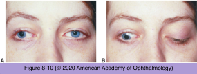

# 5.8.5. Diplopia (V): Infranuclear Causes of Diplopia (II)

## Images

## Hierarchy

- Pupil-sparing third nerve palsy
  - complete pupil-sparing third nerve palsy
    - normal pupillary function + COMPLETE loss of eyelid and ocular motor functions
    - ± pain
      - many vasculopathic palsies produce pain that may be intense
        - head/periorbital pain is not helpful in establishing the cause of third nerve palsy
    - almost always benign
      - secondary to microvascular disease
        - diabetes mellitus
        - hypertension
        - hyperlipidemia
        - in older adults giant cell arteritis must also be considered
          - Westergren sedimentation rate
        - general medical evaluation indicated
      - acute, isolated, pupil-sparing, but otherwise complete third nerve palsy in a patient over 50 years of age with appropriate vascular risk factors and without history of cancer
        - does not necessarily require neuroimaging
    - improves (and usually fully resolves) within 3 months
    - diagnostic workup
      - indications for neuroimaging
        - progression occurs
        - other cranial neuropathies develop
        - expected recovery does not ensue within 3 months,
        - search for a mass or infiltrative lesion at the base of the skull or within the cavernous sinus
          - need to be repeated, especially if the mass is contained within the cavernous sinus
      - lumbar puncture
        - to detect carcinomatous meningitis, inflammation, or infection
  - relative pupil-sparing third nerve palsy
    - normal pupillary function + partial (minor) loss of eyelid and ocular motor functions
    - does not have the same benign implication as complete pupil-sparing third nerve palsy
      - some proportion of partial third nerve palsies with normal pupillary function are related to compressive lesions and may later progress to involve the pupil
    - most third nerve palsies caused by aneurysms present with pain
- Third nerve palsy in younger patients
  - etiology
    - viral infection
      - follow-up should be scheduled to monitor recovery
    - vaccination
    - aneurysms
      - rare in children
      - pupil-involving third nerve palsy necessitates neuromaging
    - ophthalmoplegic migraine
      - pain
      - third nerve dysfunction
        - ophthalmoplegia develops days after the onset of head pain
      - MRI demonstrates reversible thickening and enhancement at the root exit zone of the third nerve
        - follow-up MRI is indicated
          - nerve enhancement will persist after resolution of the third nerve palsy
    - third nerve schwannoma
      - may mimic the fluctuating nature of ophthalmoplegic migraine
- Aberrant regeneration of the third nerve
  - regenerating nerve axons regrow to innervate muscles other than those they originally innervated
  - synkinetic phenomena
    - co-contraction of muscles that normally are not activated at the same time
      - eyelid retraction with adduction
      - pupillary miosis with elevation, adduction, or depression
  - etiology
    - trauma
    - compression by an aneurysm or tumor
    - does not occur with third nerve palsy caused by microvascular ischemia
  - primary aberrant regeneration
    - aberrant regeneration without a history of third nerve palsy
    - slowly expanding parasellar lesion
      - meningioma
      - carotid aneurysm within the cavernous sinus
    - requires appropriate neuroimaging
- Divisional third nerve palsy
  - anatomy
    - third cranial nerve
      - superior division
      - inferior division
      - at superior orbital fissure or within the cavernous sinus
        - isolated involvement of either division usually indicates a lesion of
          - anterior cavernous sinus
          - posterior orbit
  - diagnostic workup
    - orbital MRI with contrast and fat suppression
      - initial diagnostic study of choice
    - medical evaluation
      - blood pressure
      - blood sugar level
      - serum lipid levels
      - Westergren sedimentation rate
      - C-reactive protein
  - other causes
    - brainstem disease
      - if neuroimaging results are normal
      - rare
      - small-vessel stroke (lacunae)
      - demyelination
    - aneurysms
      - much less common
    - tumors
    - inflammation (eg, sarcoidosis, vasculitis)
    - infection (eg, meningitis)
    - infiltration (eg, carcinomatous meningitis or lymphoma)
    - trauma
