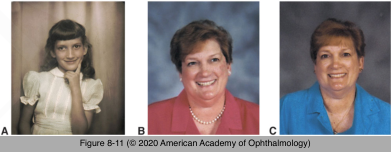

# 5.8.6. Diplopia (V): Infranuclear Causes of Diplopia (III)

## Images

## Hierarchy

- Sixth Nerve Palsy
  - most frequent isolated ocular motor palsy
  - clinical presentation
    - abduction deficit
      - horizontal diplopia
      - esodeviation
      - worsens on ipsilateral gaze
    - divergence paralysis
      - during the evolving or resolving phase of a sixth nerve palsy
  - etiology
    - ischemic mononeuropathy
      - adults > 50 years
        - most common cause
      - resolves within 3 months
        - recovery does not necessarily indicate a benign cause
          - palsy may recur as a manifestation of an intracranial tumor!
      - neuroimaging
        - not required at initial diagnosis
    - cerebellopontine angle lesions
      - acoustic neuroma
        - mandatory if no obvious improvement within 3 months
      - meningioma
      - associated findings
        - decreased facial and corneal sensitivity (CN V)
        - facial paralysis (CN VII)
        - decreased hearing with vestibular signs (CN VIII)
          - ipsilateral abducens palsy
    - chronic inflammation of the petrous bone
      - Gradenigo syndrome
        - facial pain
        - especially in children with recurrent middle ear infections
    - meningeal/skull-based processes
      - meningioma
      - nasopharyngeal carcinoma
      - chordoma
      - chondrosarcoma
    - trauma
      - where the sixth nerve enters the cavernous sinus through the Dorello canal
        - opening below the petroclinoid ligament
      - sixth nerve palsy after seemingly minor head trauma should raise concern for preexisting pathology
    - elevated intracranial pressure
    - congenital
      - abduction paresis early in life
        - congenital sixth nerve palsies almost never occur in isolation
        - Duane syndrome
    - posteriorly draining carotid-cavernous fistula
      - sixth nerve palsy may be the only presenting ocular sign
    - demyelination
      - MRI (FLAIR)
        - T2 hyperintensities
      - adolescents and young adults
    - brainstem glioma
      - children
    - thyroid eye disease with medial rectus involvement
    - neuromuscular junction disease
      - edrophonium testing
  - diagnostic workup
    - neuroimaging
      - .>50 years
        - if no obvious improvement within 3 months
      - <50 years
        - mandatory
          - few are caused by ischemic cranial neuropathy
          - children with 6th nerve palsy require neuroimaging
    - medical evaluation
    - lumbar puncture
    - chest imaging
    - hematologic studies
      - collagen vascular disease
      - sarcoidosis
      - syphilis
- Fourth Nerve Palsy
  - fourth nerve palsy
    - grossly normal motility in most cases
      - ± limited downgaze in the adducted position
    - cover-uncover or Maddox rod testing
    - Parks-Bielschowsky 3-step test
      - ipsilateral hyperdeviation
        - worse on downgaze
          - compensatory chin down position
          - worse on contralateral gaze
            - diplopia (tendency to close 1 eye) while reading!
            - compensatory head turn to the opposite side
        - worse on ipsilateral head tilt
          - compensatory head tilt to the opposite side
            - facial asymmetry
            - confirmed by reviewing old photographs
        - “spread of comitance”
          - reliability of the 3-step test in identifying patterns of vertical strabismus lessens somewhat over time
    - relative excyclotropia of the involved eye
      - most helpful in determining whether a vertical strabismus conforms to the pattern of a fourth nerve palsy
    - large vertical fusional range (>3 prism diopters)
      - ± asymptomatic until the adult years
  - bilateral fourth nerve palsy
    - should always be considered whenever a unilateral palsy is diagnosed, especially after head trauma
    - crossed hypertropia
      - right eye is higher on left gaze, and the left eye is higher on right gaze
    - excyclotorsion of ≥10°
      - double Maddox rod testing
    - large (≥25 D) V pattern of strabismus
      - habitual chin down posture
  - etiology
    - congenital
      - anomalous superior oblique tendon
      - anomalous site of its insertion
      - defect in the trochlea
      - comparison of superior oblique size on MRI between the affected and unaffected sides does not reliably distinguish acquired from congenital palsies
    - benign tumor (eg, schwannoma) of the fourth nerve
    - microvascular ischemic disease
      - .>50 years
      - full medical evaluation is appropriate
        - function always improves and typically resolves within 3 months
      - older patients should be followed to ensure recovery
        - lack of recovery after 3 months should prompt neuroimaging
          - search for a mass lesion at the skull base
    - closed-head cranial trauma
      - because of the unique dorsal midbrain- crossing anatomy
    - disease within the subarachnoid space or cavernous sinus
    - isolated, nontraumatic fourth nerve palsy
      - most cases have congenital, ischemic, or idiopathic causes
  - differential diagnosis
    - skew deviation
      - occasionally, skew deviation mimics fourth nerve palsy on the 3-step test
    - myasthenia gravis
      - moving the patient from the sitting to the supine position will often reduce the hypertropia in skew deviation
    - thyroid eye disease
    - previous orbital trauma
    - partial oculomotor nerve palsy
    - simultaneous dysfunction of many ocular motor cranial nerves
    - acquired vertical strabismus not from a fourth nerve palsy is often the result of the dysfunction of more than 1 muscle
      - will not generate a positive 3-step test!
- leukemia
  - children
