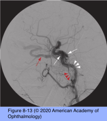
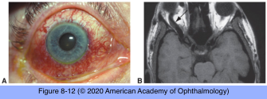

# 5.8.7. Diplopia (VII): Infranuclear Causes of Diplopia (IV)

## Images

## Hierarchy

- Neuromyotonia
  - rare
  - prior skull-base radiation therapy
    - months-years postradiation
  - may affect any of the ocular motor nerves or their divisions
  - episodic diplopia
    - often triggered by activation of the affected nerve
    - overaction of the nerve produces ocular misalignment
    - carbamazepine and its derivatives
      - first-line treatment
  - medical therapy
- 30–60 seconds
- Carotid cavernous sinus fistula
  - abnormal connections between the carotid artery or its branches and the cavernous sinus
    - direct, high-flow connections
      - between the internal carotid artery and the cavernous sinus
      - after severe head trauma
    - indirect, “dural” low-flow connections
      - between small arterial feeders off the internal or external carotids and the cavernous sinus
      - occur spontaneously
        - older women
    - high- and low-flow fistulas cannot be distinguished reliably through physical examination
      - except cranial bruit that indicates high flow
    - cerebral angiography is necessary to make the correct diagnosis
  - clinical presentation
    - pain
      - may partly result from ocular surface drying if proptosis is significant
    - ocular motor neuropathy with diplopia
      - compression of CN VI by an enlarged inferior petrosal sinus
        - drains the fistula
          - isolated sixth nerve palsy even in the context of a quiet eye
    - may reverse blood flow within the superior ophthalmic vein
      - venous congestion within the orbit
        - proptosis
      - arterialization of conjunctival vessels
    - elevated intraocular pressure
    - arterial or venous compromise to the retina and eye
    - ischemic optic neuropathy
    - choroidal effusions
      - can push the iris forward and produce angle- closure glaucoma
    - cerebral venous infarction (rare)
  - management
    - angiographic studies are required
    - some indirect fistulas remain stable or close spontaneously
    - interventional radiologic techniques
      - variety of thrombogenic materials
        - coils, beads, or balloons
    - radiosurgery
- Paresis of More Than One Cranial Nerve
  - etiology
    - benign microvascular disease rarely causes simultaneous involvement of >1 ocular motor nerve
    - simultaneous involvement of contiguous nerves (CNs III, IV, V, VI, and sympathetic nerves)
      - cavernous sinus lesion
    - bilateral cranial nerve involvement
      - diffuse infiltrative process
        - carcinoma, leukemia, or lymphoma
      - midline mass lesion that extends bilaterally
        - chordoma, chondrosarcoma, or nasopharyngeal carcinoma
      - meningeal-based process
      - inflammatory polyneuropathy
        - Guillain-Barré syndrome
        - sarcoidosis
      - myasthenia gravis
  - diagnostic workup
    - neurologic evaluation should be undertaken
    - if neuroimaging results are normal
      - lumbar puncture with cytopathologic examination
      - special testing for cancer-associated protein markers
      - repeat studies may be needed
  - Idiopathic multiple cranial neuropathy syndrome
    - diagnosis of exclusion
- CT-PET scan
  - in suspected neoplastic meningeal involvement (meningeal carcinomatosis)
    - study of choice
- Cavernous Sinus and Superior Orbital Fissure Involvement
  - combination of third, fourth, and sixth cranial nerve palsies
    - If only 1 ocular motor nerve is involved, it is usually the sixth nerve
      - the only ocular motor nerve not protected within the dural wall of the cavernous sinus
  - fifth cranial nerve involvement
    - facial hypoesthesia
  - sympathetic involvement
    - third-order (postganglionic) Horner syndrome
  - aggressive lesions of the cavernous sinus
    - especially infectious or inflammatory
    - may compromise venous outflow
      - engorgement of ocular surface vessels
      - orbital venous congestion
      - increased intraocular pressure
      - increased ocular pulse pressure
  - clinically impossible to distinguish cavernous sinus lesions from superior orbital fissure lesions
  - offending lesion may extend toward the optic foramen or into the orbital apex
    - optic nerve dysfunction
      - sphenocavernous syndrome/parasellar syndrome
      - orbital apex syndrome
- Tolosa-Hunt syndrome
  - idiopathic, sterile inflammation that primarily affects the cavernous sinus
  - severe, “boring” pain
    - almost always present
    - typically responds rapidly and dramatically to corticosteroid therapy
      - a positive response may also occur with neoplastic mass lesions, especially lymphoma
        - diagnosis of this syndrome is one of exclusion
  - neuroimaging
    - enhancing mass within the cavernous sinus
  - other cavernous sinus lesions
    - aneurysm
    - meningioma
    - lymphoma
    - schwannoma
    - pituitary adenoma
    - carotid cavernous fistula
    - metastasis
    - sarcoidosis
    - cavernous sinus thrombosis
- Neuromuscular Junction Causes of Diplopia (Myasthenia Gravis)
  - any pattern of ocular misalignment
    - diplopia
  - ptosis
  - it never produces
    - sensory symptoms
    - pain
    - autonomic dysfunction
    - clinical pupillary dysfunction
