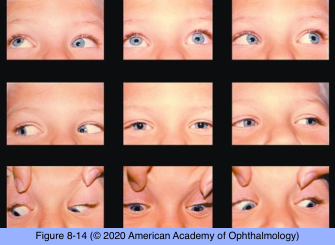

# 5.8.8. Diplopia (VIII): Infranuclear Causes of Diplopia (V)

## Images

## Hierarchy

- Thyroid Eye Disease (TED)
  - most common cause of restrictive strabismus in adults
  - any extraocular muscles may be involved
    - most common
      - inferior rectus
        - ipsilateral hypotropia
          - in primary position
          - increases in upgaze
      - medial rectus
        - esodeviation
          - increases on lateral gaze to same side
  - other findings
    - proptosis
    - chemosis
    - eyelid retraction
    - eyelid lag
    - restrictive strabismus may be the only sign
  - diagnostic workup
    - forced duction testing
    - measurement of intraocular pressure in different positions of gaze
    - neuroimaging
      - enlargement of the bellies of the extraocular muscles, with sparing of the tendons
- Brown Syndrome
  - impaired supraduction in adduction
  - etiology
    - usually congenital
      - short superior oblique tendon
    - can be acquired
      - damage/trauma to the trochlea
        - ipsilateral hypodeviation
          - increases on upgaze to the opposite side
        - may cause a “click” that the patient can feel
      - rheumatoid arthritis
      - idiopathic orbital inflammatory disease
      - focal metastasis to the superior oblique muscle
- Orbital Myositis
  - etiology
    - usually an isolated phenomenon
    - may be part of a systemic disease
      - Wegener granulomatosis
      - systemic lupus erythematosus
      - sarcoidosis
  - clinical presentation
    - ophthalmoplegia
    - pain
    - conjunctival hyperemia
      - If confined to the posterior orbit, the eye may appear white and quiet
    - chemosis
    - ± proptosis
  - neuroimaging
    - inflammation often extends into the orbital fat
      - CT or MRI typically show enlargement of extraocular muscle with tendon involvement
  - management
    - systemic corticosteroid therapy
      - pain usually responds within 24 hours
      - diplopia may take longer to resolve
- Posttraumatic Restriction
  - blowout fractures of the orbit
    - fracture of the orbital floor with entrapment of the inferior rectus muscle
      - mimics the pattern of vertical strabismus in TED
    - entrapment of the medial rectus muscle
      - less common
    - paretic strabismus from swelling may occur in the acute phase
  - coronal CT of the orbit
  - management
    - as swelling resolves, so may the diplopia
      - decisions about surgery for orbital blowout fractures must be made judiciously
- Post–Cataract Extraction Restriction
  - after retrobulbar injection for cataract or other ocular surgery
    - nerve damage
    - myotoxicity
      - from the local anesthetic
    - injury to the inferior rectus or other muscles
  - initial paretic/myotoxic effect evolves into extraocular muscle fibrosis
    - involved eye transitions from hypertropic to hypotropic status
      - hypotropia increasing in upgaze
- Neoplastic Involvement
  - Infiltration of the orbit by cancer
    - extraocular muscle infiltration
    - involvement of the ocular motor cranial nerves
    - especially from surrounding paranasal sinuses
  - relative enophthalmos
  - eyelid “hang-up” on downgaze
  - occasionally, extraocular muscles may be the site of a metastatic tumor
