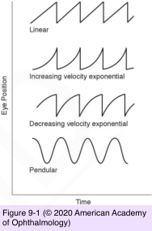

# 5.9.1. Nystagmus (I)

## Images

## Hierarchy

- Introduction
  - definition
    - nystagmus
      - rhythmic, to-and-fro eye movements that incorporate a slow phase
    - jerk nystagmus
      - has 2 phases
        - (1) a slow-phase drift from the visual target
        - (2) a corrective saccade (fast phase) back to the target
      - direction of jerk nystagmus is reported as the direction of its fast-phase component
      - slow-phase component indicates the pathology
    - pendular nystagmus
      - back-and-forth slow-phase movements that occur without a fast phase
    - saccadic intrusions/oscillations
      - abnormal saccadic movements
        - adversely affect visual fixation
        - have no slow phase
    - dissociated nystagmus
      - amplitude of oscillations differs in each eye
    - disconjugate/disjunctive nystagmus
      - direction of oscillations differs between the 2 eyes
    - oscillopsia
      - sensation of environmental movement
      - acquired nystagmus
      - absent in children with congenital nystagmus
  - history
    - associated neurologic symptoms
      - vertigo
      - ataxia
      - motor weakness
      - sensory weakness
    - family history of abnormal eye movements or strabismus
  - clinical presentation
    - a few beats of nystagmus are normally present in the extremes of horizontal gaze (beyond 45°)
      - especially in older patients
      - should not be considered pathologic unless the nystagmus is
        - persistent
        - asymmetric (eg, present to the left but not the right)
        - accompanied by other features
    - nystagmus in primary position may degrade visual acuity
    - any abnormal eye movement in the cardinal positions should be examined
      - monocular or binocular
      - conjugate
        - the eyes behave similarly
      - horizontal, vertical, torsional, or mixed in pattern
      - continuous or induced by a particular eye position
      - reduced at a null point
        - characterized by slow phases only (ie, pendular nystagmus), fast-and-slow phases (ie, jerk nystagmus), or fast phases only (ie, saccadic intrusion)
        - field of gaze at which the nystagmus is minimal
    - amplitude of nystagmus often changes with gaze position
  - diagnostic workup
    - illuminated Frenzel (high-magnification) goggles
      - block the patient’s fixation and magnify abnormal eye movements
    - 20 D lens
    - slit lamp
    - direct ophthalmoscope
    - ocular motor recordings
      - objective and highly sensitive measure of eye movements
      - rarely needed in standard clinical practice
    - video recording
- Gaze-Evoked Nystagmus
  - inability to maintain fixation in eccentric gaze
    - eyes drift back to the midline
      - a corrective saccade is generated to reposition the eyes on the eccentric target
        - fast phase is always in the direction of gaze
  - Alexander’s law
    - nystagmus increases in intensity (amplitude and frequency) as the eyes are moved in the direction of the fast phase
  - pathogenesis
    - dysfunction of the neural integrator
      - horizontal gaze
        - nucleus prepositus hypoglossi
      - vertical gaze
        - interstitial nucleus of Cajal
          - medial vestibular nuclei
      - flocculus and nodulus of the cerebellum also play a role in maintaining an eccentric position of gaze
      - neural control of eye movements
        - • PPRF: saccadic generator for horizontal eye movements (pons )
          - • nucleus prepositus hypoglossi: neural integrator for horizontal eye movements
        - • riMLF: saccadic generator for vertical (and torsional) eye movements (midbrain)
          - • interstitial nucleus of Cajal: neural integrator for vertical and torsional eye movements
  - a few beats of symmetric jerk nystagmus at the extremes of far horizontal gaze is physiologic
    - no rebound nystagmus
    - no saccadic dysmetria
  - further evaluation is required if
    - nystagmus is asymmetric
    - nystagmus is sustained
  - etiology
    - metabolic/toxic
      - ethanol
      - anticonvulsants
      - sedatives
      - hypnotics
    - ipsilateral lesion of the brainstem or cerebellum
      - stroke
      - demyelination
      - tumor
    - end-organ disease
      - extraocular myopathies
      - myasthenia
      - pattern similar to that observed with lesions of the central nervous system
  - Rebound Nystagmus
    - after prolonged eccentric viewing
      - jerk nystagmus in the opposite direction after an attempted return to primary gaze
    - often a manifestation of cerebellar disease
