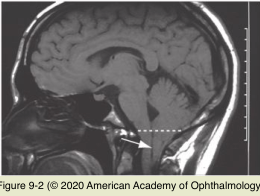

# 5.9.4. Nystagmus (IV): Central Vestibular Nystagmus

## Images

## Hierarchy

- See Table 9-2
- ocular bobbing
  - rapid downward movement of both eyes, followed by slow return to midline
  - pons
    - infarction
    - hemorrhage
  - extremely poor prognosis for neurologic recovery
  - valuable localization and prognostic information
  - bilateral pontine lesions lead to loss of horizontal eye movements
- extensive interconnections between the central vestibular structures of the brainstem and the phylogenetically older regions of the cerebellum (ie, flocculus, nodulus, and vermis)
  - difficult to determine by clinical examination alone the precise location of some lesions that produce central nystagmus
- Upbeat nystagmus
  - downward drifting of the eyes, followed by corrective, upward saccades
  - etiology
    - lesions in
      - anterior cerebellar vermis
        - brainstem (often medulla)
    - demyelination
    - stroke
    - cerebellar degeneration
    - tobacco smoking
- Torsional nystagmus
  - peripheral vestibular nystagmus may have a torsional component
  - purely torsional nystagmus indicates a central lesion
  - medullary lesion
    - syringobulbia
    - lateral medullary infarction
  - may be part of an ocular tilt reaction
- Downbeat nystagmus
  - most common form of central vestibular nystagmus
  - clinical presentation
    - oscillopsia
    - upward drift corrected with a downward saccade
      - may be present in primary position
      - Alexander’s law
        - downbeating movements are usually accentuated in downgaze
    - asymmetric vertical VOR; symmetric horizontal VOR
  - etiology
    - lesions of vestibulocerebellum (ie, nodulus, uvula, flocculus, and paraflocculus)
      - diminish the tonic output from the anterior semicircular canals to the ocular motoneurons
    - lesion is often located at the cervical- medullary junction
    - differential diagnosis of downbeat nystagmus
      - Arnold-Chiari type I malformation
        - most common structural lesion
        - posterior fossa crowding and cerebellar tonsillar protrusion into the foramen magnum
      - tumors (eg, meningioma, cerebellar hemangioma) at the foramen magnum
      - demyelination
      - stroke
      - cranial trauma
      - drug toxicity (eg, lithium, anticonvulsants)
      - platybasia
      - basilar artery impression
      - spinocerebellar degenerations
      - syrinx of the brainstem or upper cervical spinal cord
      - brainstem encephalitis
      - paraneoplastic syndrome
      - impaired nutrition (eg, Wernicke encephalopathy, parenteral feeding, magnesium deficiency)
      - idiopathic
        - antibodies to glutamic acid decarboxylase
          - interfere with the GABAergic neurons of the vestibular complex that normally inhibit the cells of the flocculus
  - treatment
    - baclofen
      - clonazepam
    - gabapentin
    - base-out prisms (to induce convergence)
    - memantine
    - 4-aminopyridine
    - 3,4-diaminopyridine
      - little to no success
- Periodic alternating nystagmus (PAN)
  - congenital or acquired
    - associated with oculocutaneous albinism
  - strictly horizontal
  - oscillation cycle of 2–4 minutes
    - any purely horizontal nystagmus that occurs in primary position should be observed for at least 2 minutes
    - crescendo–decrescendo nystagmus
      - change in amplitude and frequency
    - short period of downbeat or no nystagmus
      - 10-20 seconds
  - periodic alternating head turn
    - to minimize the nystagmus, in accordance with Alexander’s law
      - crescendo–decrescendo nystagmus in the opposite direction
  - dysfunction of the cerebellar nodulus and uvula
    - multiple sclerosis
    - cerebellar degeneration
    - Arnold-Chiari type I malformation
    - stroke
    - use of anticonvulsant medication
    - bilateral loss of vision
      - reversible
  - baclofen
    - can be effective for the acquired form
