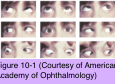

# 6.10.1. Pattern Strabismus

## Images

## Hierarchy

- Introduction
  - definition
    - horizontal deviation changes in magnitude between upgaze and downgaze
  - V pattern
    - most common
    - horizontal deviation is more divergent (less convergent) in upgaze than in downgaze
      - ≥15 Δ
        - normally there is some physiologic convergence in downgaze
  - A pattern
    - horizontal deviation is more divergent (less convergent) in downgaze compared with upgaze
      - ≥10 Δ
  - 15%–25% of horizontal strabismus cases
- Etiology
  - Dysfunction of oblique muscles
    - apparent inferior oblique muscle overaction with V patterns
      - overelevation in adduction (OEAd)
    - apparent superior oblique muscle overaction with A patterns
      - overdepression in adduction (ODAd)
  - Abnormalities of the orbital pulley system
    - patients with upward-or downward-slanting palpebral fissures may show A and V patterns
    - craniofacial anomalies
      - V-pattern strabismus
      - marked elevation of the adducting eye
  - Dysfunction of horizontal rectus muscles
    - effectiveness of lateral rectus muscles in the upper half of the vertical gaze field
    - effectiveness of medial rectus muscles in the lower half of this field
    - increases in lateral rectus or medial rectus muscle action produce a V pattern
    - decreases in lateral rectus or medial rectus muscle action produce a an A pattern
  - Selective innervation of horizontal rectus muscles
  - Dysfunction of vertical rectus muscles
    - increases or decreases in the tertiary adducting action of these muscles
- Management
  - General Principles
    - apparent overaction of oblique muscles (OEAd, ODAd)
      - weakening of oblique muscles
    - no apparent overaction of oblique muscles
      - vertical transposition of horizontal muscles
        - from one-half width to full width of insertion
        - MALE
          - medial rectus muscles are always moved toward “apex” of pattern
          - lateral rectus muscles are moved toward open end or “empty space”
          - these rules apply whether horizontal rectus muscles are weakened or tightened
    - when horizontal rectus muscle recession- resection surgery is the preferred choice
      - displace rectus muscle insertions in mutually opposite directions
        - this displacement has little, if any, vertical effect in primary position
      - some surgeons adjust amount of horizontal surgery because of potential effect of oblique muscle weakening on horizontal deviation
        - particularly for superior oblique muscle surgery
          - bilateral superior oblique weakening causes a change of 10Δ–15Δ toward convergence in primary position
        - for inferior oblique muscle weakening procedures, amount of horizontal rectus muscle surgery does not need to be altered
        - controversial
    - surgery on vertical rectus muscles is rarely employed
      - temporal displacement of superior rectus muscles for A-pattern esotropia
      - temporal displacement of inferior rectus muscles for V-pattern esotropia
  - Treatment of Specific Patterns
    - V pattern
      - V-pattern XT or ET + OEAd
        - inferior oblique muscle weakening
          - myectomy
          - recession
          - corrects ≤15Δ–20Δ of V pattern
        - patients who also have DVD
          - anterior transposition of inferior oblique muscle
            - may improve both V pattern and DVD
          - patients with V-pattern infantile ET <2 years are at risk of developing DVD
            - anterior transposition of inferior oblique may be considered in this group to preemptively address DVD
      - V-pattern XT or ET without OEAd
        - vertical transposition of horizontal rectus muscles
    - A pattern
      - A-pattern XT or ET + OEAd
        - superior oblique muscle weakening
          - tenectomy of posterior 7/8 of the insertions
            - corrects ≈ 20Δ of A pattern
            - no significant effect on torsion
          - recession
          - lengthening of the tendon
            - spacer
            - Z-lengthening procedure
          - bilateral superior oblique tenotomy is a very powerful procedure
            - may correct up to 40Δ–50Δ of A pattern
            - risk of induced torsional imbalance
              - may cause problems for patients with fusional ability
      - A-pattern XT or ET without OEAd
        - vertical transposition of horizontal rectus muscles
      - trisomy 21
        - early-onset esotropia with A-pattern strabismus + ODAd
          - caused by orbital abnormalities
          - vertical transposition of horizontal rectus muscles is employed
    - Y pattern
      - not due to overaction of inferior oblique muscles
      - superior transposition of lateral rectus muscles
    - X pattern
      - recession of lateral rectus muscles alone
    - λ pattern
      - typically associated with ODAd
      - superior oblique weakening procedures
- Clinical Features and Identification
  - measuring alignment
    - patient fixates on an accommodative target at distance, with fusion prevented
      - primary position
      - straight upgaze
        - 25° from the primary position
      - straight downgaze
        - 25° from the primary position
  - proper refractive correction is necessary
    - uncompensated accommodative component can introduce exaggerated convergence in downgaze
  - V Pattern
    - most common type
    - associations
      - infantile esotropia
        - most frequent
        - not present when esotropia first develops
          - becomes apparent during the first year of life or later
      - superior oblique palsies
        - particularly if bilateral
      - craniofacial malformations
  - A Pattern
    - second most common type
    - associations
      - exotropia
        - most frequent
      - A patterns are more common than V patterns in infantile strabismus associated with
        - craniofacial malformations
        - trisomy 21
        - myelomeningocele
  - Y Pattern
    - pathogenesis
      - aberrant innervation of the lateral rectus muscles in upgaze
    - normal ocular alignment in primary position and downgaze
    - diverge in upgaze
    - appear to have overacting inferior oblique muscles
      - pseudo-overaction of the inferior oblique
        - overelevation is not seen when the eyes are moved directly horizontally
          - becomes manifest when the eyes are moved medially and slightly elevated
        - no fundus torsion
        - no superior oblique muscle underaction
    - references
  - X Pattern
    - pathogenesis
      - contracture of lateral rectus muscle
        - slippage of globe as eye adducts
    - most commonly seen in patients with large- angle exotropia
    - deviation in primary position increases in both upgaze and downgaze
    - overelevation and overdepression in adduction when the eye moves slightly above or below direct side gaze
  - λ Pattern
    - rare
    - deviation is the same in primary position and upgaze and increases in downgaze
    - usually associated with ODAd
