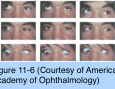

# 6.11.3. Vertical Deviations (III)

## Images

## Hierarchy

- Dissociated Vertical Deviation (DVD)
  - innervational disorder
    - references
  - 50% of patients with infantile strabismus (esotropia or exotropia)
  - clinical features
    - <2 years
    - usually bilateral
      - frequently asymmetric
    - occurs whether or not the horizontal deviation has been surgically corrected
      - in contrast to see-saw nystagmus in which the elevating eye intorts
        - in contrast to skew deviation in which the hypertropic eye intorts
    - either eye slowly drifts upward and outward, with simultaneous extorsion
      - when occluded or during periods of visual inattention
      - some patients attempt to compensate by tilting the head
      - vertical movement usually predominates
      - sometimes abduction predominates
        - dissociated horizontal deviation (DHD)
    - types
      - may occur spontaneously (manifest DVD)
      - only when 1 eye is occluded (latent DVD)
    - associated findings
      - latent nystagmus
      - horizontal strabismus
    - measurement
      - occluder technique
        - place base-down prism in front of upwardly deviating eye while it is behind an occluder
        - occluder is then switched to fixating lower eye
        - prism power is adjusted until the deviating eye shows no downward movement to refixate
      - red Maddox rod technique
        - placed in front of dissociated (higher) eye
          - generates a horizontal line
        - other eye fixates on a small light
        - vertical prism power is adjusted to eliminate the separation of the light and the line
      - each eye is tested separately in cases of bilateral DVD
  - differential diagnosis
    - inferior oblique muscle overaction
  - management
    - indications for treatment
      - deviation is noticeable
        - .>6Δ–8Δ
      - occurs frequently during the day
    - optical penalization
      - to change fixation preference
      - effective mostly in unilateral or highly asymmetric bilateral DVD
    - superior rectus muscle recession
      - from 6 to 10 mm
      - bilateral surgery whenever both eyes can fixate
        - asymmetric recessions are an option if DVD is asymmetric
      - surgery on vertical muscles often improves the condition but rarely eliminates it
    - inferior rectus muscle resection or plication
      - for residual DVD after superior rectus muscle recession
    - inferior oblique muscle anterior transposition
      - especially if it is accompanied by inferior oblique muscle overaction
- Comitant Vertical Tropias
  - tropia does not change significantly when gaze is shifted from one side to the other
  - Monocular Elevation Deficiency
    - limitation of upward gaze with a hypotropia that is similar in adduction and abduction
      - "double-elevator palsy"
    - etiology
      - restriction of the inferior rectus muscle
      - innervational deficit
        - weakness of 1 or both elevator muscles
        - monocular supranuclear gaze disorder
      - combination
    - clinical features
      - hypotropia
        - increases in upgaze
      - chin-up position with fusion in downgaze
      - ptosis or pseudoptosis
        - true ptosis in 50%
        - If any other feature of third nerve palsy is present, that condition should be suspected
      - 3 forms
        - restriction
          - positive forced duction on elevation
          - normal elevation force generation and elevation saccadic velocity (no muscle paralysis)
          - often an extra or deeper lower eyelid fold on attempted upgaze
          - poor or absent Bell phenomenon
        - elevator muscle innervational deficit
          - free forced duction on elevation
          - reduced elevation force generation and saccadic velocity
          - preservation of Bell phenomenon (indicating a supranuclear cause) in many cases
        - combination
          - positive forced duction on elevation
          - reduced elevation force generation and saccadic velocity
    - management
      - indications for treatment
        - large vertical deviation in primary position
          - ±ptosis
        - abnormal chin-up head position
      - with restriction
        - inferior rectus muscle recession
          - ± adjustable suture
      - no restriction
        - transposition of medial and lateral rectus muscles
          - Knapp procedure
        - recess the ipsilateral inferior rectus + either recess the contralateral superior rectus or resect the ipsilateral superior rectus
      - ptosis surgery should be deferred until the vertical deviation has been corrected
  - Orbital Floor Fractures
    - pathogenesis
      - muscle entrapment and restriction
      - muscle paralysis due to nerve damage
    - clinical features
      - diplopia in the immediate postinjury stage
        - not necessarily an indication for urgent intervention
          - muscle palsy may resolve over several months
      - outcome after fracture repair
        - range of eye movements may improve
        - fibrosis may cause restriction to persist even after successful repair of the fracture
          - partial restriction persists in many cases even though imaging studies may show no residual entrapment
    - management
      - indications for surgery
        - diplopia in primary position or downgaze
        - compensatory head position
      - mild limitation of eye movements
        - prisms
      - nonresolving hypotropia in primary position
        - especially if the muscle is tight on forced- duction testing
          - recession of the ipsilateral inferior rectus muscle
      - nonresolving esotropia in primary position
        - especially if the muscle is tight on forced- duction testing
          - recession of the ipsilateral medial rectus muscle
      - hypertropia due to weakness of inferior rectus muscle without entrapment
        - observation
          - weakness may improve with time
        - indications for surgery
          - recovery is not complete within 6–12 months
          - there is at least a moderate degree of active force
        - resection of inferior rectus muscle
        - if hypertropia is large
          - inferior rectus muscle resection + recession of ipsilateral superior rectus muscle
        - procedures to limit fellow eye’s downgaze movement and match the duction deficiency of the injured eye
          - recession of the contralateral inferior rectus muscle
            - with or without the addition of a posterior fixation suture
              - fadenoperation
          - combined recession and resection of the contralateral inferior rectus muscle
        - complete chronic inferior rectus muscle palsy
          - transposition of ipsilateral medial and lateral rectus muscles to inferior rectus muscle
            - inverse Knapp procedure
  - Other Comitant Vertical Tropias (Hypertropias)
    - innervational problems
      - superior division (partial) palsy of the third cranial nerve
    - mechanical disorders
      - thyroid eye disease
      - congenital fibrosis of extraocular muscles
    - orbital tumors
    - long-standing superior oblique palsy
      - may develop spread of comitance
