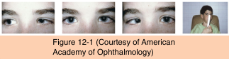
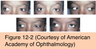
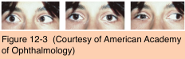

# 6.12.2. Special Forms of Strabismus (II): Duane Retraction Syndrome

## Images

## Hierarchy

- pathogenesis
  - absent or hypoplastic sixth cranial nerve nucleus
    - defect in development between fourth and sixth weeks of gestation
    - aberrant branch of third cranial nerve innervates lateral rectus muscle
      - anomalous co-contraction of medial and lateral rectus muscles on actual or attempted adduction
        - globe retraction
  - tight and broadly inserted medial rectus muscles
  - fibrotic lateral rectus muscles
  - corresponding forced-duction abnormalities
- genetics
  - sporadic
    - most cases
  - autosomal dominant
    - 5%–10%
    - discordance in monozygotic twins
      - role of intrauterine environment
- management
  - indications for surgery
    - primary position deviation
    - head turn
    - marked globe retraction
    - large upshoots or downshoots
    - no surgical approach will normalize rotations
  - goals of surgery
    - to centralize and expand the field of single binocular vision
      - in many patients eyes are properly aligned in at least 1 position of gaze, allowing development of binocular vision
  - type 1
    - recession of medial rectus muscle
      - esotropia >20Δ in primary position
        - bilateral medial rectus muscle recession
      - overcorrection due to excessive medial rectus recession
        - treat with recession of the lateral rectus muscle of the uninvolved eye
      - does not usually improve abduction significantly
    - most surgeons do not favor resection of the lateral rectus muscle
      - globe retraction will worsen!
    - to improve abduction
      - partial or full lateral transposition of both of the vertical rectus muscles or the superior rectus alone
        - ± posterior scleral fixation (myopexy)
  - type 2
    - recession of lateral rectus muscle on the involved side
      - some surgeons recess both lateral rectus muscles if a large-angle exotropia is present
    - resection of the medial rectus muscle is avoided
  - type 3
    - severe globe retraction may be lessened by recession of both the medial and the lateral rectus muscles
      - lateral recession must be very large to improve the retraction
      - may benefit the induced anomalous vertical movements
      - also an option for treating retraction in type 1 and type 2
  - procedures for upshoot or downshoot
    - large lateral rectus recession
    - splitting of the lateral rectus muscle in a Y configuration
    - retroequatorial fixation of the lateral rectus muscle
    - disinsertion of the lateral rectus muscle and reattachment to the lateral periosteum of the orbit
- clinical features
  - F>M
  - bilateral
    - left eye>right eye
    - 15%
  - globe retraction on adduction
    - obviates the need for neurologic investigation for sixth nerve palsy
    - can be difficult to appreciate in an infant
    - vertical slit-lamp beam cast from cornea onto lower eyelid is disrupted by globe retraction when the eye adducts
  - horizontal eye movement (abduction and adduction) can be limited to various degrees
  - upshoot or downshoot of globe on adduction
    - caused by vertical slippage of a tight lateral rectus muscle by 1–2 mm
  - classification
    - type 1
      - most common form
        - 50%–80%
      - poor abduction
      - primary position esotropia
    - type 2
      - poor adduction
      - exotropia
    - type 3
      - poor abduction and adduction
      - esotropia, exotropia, or no primary position deviation
        - often have straight eyes in or near the primary position and little, if any, head turn
  - associated systemic defects
    - Goldenhar syndrome
    - Wildervanck syndrome
  - differentiation from 6th nerve palsy
    - globe retraction on adduction
    - lack of correspondence between absent or typically modest primary position esotropia (usually <30Δ) and the usually profound abduction deficit
    - even in esotropic Duane retraction syndrome, a small-angle exotropia is frequently present on gaze to opposite eye
- references
