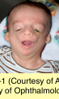

# 6.17.1. Eyelid Disorders (I): Congenital Eyelid Disorders (I)

## Images

## Hierarchy

- Introduction
  - ± isolated
  - ± associated with orbital malformations
  - ± part of a syndrome
    - evaluation of eyelids, ocular adnexa, and interpupillary distance is an essential part of clinical evaluation of a dysmorphic infant
  - morphologic measurements of the eyelids and orbit
    - transparent rulers or calipers
    - compared with normal reference measures
    - Farkas canthal index
      - hypotelorism
        - <38
      - hypertelorism
        - .>42
      - ratio of inner canthal distance to outer canthal distance × 10
- Cryptophthalmos
  - rare
  - forms
    - isolated
    - Fraser syndrome
      - autosomal recessive
        - mutations in the FRAS1 gene
          - 4q21
          - encodes a putative extracellular matrix protein
      - acrofacial malformations
        - partial syndactyly
      - genitourinary anomalies
  - skin passes uninterrupted from the forehead, over the eye, to the cheek
    - blends in with the cornea, which is usually malformed
- Telecanthus
  - greater-than-normal distance between the inner canthi
  - types
    - primary
      - interpupillary distance is normal
    - secondary
      - interpupillary distance is greater than normal
  - common in many syndromes
- Congenital Tarsal Kink
  - tarsal plate of upper eyelid is folded at birth
    - entropion
    - cornea may be exposed
      - ulceration
  - managment
    - minor defects
      - manually unfolding the tarsus
      - taping the eyelid shut with a pressure dressing for 1–2 days
    - more severe defects
      - surgical incision of the tarsal plate
      - excision of a V-shaped wedge from the inner surface
- Dystopia Canthorum
  - lateral displacement of both the inner canthi and the lacrimal puncta
    - an imaginary vertical line connecting upper and lower puncta crosses the cornea
  - Waardenburg syndrome type 1
- Epiblepharon
  - horizontal fold of skin adjacent to either the upper or lower eyelid
    - most commonly, the lower eyelid
  - may turn the lashes inward
  - cornea often tolerates this condition surprisingly well
  - management
    - often resolves spontaneously
    - ocular lubricants
    - surgical repair
      - cases that do not resolve or that cause chronic corneal irritation
- Ablepharon
  - absence or severe hypoplasia of the eyelids
  - very rare
  - at high risk for exposure keratopathy
  - ablepharon macrostomia syndrome
- Congenital Entropion
  - rare
  - eyelid inversion is present at birth
  - does not resolve spontaneously
  - surgery
    - when corneal integrity is threatened
- Congenital Ectropion
  - eversion of the eyelid margin
    - usually involves the lower eyelid
  - secondary to a vertical deficiency of the skin
  - treatment
    - mild cases
      - lateral tarsorrhaphy
    - severe cases
      - skin flap or graft
- Congenital Coloboma of the Eyelid
  - from a small notch to a defect encompassing the horizontal length of eyelid
  - usually involves the upper eyelid
  - eyelid may be fused to the globe
  - unrelated to other ocular colobomas
  - associations
    - medial upper eyelid
      - isolated
        - ?
    - lower eyelid
      - facial clefts (eg, Goldenhar syndrome)
        - Goldenhar syndrome (oculoauriculovertbebral dysgenesis)
          - Upper lid coloboma
          - Epibulbar dermoid
          - Preauricular skin tags
          - Vertebral anomalies
        - mandibulofacial dysostosis (Treacher Collins– Franceschetti syndrome)
          - Lower lid coloboma
          - downward palpebral fissure
      - amniotic band syndrome
      - lacrimal deformities
  - should be observed for exposure keratopathy
  - surgical closure of the eyelid defect is required in most cases
- Ankyloblepharon
  - fusion of part or all of the eyelid margins
  - ± dominantly inherited
  - treatment is surgical
  - ankyloblepharon filiforme adnatum
    - eyelid margins are connected by fine strands
  - Hay-Wells syndrome
    - ankyloblepharon–ectodermal dysplasia– clefting syndrome
    - includes cleft lip or palate
