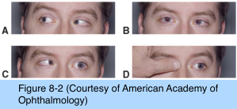

# 6.8.4. Esodeviations (IV): Incomitant Esotropias: Sixth Nerve Palsy

## Images

## Hierarchy

- definition of incomitant esotropia
  - esodeviation varies in size in different positions of gaze
- Introduction
  - 6th nerve palsy within the first 2 months of life is not common
    - usually transient
  - differential diagnosis
    - infantile esotropia
      - most cases of suspected congenital sixth nerve palsy are actually infantile esotropia with cross-fixation
    - esotropic Duane retraction syndrome
      - congenital sixth nerve palsy may be difficult to differentiate from esotropic Duane retraction syndrome in young infants
        - unique retraction feature of this syndrome may not be evident in an infant who has shallow orbits and who may not track well to extreme side gaze
        - for an equal amount of abduction deficit, the deviation in primary position is usually much larger in sixth nerve palsy than it is in esotropic Duane retraction syndrome
        - esotropic Duane retraction syndrome is a much more frequent cause of persistent abduction deficit in infants than is sixth nerve palsy
- Pathogenesis
  - infants (congenital)
    - increased intracranial pressure associated with the birth process
    - usually resolves spontaneously
  - children
    - much more frequent than in infancy
    - ≈1/3 of cases in older children are associated with intracranial lesions and may have other associated neurologic findings
    - infectious or immunologic processes involving cranial nerve VI
  - adults
    - isolated transient sixth nerve palsy is thought to be caused most commonly by a virus in a child or a microvascular occlusive event in an adult
- Management
  - patching
    - to prevent or treat amblyopia
    - if the child is not using a compensatory head posture or if the child is very young
  - press-on prisms
    - to correct diplopia in primary position
  - correction of a significant hyperopic refractive error
  - botulinum toxin injection of the ipsilateral medial rectus muscle
    - to decrease the esotropia and prevent secondary contracture
  - surgery
    - if the deviation does not resolve after 6 months of treatment
    - horizontal rectus muscle surgery if abduction is at least partially preserved
    - vertical rectus muscle transposition surgery if abduction is absent
- Other Forms of Incomitant Esotropia
  - medial rectus muscle restriction
    - thyroid eye disease
    - medial orbital wall fracture
    - excessive medial rectus muscle resection
    - congenital fibrosis of the extraocular muscles
  - Duane retraction syndrome & Möbius syndrome
    - begin as paralytic disorders
    - secondary restriction of the medial rectus may develop later
  - high myopia
    - may develop esotropia due to displacement of the posterior globe between the lateral and superior rectus muscles
- Evaluation
  - older patients
    - diplopia
    - compensatory head turn toward the side of the paralyzed lateral rectus muscle
  - soon after onset, vision in the eyes is usually equal
  - esotropia increases in gaze toward paralyzed lateral rectus muscle
  - saccadic velocities show slowing of affected lateral rectus muscle
  - active force generation tests document weakness of that muscle
  - versions show limited or no abduction of the affected eye
  - history
    - antecedent infections
    - head trauma
    - hydrocephalus
    - adults
      - diabetes mellitus
      - hypertension
  - children require neurologic evaluation and gadolinium-enhanced magnetic resonance imaging of the head and orbit, even in the absence of other focal neurologic findings
