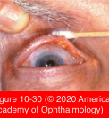
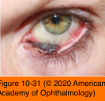

# 7.10.10. Eyelid Neoplasms (VII)

## Images

## Hierarchy

- Melanoma
  - epidemiology
    - incidence of melanoma in United States has been steadily increasing over the past 30 years
    - 5% of cutaneous cancers
      - <0.1% of eyelid cancers
    - 75% of cutaneous cancer deaths
    - predisposing factors
      - sunlight exposure
      - genetic predisposition
      - environmental mutagens
    - predisposing lesions
      - de novo
      - preexisting melanocytic nevi
      - lentigo maligna
  - clinical presentation
    - variable pigmentation
    - irregular borders
    - ± ulcerate and bleed
    - should be suspected in any patient with an acquired pigmented lesion beyond the first 2 decades of life
      - 30-50%
  - 4 clinicopathologic forms
    - lentigo maligna melanoma
      - invasive vertical malignant growth occurring in 10%–20% of lentigo malignas
        - invasive areas are marked by nodule formation within the broader, flat, tan to brown irregular macule
      - 90% of head and neck melanomas
      - eyelid is usually involved by secondary extension from the malar region
      - pigmentation may progress over the eyelid margin and onto the conjunctival surface
      - surgical excision
        - recommended for a premalignant lentigo maligna
        - mandatory for lentigo maligna melanoma
    - nodular melanoma
      - 10% of cutaneous melanomas
        - extremely rare on the eyelids
      - may be amelanotic
    - superficial spreading melanoma
    - acrolentiginous melanoma
    - eyelid is most often involved by either lentigo maligna melanoma or nodular melanoma
  - prognosis
    - tumor thickness has strong prognostic implications
      - thin lesions (<0.75 mm)
        - 5-year survival rate of 98%
      - thicker lesions (>4 mm) with ulceration
        - survival rate of <50%
    - biopsy of these lesions does not increase the risk of metastatic spread
  - management
    - wide surgical excision
      - histologic assurance (by means of permanent sections) of complete tumor removal
      - periocular regions
        - margins <1 cm are often used
    - regional sentinel lymph node biopsy
      - indications
        - microscopic evidence of vascular or lymphatic involvement
        - Breslow thickness >1 mm
    - complete preoperative metastatic workup
      - tumor thickness >1.5 mm
    - cryotherapy
      - should not be considered for treatment of cutaneous melanoma
      - may have a role in the treatment of acquired melanomas in the conjunctiva
- Sebaceous adenocarcinoma
  - arises from
    - meibomian glands of the tarsal plate
    - glands of Zeis
      - associated with the eyelashes
    - sebaceous glands of caruncle, eyebrow, or facial skin
    - multicentric origin is common
      - separate upper and lower eyelid tumors in 6%–8%
  - .>50 years
  - F>M
  - upper lid: lower eyelid = 2:1
    - greater numbers of meibomian and Zeis glands in the upper eyelid
  - clinical presentation
    - course
      - tumor within the tarsal plate
        - intraepidermal/intraepithelial growth
          - extends over the palpebral and bulbar conjunctiva
          - may replace corneal epithelium
          - fine papillary elevation of the tarsal conjunctiva may indicate pagetoid spread of tumor cells
    - appears yellow as a result of lipid material within the neoplastic cells
    - effacement of the meibomian gland orifices
    - destruction of follicles of the cilia
      - loss of eyelashes
    - conjunctival inflammation/hyperemia
    - nodule
      - initially simulates a chalazion
      - later causes loss of eyelashes and destruction of the meibomian gland orifices
  - differential diagnosis
    - chalazia
      - material from a chalazion that has been surgically excised more than once should be submitted for histologic examination
    - chronic blepharitis
      - any chronic unilateral blepharitis could raise the possibility of sebaceous gland carcinoma
    - basal cell or squamous cell carcinoma
    - mucous membrane (ocular cicatricial) pemphigoid
    - superior limbic keratoconjunctivitis
    - pannus associated with adult inclusion conjunctivitis
  - histology
    - rate of histologic misdiagnosis is high among general pathologists
    - clinician should maintain suspicion based on clinical findings
      - request special stains (lipid) or outside consultation
  - diagnostic workup
    - superficial shave biopsies may reveal chronic inflammation but miss the underlying tumor
    - full-thickness eyelid biopsy
    - full-thickness punch biopsy of the tarsal plate
  - management
    - surgical excision
    - Mohs micrographic surgery
      - considerable caution is required because of the skip areas, pagetoid spread, and polycentricity
    - map biopsies of the conjunctiva
      - to eliminate the potential of pagetoid spread
    - adjunctive cryotherapy
      - for pagetoid spread
    - orbital exenteration
      - for recurrent or large tumors invading through the orbital septum
    - radiation therapy
      - usually not appropriate
      - relatively radioresistant
    - metastasis
      - regional lymph nodes
        - most common
          - commonly occurs before metastasis to distant sites
        - identification of microscopic regional nodal metastases may
          - indicate that more extensive therapy is warranted
          - provide prognostic information to the physician and the patient
        - with the exception of basal cell carcinoma, cancers of eyelid and conjunctiva typically metastasize to regional lymph nodes
      - hematogenous
        - rare
      - direct extension
        - rare
    - sentinel lymph node biopsy
      - eyelid sebaceous cell carcinoma with high-risk features
        - recurrent lesions
        - extensive involvement of the eyelid or orbit
      - conjunctival or cutaneous melanoma with a Breslow thickness greater than 1 mm
      - Merkel cell carcinoma of the eyelid
