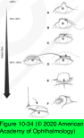
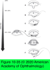

# 7.10.12. Eyelid & Canthal Reconstruction

## Images

## Hierarchy

- Priorities in eyelid reconstruction
  - development of a stable eyelid margin
  - provision of adequate vertical eyelid height
  - adequate eyelid closure
  - smooth, epithelialized internal surface
  - maximum cosmesis and symmetry
- general principles
  - one may reconstruct either the anterior or the posterior eyelid lamella, but not both, with a graft
    - 1 of the layers must provide the blood supply (pedicle flap)
  - maximize horizontal tension and minimize vertical tension
  - maintain sufficient and anatomical canthal fixation
  - match like tissue to like tissue
  - narrow the defect as much as possible before sizing a graft
  - get help from a subspecialist if you need it
- eyelid defects not involving the eyelid margin
  - techniques
    - direct closure
      - if this procedure does not distort the eyelid margin
    - skin flaps
      - types
        - rectangular advancement
        - rotation
        - transposition
      - usually provide the best tissue match and aesthetic result
    - skin grafts
      - easier to perform
      - avoid placement of hair-bearing skin grafts near the eyes
      - use of split-thickness grafts should be avoided in eyelid reconstruction
        - recommended only in the treatment of severe burns of the face when adequate full-thickness skin is not available
      - anterior lamella upper eyelid defects
        - full-thickness skin grafts
          - contralateral upper eyelid
            - best choice
          - preauricular or postauricular skin grafts
            - greater thickness may limit upper eyelid mobility
      - anterior lamella lower eyelid defects
        - preauricular or postauricular skin grafts
          - best choice
        - supraclavicular fossa
        - inner upper arm
  - tension of closure should be directed horizontally
    - placement of vertically oriented incision lines
    - vertical tension may cause eyelid retraction or ectropion
- medial canthal defects
  - spontaneous granulation of anterior lamellar defects
  - full-thickness skin grafs
    - thin enough to allow for early detection of tumor recurrence
    - make every effort at time of tumor resection to minimize risk of recurrent medial canthal tumors
      - frozen sections
      - wide margins
      - Mohs micrographic resection techniques
        - offers the highest cure rates for eradication of medial canthal epithelial malignancies
  - forehead or glabellar flaps
    - disadvantage of being thick, thereby making early detection of recurrences difficult
    - often require second-stage thinning in order to achieve the best cosmetic result
  - when full-thickness medial eyelid defects are present, the medial canthal attachments of the remaining eyelid margin must be fixed to firm periosteum or bone
    - heavy permanent suture
    - wire
    - titanium miniplates
  - defects involving the lacrimal drainage apparatus
    - simultaneous microsurgical reconstruction
    - possible silicone intubation or marsupialization
    - if extensive sacrifice of the canaliculi has occurred in the resection of a tumor
      - patient may have to tolerate epiphora until recurrence of the tumor is no longer a risk
        - recurrence-free period of 5 years
          - conjunctivodacryocystorhinostomy with a Jones tube
- lateral canthal defects
  - laterally based transposition flaps of upper eyelid tarsus and conjunctiva
    - for large lower eyelid defects extending to the lateral canthus
    - can be covered with free skin grafts
  - semicircular advancement flaps of skin
  - strips of periosteum and/or deep temporal fascia
    - left attached at the lateral orbital rim
    - swung over and attached to the remaining lateral eyelid margins
    - y-shaped pedicle flap of periosteum is optimal for reconstruction of the entire lateral canthal posterior lamella
- eyelid defects involving the eyelid margin
  - upper eyelid
    - small upper eyelid defects
      - ≤1/3 involvement
      - primary closure
        - surgeon can cut the superior limb of the lateral canthal tendon to allow 3–5 mm of medial mobilization
          - avoid the lacrimal ductules in the lateral third of the upper eyelid!
        - postoperatively, the eyelid appears tight and ptotic because of traction, but it relaxes over several weeks
    - moderate upper eyelid defects
      - 33%–50% involvement
      - advancement of the lateral segment of the eyelid
        - lateral canthal tendon is incised
        - a semicircular skin flap is made below the lateral portion of the eyebrow and canthus
      - tarsal-sharing procedures involving the lower eyelid
    - large upper eyelid defects
      - 50% involvement
      - Cutler-Beard procedure
        - incision below the lower eyelid tarsus
        - full-thickness lower eyelid flap is moved into the defect of the upper eyelid by advancement of the flap behind the remaining lower eyelid margin (cutler-beard procedure)
      - free tarsoconjunctival graft from the contralateral upper eyelid
        - covered with a skin–muscle flap if adequate redundant upper eyelid skin is present
  - lower eyelid
    - small lower eyelid defects
      - ≤1/3 involvement
      - primary closure
        - inferior crus of the lateral canthal tendon can be internally or externally released
          - additional 3–5 mm of medial mobilization
    - moderate lower eyelid defects
      - modification of the tenzel semicircular rotation flap
      - tarsoconjunctival autografts harvested from the underside of the upper eyelid
        - marginal 4–5 mm height of the tarsus is preserved to prevent distortion of the donor eyelid margin
        - covered with
          - skin flaps
            - cheek elevation may also be required
          - full-thickness skin graft
    - large lower eyelid defects
      - 50% involvement
      - modified Hughes procedure
        - advancement of a tarsoconjunctival flap from the upper eyelid into the posterior lamellar defect of the lower eyelid
        - anterior lamella
          - advancement skin flap
          - free skin graft
            - preauricular
            - postauricular
        - results in a bridge of conjunctiva from the upper eyelid across the pupil for several weeks
          - vascularized pedicle of conjunctiva is then released in second procedure once the lower eyelid flap is revascularized
        - eyelid-sharing techniques should be avoided in children
      - Mustardé procedure
        - large rotating cheek flaps
        - require some tarsal substitute
          - free tarsoconjunctival autograft
          - hard-palate mucosa
          - Hughes flap
        - both the Mustardé cheek rotation flap and the Tenzel semicircular rotation flap frequently result in a rounded lateral canthus
          - mitigate this problem by creating a very high incision toward the lateral end of the eyebrow
      - free tarsoconjunctival autografts from the upper eyelid
        - covered with a vascularized skin flap
        - requires only 1 surgical stage
          - prevents even temporary occlusion of the visual axis
