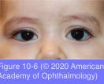
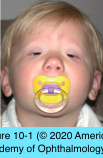
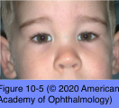
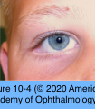
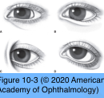
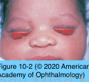

# 7.10.1. Congenital Eyelid Anomalies (I)

## Images

## Hierarchy

- introduction
  - types
    - isolated
    - associated with other eyelid, facial, or systemic anomalies
  - most congenital eyelid anomalies occur during the second month of gestation
- Epiblepharon
  - lower eyelid pretarsal muscle and skin ride above the lid margin
    - form a horizontal fold of tissue that causes the cilia to assume a vertical position
      - cilia often do not touch the cornea except in downgaze
        - rarely causes corneal staining
    - eyelid margin is in normal position
  - most common in Asian children
  - surgical treatment
    - may not require treatment
      - tends to diminish with maturation of facial bones
    - indication for surgical treatment
      - chronic corneal epithelial irritation
    - excess skin and muscle fold are excised just inferior to the eyelid margin
- Blepharophimosis–Ptosis–Epicanthus Inversus Syndrome (BPES)
  - blepharophimosis syndrome
  - autosomal dominant
    - chromosome 3
      - FOXL2 gene
  - clinical presentation
    - blepharophimosis
    - severe ptosis
    - epicanthus inversus (fold of skin extending from the lower to upper eyelid)
    - lateral lower eyelid ectropion
    - hypoplasia of the superior orbital rims
    - telecanthus
    - hypertelorism
    - poorly developed nasal bridge
    - ear deformities
  - 2 types
    - type I
      - early loss of ovarian function
    - type II
  - management
    - multiple surgeries required
    - indications for surgical correction
      - visually disruptive ptosis
        - usually requires frontalis suspension
      - telecanthus
        - medial canthal repositioning places traction on the upper eyelid and may exacerbate the ptosis
        - multiple Z-plasties or Y–V-plasties + transnasal wiring of the medial canthal tendons
      - ectropion
      - orbital rim hypoplasia
- Epicanthus
  - usually bilateral
  - medial canthal fold
  - pathogenesis
    - immature midfacial bones
    - fold of skin and subcutaneous tissue
  - child may appear esotropic
    - pseudostrabismus
  - 4 types
    - epicanthus tarsalis
      - most prominent in the upper eyelid
      - can be a normal variation of the Asian eyelid
    - epicanthus inversus
      - most prominent in the lower eyelid
      - frequently associated with BPES
    - epicanthus palpebralis
      - involves the upper and lower eyelids equally
    - epicanthus supraciliaris
      - arises from the eyebrow region and runs to the lacrimal sac
  - management
    - most forms become less apparent with normal growth of facial bones
      - observation is recommended until the face achieves maturity
      - epicanthus inversus rarely resolves with facial growth
    - isolated epicanthus
      - linear revisions (Z-plasty or Y–V-plasty)
    - epicanthus tarsalis in the Asian patient
      - Y–V-plasty
      - ± construction of an upper eyelid crease
- Ankyloblepharon
  - partial or complete fusion of eyelids by webs of skin
  - can usually be opened with scissors after being clamped for a few seconds with a hemostat
- Congenital Ectropion
  - etiology
    - isolated finding
      - rare
    - often associated with
      - BPES
      - Down syndrome
      - ichthyosis
  - clinical presentation
    - vertical insufficiency of the anterior lamella of eyelid
    - chronic epiphora
    - exposure keratitis
  - treatment
    - mild cases
      - observation
    - severe/symptomatic cases
      - treated like a cicatricial ectropion
        - horizontal tightening of the lateral canthal tendon
        - vertical lengthening of anterior lamella with full-thickness skin grafting
  - complete eversion of upper eyelids
    - occasionally occurs in newborns
    - etiology
      - inclusion conjunctivitis
      - anterior lamellar inflammation or shortage
      - Down syndrome
    - management
      - topical lubrication
      - short-term patching of both eyes
      - full-thickness sutures
      - temporary tarsorrhaphy
      - definitive repair
- Euryblepharon
  - ± associated with BPES
  - clinical presentation
    - vertical shortening + horizontal lengthening of the involved eyelids
      - lateral portion of the eyelids is typically more involved
    - inferiorly displaced lateral canthal tendon
      - palpebral fissure often has a downward slant
    - impaired blinking
    - poor closure
    - lagophthalmos
    - exposure keratitis
  - surgial reconstruction
    - if symptomatic
    - lateral canthal repositioning
    - suspension of suborbicularis oculi fat to lateral orbital rim to support lower eyelid
    - lateral tarsal strip or eyelid margin resection
      - for excess horizontal length
    - ± skin grafts
